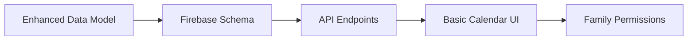
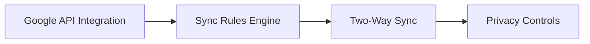
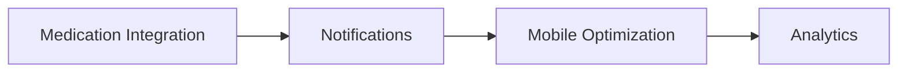
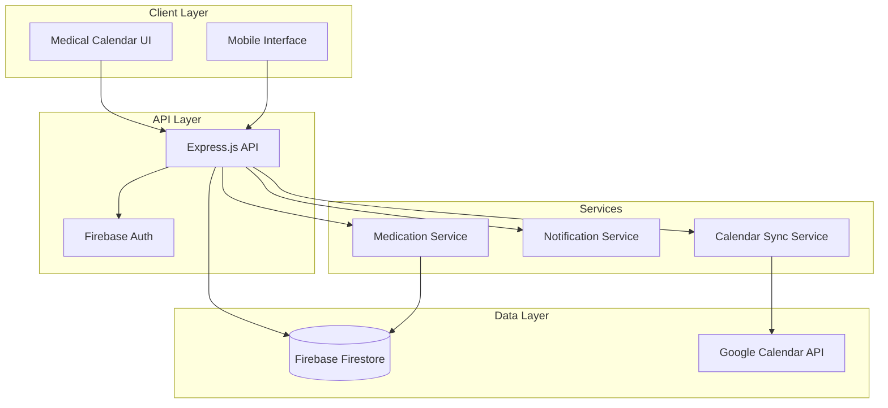

# Medical Calendar Implementation Summary

## 🎯 Recommendation: Hybrid Medical Calendar System

Based on your requirements to track medical appointments, lab results, medication schedules, and care tasks with optional Google Calendar sync, I **strongly recommend the hybrid approach**.

## 📋 Complete Architecture Package

I've created a comprehensive architectural plan consisting of:

1. **[`MEDICAL_CALENDAR_ARCHITECTURE.md`](MEDICAL_CALENDAR_ARCHITECTURE.md)** - Core system design and technical architecture
2. **[`CALENDAR_UI_WIREFRAMES.md`](CALENDAR_UI_WIREFRAMES.md)** - Detailed UI/UX designs for all calendar views
3. **[`DATA_MIGRATION_STRATEGY.md`](DATA_MIGRATION_STRATEGY.md)** - Step-by-step migration from your current system

## 🏗️ Why Hybrid is the Best Choice

### ✅ Advantages Over Alternatives

| Approach | Medical Metadata | Family Coordination | Privacy Control | Offline Access | Future-Proof |
|----------|------------------|---------------------|-----------------|----------------|--------------|
| **Hybrid (Recommended)** | ✅ Rich | ✅ Full | ✅ Complete | ✅ Yes | ✅ Yes |
| Pure Google Calendar | ❌ Limited | ❌ Basic | ⚠️ Limited | ❌ No | ❌ Vendor Lock |
| Custom Only | ✅ Rich | ✅ Full | ✅ Complete | ✅ Yes | ⚠️ No Sync |

### 🎯 Perfect for Your Use Case

Your hybrid system will provide:

- **Medical-First Design**: Rich metadata for appointments, lab results, medications, and care tasks
- **Family Coordination**: Multi-user access with granular permissions
- **Optional Google Sync**: Personal calendar reminders without compromising medical privacy
- **Medication Integration**: Automatic calendar events from medication schedules
- **HIPAA Compliance**: Sensitive data stays in your secure Firebase database

## 🚀 Implementation Roadmap

### Phase 1: Core Medical Calendar (2-3 weeks)


**Key Deliverables:**
- Enhanced [`MedicalEvent`](MEDICAL_CALENDAR_ARCHITECTURE.md:45) data model with rich medical metadata
- Firebase Firestore collections for medical events and family access
- Backend API routes for calendar operations
- Updated calendar component with medical-specific features
- Family member permission system

### Phase 2: Google Calendar Sync (1-2 weeks)


**Key Deliverables:**
- Google Calendar API integration with OAuth flow
- Privacy-preserving sync rules (medical details stay private)
- Two-way synchronization for basic scheduling
- User controls for what gets synced

### Phase 3: Advanced Features (2-3 weeks)


**Key Deliverables:**
- Automatic medication schedule → calendar event generation
- Multi-channel notification system (push, email, SMS)
- Mobile-responsive calendar interface
- Calendar insights and analytics

### Phase 4: Polish & Launch (1 week)
- Performance optimization and caching
- Security audit and compliance review
- User testing and feedback integration
- Production deployment

## 📊 Technical Architecture Overview



## 🔧 What You Already Have

### ✅ Strong Foundation
- [`CalendarIntegration.tsx`](client/src/components/CalendarIntegration.tsx:1) component with Google Calendar API setup
- Google Calendar credentials configured
- [`googleapis`](package.json:43) package installed
- Firebase Firestore for secure data storage
- Existing [`Appointment`](shared/types.ts:202) and [`MedicationReminder`](shared/types.ts:137) types

### 🔨 What Needs Building
- Enhanced medical event data model
- Backend API routes for calendar operations
- Family permission system
- Medication schedule integration
- Google Calendar sync service
- Multi-channel notification system

## 💡 Key Implementation Insights

### 1. Data Model Design
The [`MedicalEvent`](MEDICAL_CALENDAR_ARCHITECTURE.md:45) interface provides rich medical context that Google Calendar can't support:

```typescript
interface MedicalEvent {
  // Standard calendar fields
  id: string;
  title: string;
  startDateTime: Date;
  endDateTime: Date;
  
  // Medical-specific metadata
  medicalData: {
    provider?: string;
    specialty?: string;
    preparationInstructions?: string[];
    relatedMedicationIds?: string[];
    labTestTypes?: string[];
    results?: { status: string; files?: string[]; };
  };
  
  // Family coordination
  familyAccess: {
    visibleTo: string[];
    editableBy: string[];
    notifyMembers: string[];
  };
  
  // Optional Google Calendar sync
  googleCalendar?: {
    syncEnabled: boolean;
    googleEventId?: string;
    syncStatus: 'synced' | 'pending' | 'failed' | 'disabled';
  };
}
```

### 2. Privacy-First Google Sync
When syncing to Google Calendar, only basic information is shared:
- **Title**: "Medical Appointment" (generic)
- **Time**: Actual appointment time
- **Location**: Address only (no medical facility details)
- **Description**: Basic reminder text

All sensitive medical data stays in your secure Firebase database.

### 3. Family Coordination System
Granular permissions allow family members different levels of access:
- **Primary Caregiver**: Full access to all medical information
- **Family Member**: View appointments and basic details
- **Emergency Contact**: Override access during emergencies

## 🔒 Security & Compliance

### HIPAA Compliance Maintained
- Medical data encrypted at rest and in transit
- Audit logging for all family member access
- Granular permission controls
- Google Calendar sync uses minimal, non-sensitive data

### Access Control
- Role-based permissions for family members
- Emergency access protocols with audit trails
- Session management and automatic timeout
- API rate limiting and monitoring

## 📱 User Experience Highlights

### Medical-Specific Features
- **Color-coded event types**: Appointments (blue), Medications (green), Lab results (orange)
- **Smart conflict detection**: Warns about scheduling conflicts and medication timing
- **Preparation reminders**: Automatic reminders for fasting, bringing documents, etc.
- **Family coordination**: Visual indicators of who's attending appointments

### Accessibility
- High contrast mode for visually impaired users
- Large text options for elderly users
- Voice commands for hands-free operation
- Screen reader compatibility
- Simplified mode for users with cognitive impairments

## 🎉 Next Steps

You now have a complete architectural plan ready for implementation. The hybrid approach gives you:

1. **Immediate Value**: Enhanced medical calendar with family coordination
2. **User Choice**: Optional Google Calendar sync for convenience
3. **Future Growth**: Foundation for additional integrations (Outlook, Apple Calendar)
4. **Compliance**: HIPAA-compliant medical data handling
5. **Scalability**: Architecture that grows with your user base

## 🤝 Ready to Implement?

This architecture provides the perfect balance of medical functionality, family coordination, and personal calendar integration. You have all the technical specifications, UI designs, and migration strategies needed to build a world-class medical calendar system.

The hybrid approach is definitely the right choice for your medical app - it gives you the rich medical context you need while providing the convenience of personal calendar integration when users want it.