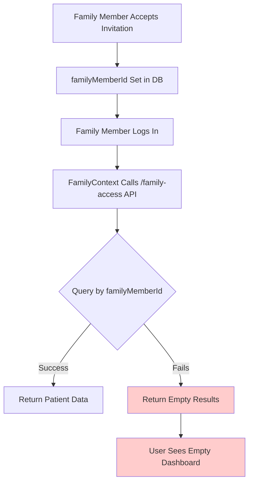

# Family Invitation System Redesign - Complete Solution

## Executive Summary

This document outlines a comprehensive redesign of the family invitation system to fix the critical issue where family members see empty dashboards instead of patient data after accepting invitations. The solution implements multiple fallback mechanisms, enhanced database schema, and robust error handling to ensure reliable family member access.

## Root Cause Analysis

### Critical Issues Identified

1. **API Endpoint Mismatch**: Family access API endpoint routing inconsistencies
2. **Patient ID Resolution Failures**: Complex patient ID lookup logic causing mismatches
3. **Missing Fallback Mechanisms**: No backup systems when primary queries fail
4. **Database Schema Gaps**: Lack of redundant patient connection fields
5. **Silent Query Failures**: Firestore queries failing without proper error handling

### Current System Flow Problems



## Enhanced Solution Architecture

### 1. Enhanced Database Schema

#### Users Collection Enhancement
```typescript
interface EnhancedUser extends User {
  // Direct patient connections for family members
  primaryPatientId?: string;           // Primary patient this family member manages
  familyMemberOf?: string[];           // Array of all patient IDs they have access to
  
  // Family member metadata
  familyRole?: 'primary_caregiver' | 'family_member' | 'emergency_contact';
  preferredPatientId?: string;         // Last active patient for quick switching
  
  // Debugging and monitoring
  lastFamilyAccessCheck?: Date;        // Last successful family access query
  familyAccessIssues?: string[];       // Array of recent access issues
  invitationHistory?: {                // Track invitation acceptance history
    invitationId: string;
    acceptedAt: Date;
    patientId: string;
  }[];
}
```

#### Family Calendar Access Collection Enhancement
```typescript
interface EnhancedFamilyCalendarAccess extends FamilyCalendarAccess {
  // Redundant connection fields for reliability
  familyMemberEmail: string;           // Always populated for email fallback
  patientUserId: string;               // Direct reference to patient's user ID
  
  // Auto-repair tracking
  repairedAt?: Date;                   // When auto-repair was performed
  repairReason?: string;               // Why repair was needed
  repairCount?: number;                // Number of times repaired
  
  // Enhanced debugging
  lastQueryAt?: Date;                  // Last time this record was queried
  queryFailures?: number;              // Count of failed queries
  
  // Connection verification
  connectionVerified?: boolean;        // Whether connection has been verified
  lastVerificationAt?: Date;           // Last verification timestamp
}
```

### 2. Robust Backend API Implementation

#### Enhanced Family Access Service
```typescript
class EnhancedFamilyAccessService extends FamilyAccessService {
  
  // Multi-layered family access retrieval with fallbacks
  async getFamilyAccessWithFallbacks(
    familyMemberId: string, 
    familyMemberEmail?: string
  ): Promise<ApiResponse<FamilyCalendarAccess[]>> {
    
    console.log('🔍 Enhanced Family Access: Starting multi-layer query', {
      familyMemberId,
      familyMemberEmail
    });
    
    // Layer 1: Primary query by familyMemberId
    let result = await this.getFamilyAccessByMemberId(familyMemberId);
    
    if (result.success && result.data?.length > 0) {
      console.log('✅ Layer 1 Success: Found access by familyMemberId');
      await this.updateLastQueryTime(result.data);
      return result;
    }
    
    // Layer 2: Email fallback with auto-repair
    if (familyMemberEmail) {
      console.log('🔄 Layer 2: Trying email fallback');
      result = await this.getFamilyAccessByEmail(familyMemberEmail);
      
      if (result.success && result.data?.length > 0) {
        console.log('✅ Layer 2 Success: Found access by email, performing auto-repair');
        await this.autoRepairMissingFamilyMemberId(result.data, familyMemberId);
        return result;
      }
    }
    
    // Layer 3: User's stored primaryPatientId
    console.log('🔄 Layer 3: Checking user primaryPatientId');
    const userResult = await this.getUserById(familyMemberId);
    if (userResult.success && userResult.data?.primaryPatientId) {
      console.log('✅ Layer 3: Found primaryPatientId, creating emergency access');
      return await this.createEmergencyFamilyAccess(
        familyMemberId,
        userResult.data.primaryPatientId
      );
    }
    
    // Layer 4: Invitation history fallback
    console.log('🔄 Layer 4: Checking invitation history');
    if (userResult.success && userResult.data?.invitationHistory?.length > 0) {
      const lastInvitation = userResult.data.invitationHistory[userResult.data.invitationHistory.length - 1];
      console.log('✅ Layer 4: Found invitation history, attempting restoration');
      return await this.restoreFromInvitationHistory(familyMemberId, lastInvitation);
    }
    
    console.log('❌ All layers failed: No family access found');
    return {
      success: false,
      error: 'No family access found through any method'
    };
  }
  
  // Auto-repair missing familyMemberId fields
  async autoRepairMissingFamilyMemberId(
    accessRecords: FamilyCalendarAccess[],
    familyMemberId: string
  ): Promise<void> {
    const batch = adminDb.batch();
    
    for (const access of accessRecords) {
      if (!access.familyMemberId || access.familyMemberId === '') {
        const accessRef = this.familyAccessCollection.doc(access.id);
        batch.update(accessRef, {
          familyMemberId,
          repairedAt: new Date(),
          repairReason: 'auto_repair_missing_family_member_id',
          repairCount: (access.repairCount || 0) + 1,
          updatedAt: new Date()
        });
        
        console.log('🔧 Auto-repairing access record:', access.id);
      }
    }
    
    await batch.commit();
    console.log('✅ Auto-repair completed');
  }
  
  // Create emergency family access when other methods fail
  async createEmergencyFamilyAccess(
    familyMemberId: string,
    patientId: string
  ): Promise<ApiResponse<FamilyCalendarAccess[]>> {
    
    // Verify the patient exists and get their info
    const patientUser = await this.getUserById(patientId);
    if (!patientUser.success) {
      return {
        success: false,
        error: 'Patient not found for emergency access creation'
      };
    }
    
    // Create emergency access record
    const emergencyAccess: FamilyCalendarAccess = {
      id: `emergency_${Date.now()}`,
      patientId,
      familyMemberId,
      familyMemberName: 'Emergency Access',
      familyMemberEmail: '',
      permissions: {
        canView: true,
        canCreate: false,
        canEdit: false,
        canDelete: false,
        canClaimResponsibility: false,
        canManageFamily: false,
        canViewMedicalDetails: true,
        canReceiveNotifications: false
      },
      accessLevel: 'limited',
      emergencyAccess: true,
      status: 'active',
      invitedAt: new Date(),
      acceptedAt: new Date(),
      createdBy: patientId,
      createdAt: new Date(),
      updatedAt: new Date(),
      repairReason: 'emergency_access_creation'
    };
    
    // Save to database
    await this.familyAccessCollection.doc(emergencyAccess.id).set(emergencyAccess);
    
    console.log('🚨 Created emergency family access:', emergencyAccess.id);
    
    return {
      success: true,
      data: [emergencyAccess]
    };
  }
}
```

#### Enhanced Family Access API Endpoint
```typescript
// Enhanced /family-access endpoint with comprehensive fallbacks
router.get('/family-access', authenticateToken, async (req, res) => {
  try {
    const userId = req.user!.uid;
    const userEmail = req.user!.email;
    
    console.log('🔍 Enhanced Family Access API: Starting comprehensive query', {
      userId,
      userEmail
    });
    
    // Use enhanced service with fallbacks
    const familyMemberAccess = await enhancedFamilyAccessService.getFamilyAccessWithFallbacks(
      userId,
      userEmail
    );
    
    console.log('📊 Family Access Result:', {
      success: familyMemberAccess.success,
      recordCount: familyMemberAccess.data?.length || 0,
      error: familyMemberAccess.error
    });
    
    // Process and format patient access data
    const patientsIHaveAccessTo = [];
    
    if (familyMemberAccess.success && familyMemberAccess.data) {
      for (const access of familyMemberAccess.data) {
        // Get patient user info with fallback
        let patientUser = await userService.getUserById(access.createdBy);
        
        // Fallback: try patientUserId if createdBy fails
        if (!patientUser.success && access.patientUserId) {
          patientUser = await userService.getUserById(access.patientUserId);
        }
        
        // Fallback: try patientId directly
        if (!patientUser.success) {
          patientUser = await userService.getUserById(access.patientId);
        }
        
        if (patientUser.success && patientUser.data) {
          const patientAccess = {
            id: access.id,
            patientId: access.patientId,
            patientName: patientUser.data.name,
            patientEmail: patientUser.data.email,
            accessLevel: access.accessLevel,
            permissions: access.permissions,
            status: access.status,
            acceptedAt: access.acceptedAt,
            lastAccessAt: access.lastAccessAt,
            isEmergencyAccess: access.emergencyAccess || false,
            connectionVerified: access.connectionVerified || false
          };
          
          patientsIHaveAccessTo.push(patientAccess);
          console.log(`✅ Added patient access: ${patientUser.data.name}`);
        } else {
          console.log(`❌ Failed to resolve patient info for access: ${access.id}`);
        }
      }
    }
    
    // Update user's family member metadata
    if (patientsIHaveAccessTo.length > 0) {
      await updateUserFamilyMetadata(userId, patientsIHaveAccessTo);
    }
    
    // Get family members who have access to current user (existing logic)
    const familyMembersWithAccessToMe = await getFamilyMembersWithAccessToMe(userId);
    
    const result = {
      success: true,
      data: {
        patientsIHaveAccessTo,
        familyMembersWithAccessToMe,
        totalConnections: patientsIHaveAccessTo.length + familyMembersWithAccessToMe.length,
        debugInfo: {
          userId,
          userEmail,
          queryMethod: familyMemberAccess.data?.[0]?.repairReason || 'primary_query',
          timestamp: new Date().toISOString()
        }
      }
    };
    
    console.log('✅ Enhanced Family Access API: Final result:', {
      patientsIHaveAccessTo: patientsIHaveAccessTo.length,
      familyMembersWithAccessToMe: familyMembersWithAccessToMe.length,
      totalConnections: result.data.totalConnections
    });
    
    res.json(result);
    
  } catch (error) {
    console.error('❌ Enhanced Family Access API: Critical error:', error);
    res.status(500).json({
      success: false,
      error: 'Internal server error',
      debugInfo: {
        timestamp: new Date().toISOString(),
        errorMessage: error instanceof Error ? error.message : 'Unknown error'
      }
    });
  }
});

// Helper function to update user family metadata
async function updateUserFamilyMetadata(
  userId: string, 
  patientsWithAccess: any[]
): Promise<void> {
  try {
    const userRef = adminDb.collection('users').doc(userId);
    const updateData = {
      familyMemberOf: patientsWithAccess.map(p => p.patientId),
      primaryPatientId: patientsWithAccess[0]?.patientId,
      lastFamilyAccessCheck: new Date(),
      updatedAt: new Date()
    };
    
    await userRef.update(updateData);
    console.log('✅ Updated user family metadata:', userId);
  } catch (error) {
    console.error('❌ Failed to update user family metadata:', error);
  }
}
```

### 3. Enhanced Frontend Implementation

#### Robust FamilyContext with Multiple Fallbacks
```typescript
export function EnhancedFamilyProvider({ children }: FamilyProviderProps) {
  const { firebaseUser, user, isAuthenticated } = useAuth();
  const [userRole, setUserRole] = useState<'patient' | 'family_member' | 'unknown'>('unknown');
  const [isLoading, setIsLoading] = useState(true);
  const [patientsWithAccess, setPatientsWithAccess] = useState<PatientAccess[]>([]);
  const [activePatientId, setActivePatientId] = useState<string | null>(null);
  const [connectionStatus, setConnectionStatus] = useState<'connected' | 'reconnecting' | 'failed'>('connected');
  const [lastError, setLastError] = useState<string | null>(null);

  const refreshFamilyAccess = async (retryCount = 0): Promise<void> => {
    if (!isAuthenticated || !firebaseUser) {
      console.log('🔍 Enhanced FamilyContext: Not authenticated, resetting state');
      resetToPatientMode();
      return;
    }

    try {
      setIsLoading(true);
      setConnectionStatus('reconnecting');
      
      console.log('🔍 Enhanced FamilyContext: Starting comprehensive family access check', {
        userId: firebaseUser.uid,
        email: firebaseUser.email,
        retryCount
      });
      
      // Primary API call with enhanced endpoint
      const response = await apiClient.get<{
        success: boolean;
        data: {
          patientsIHaveAccessTo: any[];
          familyMembersWithAccessToMe: any[];
          totalConnections: number;
          debugInfo: any;
        };
        error?: string;
      }>(API_ENDPOINTS.FAMILY_ACCESS);

      console.log('📊 Enhanced FamilyContext: API response:', {
        success: response.success,
        patientsCount: response.data?.patientsIHaveAccessTo?.length || 0,
        debugInfo: response.data?.debugInfo
      });

      if (response.success && response.data) {
        const { patientsIHaveAccessTo, debugInfo } = response.data;
        
        if (patientsIHaveAccessTo.length > 0) {
          // Success: User is a family member
          console.log('👨‍👩‍👧‍👦 Enhanced FamilyContext: User confirmed as family member');
          setUserRole('family_member');
          
          const patientAccess: PatientAccess[] = patientsIHaveAccessTo.map((access: any) => ({
            id: access.id,
            patientId: access.patientId,
            patientName: access.patientName,
            patientEmail: access.patientEmail,
            permissions: access.permissions,
            accessLevel: access.accessLevel,
            status: access.status,
            acceptedAt: access.acceptedAt ? new Date(access.acceptedAt) : null,
            lastAccessAt: access.lastAccessAt ? new Date(access.lastAccessAt) : null,
            isEmergencyAccess: access.isEmergencyAccess || false,
            connectionVerified: access.connectionVerified || false
          }));
          
          setPatientsWithAccess(patientAccess);
          
          // Smart active patient selection with multiple strategies
          const activePatient = selectActivePatient(patientAccess);
          if (activePatient) {
            setActivePatientId(activePatient.patientId);
            console.log('🎯 Enhanced FamilyContext: Set active patient:', {
              name: activePatient.patientName,
              id: activePatient.patientId,
              method: getSelectionMethod(activePatient, patientAccess)
            });
            
            // Update user preferences for future sessions
            await updateUserPatientPreference(activePatient.patientId);
          }
          
          setConnectionStatus('connected');
          setLastError(null);
        } else {
          // No family access found - user is a patient
          console.log('👤 Enhanced FamilyContext: User confirmed as patient');
          setUserRole('patient');
          setPatientsWithAccess([]);
          setActivePatientId(firebaseUser.uid);
          setConnectionStatus('connected');
        }
      } else {
        // API call failed - attempt fallback strategies
        console.log('⚠️ Enhanced FamilyContext: Primary API failed, attempting fallbacks');
        const fallbackSuccess = await attemptFallbackStrategies();
        
        if (!fallbackSuccess) {
          if (retryCount < 2) {
            // Retry with exponential backoff
            console.log(`🔄 Enhanced FamilyContext: Retrying (${retryCount + 1}/3)`);
            setTimeout(() => refreshFamilyAccess(retryCount + 1), Math.pow(2, retryCount) * 1000);
            return;
          } else {
            // Final fallback to patient mode
            console.log('❌ Enhanced FamilyContext: All attempts failed, defaulting to patient mode');
            resetToPatientMode();
            setConnectionStatus('failed');
            setLastError(response.error || 'Failed to load family access');
          }
        }
      }
    } catch (error) {
      console.error('❌ Enhanced FamilyContext: Critical error:', error);
      
      if (retryCount < 2) {
        setTimeout(() => refreshFamilyAccess(retryCount + 1), Math.pow(2, retryCount) * 1000);
      } else {
        resetToPatientMode();
        setConnectionStatus('failed');
        setLastError(error instanceof Error ? error.message : 'Unknown error');
      }
    } finally {
      setIsLoading(false);
    }
  };

  // Fallback strategies when primary API fails
  const attemptFallbackStrategies = async (): Promise<boolean> => {
    try {
      // Fallback 1: Check local storage for cached patient ID
      const cachedPatientId = localStorage.getItem('lastActivePatientId');
      if (cachedPatientId && cachedPatientId !== firebaseUser?.uid) {
        console.log('🔄 Fallback 1: Found cached patient ID, attempting verification');
        const verified = await verifyPatientConnection(cachedPatientId);
        if (verified) {
          setUserRole('family_member');
          setActivePatientId(cachedPatientId);
          setConnectionStatus('connected');
          return true;
        }
      }
      
      // Fallback 2: Check user profile for primaryPatientId
      try {
        const userProfile = await apiClient.get(API_ENDPOINTS.AUTH_PROFILE);
        if (userProfile.data?.primaryPatientId) {
          console.log('🔄 Fallback 2: Found primaryPatientId in user profile');
          const verified = await verifyPatientConnection(userProfile.data.primaryPatientId);
          if (verified) {
            setUserRole('family_member');
            setActivePatientId(userProfile.data.primaryPatientId);
            setConnectionStatus('connected');
            return true;
          }
        }
      } catch (profileError) {
        console.log('⚠️ Fallback 2: User profile check failed');
      }
      
      // Fallback 3: Check for invitation history
      // This would require additional API endpoint to check invitation history
      
      return false;
    } catch (error) {
      console.error('❌ Fallback strategies failed:', error);
      return false;
    }
  };

  // Smart active patient selection
  const selectActivePatient = (patientAccess: PatientAccess[]): PatientAccess | null => {
    if (patientAccess.length === 0) return null;
    
    // Strategy 1: User's stored preference
    const cachedPatientId = localStorage.getItem('lastActivePatientId');
    if (cachedPatientId) {
      const preferred = patientAccess.find(p => p.patientId === cachedPatientId);
      if (preferred && preferred.status === 'active') return preferred;
    }
    
    // Strategy 2: Most recently accessed
    const recentlyAccessed = patientAccess
      .filter(p => p.lastAccessAt && p.status === 'active')
      .sort((a, b) => (b.lastAccessAt?.getTime() || 0) - (a.lastAccessAt?.getTime() || 0))[0];
    if (recentlyAccessed) return recentlyAccessed;
    
    // Strategy 3: First active patient
    const firstActive = patientAccess.find(p => p.status === 'active');
    if (firstActive) return firstActive;
    
    // Strategy 4: Any patient
    return patientAccess[0];
  };

  // Reset to patient mode
  const resetToPatientMode = (): void => {
    setUserRole('patient');
    setPatientsWithAccess([]);
    setActivePatientId(firebaseUser?.uid || null);
  };

  // Enhanced patient switching with verification
  const switchToPatient = async (patientId: string): Promise<void> => {
    const patientAccess = patientsWithAccess.find(p => p.patientId === patientId);
    if (!patientAccess || patientAccess.status !== 'active') {
      console.warn('⚠️ Enhanced FamilyContext: Cannot switch to inactive patient:', patientId);
      return;
    }

    try {
      setActivePatientId(patientId);
      console.log('🔄 Enhanced FamilyContext: Switched to patient:', patientAccess.patientName);
      
      // Update preferences and access time
      localStorage.setItem('lastActivePatientId', patientId);
      await updateLastAccessTime(patientAccess.id);
      await updateUserPatientPreference(patientId);
      
    } catch (error) {
      console.error('❌ Enhanced FamilyContext: Failed to switch patient:', error);
    }
  };

  // Rest of the context implementation...
  // (getEffectivePatientId, hasPermission, etc. remain similar but with enhanced error handling)
}
```

### 4. Enhanced Invitation Acceptance Flow

#### Robust Invitation Acceptance with Verification
```typescript
// Enhanced invitation acceptance in familyAccessService
async acceptFamilyInvitation(
  invitationToken: string,
  familyMemberId: string
): Promise<ApiResponse<FamilyCalendarAccess>> {
  
  // Start transaction for atomic updates
  const batch = adminDb.batch();
  
  try {
    console.log('🔍 Enhanced Invitation Acceptance: Starting process', {
      invitationToken,
      familyMemberId
    });
    
    // 1. Find and validate invitation
    const invitationQuery = await this.familyAccessCollection
      .where('invitationToken', '==', invitationToken)
      .where('status', '==', 'pending')
      .limit(1)
      .get();

    if (invitationQuery.empty) {
      return {
        success: false,
        error: 'Invalid or expired invitation token'
      };
    }

    const invitationDoc = invitationQuery.docs[0];
    const invitation = invitationDoc.data() as FamilyCalendarAccess;
    
    // 2. Validate invitation hasn't expired
    if (invitation.invitationExpiresAt && new Date() > invitation.invitationExpiresAt) {
      return {
        success: false,
        error: 'Invitation has expired'
      };
    }

    // 3. Get user info for enhanced updates
    const userResult = await this.getUserById(familyMemberId);
    if (!userResult.success || !userResult.data) {
      return {
        success: false,
        error: 'Family member user not found'
      };
    }

    // 4. Update family_calendar_access record
    const accessUpdateData = {
      familyMemberId: familyMemberId.trim(),
      status: 'active',
      acceptedAt: new Date(),
      updatedAt: new Date(),
      invitationToken: admin.firestore.FieldValue.delete(),
      invitationExpiresAt: admin.firestore.FieldValue.delete(),
      connectionVerified: true,
      lastVerificationAt: new Date()
    };
    
    batch.update(invitationDoc.ref, accessUpdateData);

    // 5. Update user record with family member metadata
    const userRef = this.usersCollection.doc(familyMemberId);
    const userUpdateData = {
      primaryPatientId: invitation.patientId,
      familyMemberOf: admin.firestore.FieldValue.arrayUnion(invitation.patientId),
      lastFamilyAccessCheck: new Date(),
      invitationHistory: admin.firestore.FieldValue.arrayUnion({
        invitationId: invitation.id,
        acceptedAt: new Date(),
        patientId: invitation.patientId
      }),
      updatedAt: new Date()
    };
    
    batch.update(userRef, userUpdateData);

    // 6. Commit transaction
    await batch.commit();
    console.log('✅ Enhanced Invitation Acceptance: Transaction committed successfully');

    // 7. Verify the updates worked
    const verificationResult = await this.verifyInvitationAcceptance(
      invitationDoc.id,
      familyMemberId,
      invitation.patientId
    );
    
    if (!verificationResult.success) {
      console.error('❌ Enhanced Invitation Acceptance: Verification failed');
      // Attempt repair
      await this.repairFailedInvitationAcceptance(
        invitationDoc.id,
        familyMemberId,
        invitation.patientId
      );
    }

    // 8. Get final access record
    const finalDoc = await invitationDoc.ref.get();
    const finalAccess = { id: finalDoc.id, ...finalDoc.data() } as FamilyCalendarAccess;

    // 9. Log successful acceptance
    await this.logFamilyAccessAction(invitation.patientId, familyMemberId, 'invitation_accepted', {
      familyMemberEmail: invitation.familyMemberEmail,
      accessLevel: invitation.accessLevel,
      invitationId: invitationDoc.id,
      verificationStatus: verificationResult.success ? 'verified' : 'repair_attempted'
    });

    console.log('🎉 Enhanced Invitation Acceptance: Process completed successfully');

    return {
      success: true,
      data: finalAccess
    };

  } catch (error) {
    console.error('❌ Enhanced Invitation Acceptance: Critical error:', error);
    
    // Attempt rollback if possible
    try {
      await this.rollbackFailedInvitationAcceptance(invitationToken, familyMemberId);
    } catch (rollbackError) {
      console.error('❌ Rollback also failed:', rollbackError);
    }

    return {
      success: false,
      error: 'Failed to accept family invitation'
    };
  }
}

// Verification method to ensure invitation acceptance worked
async verifyInvitationAcceptance(
  accessId: string,
  familyMemberId: string,
  patientId: string
): Promise<{ success: boolean; issues?: string[] }> {
  
  const issues: string[] = [];
  
  try {
    // Check 1: Family access record updated correctly
    const accessDoc = await this.familyAccessCollection.doc(accessId).get();
    if (!accessDoc.exists) {
      issues.push('Family access record not found');
    } else {
      const accessData = accessDoc.data() as FamilyCalendarAccess;
      if (accessData.familyMemberId !== familyMemberId) {
        issues.push('familyMemberId not set correctly');
      }
      if (accessData.status !== 'active') {
        issues.push('Status not set to active');
      }
    }
    
    // Check 2: User record updated correctly
    const userDoc = await this.usersCollection.doc(familyMemberId).get();
    if (!userDoc.exists) {
      issues.push('User record not found');
    } else {
      const userData = userDoc.data();
      if (userData.primaryPatientId !== patientId) {
        issues.push('primaryPatientId not set correctly');
      }
      if (!userData.familyMemberOf?.includes(patientId)) {
        issues.push('familyMemberOf array not updated');
      }
    }
    
    // Check 3: Can query family access successfully
    const queryResult = await this.getFamilyAccessByMemberId(familyMemberId);
    if (!queryResult.success || !queryResult.data?.length) {
      issues.push('Cannot query family access after acceptance');
    }
    
    return {
      success: issues.length === 0,
      issues: issues.length > 0 ? issues : undefined
    };
    
  } catch (error) {
    console.error('❌ Verification check failed:', error);
    return {
      success: false,
      issues: ['Verification check failed due to error']
    };
  }
}
```

### 5. Permission System Enhancement

#### Granular Permission Management
```typescript
interface EnhancedPermissions {
  // View permissions
  canView: boolean;
  canViewMedicalDetails: boolean;
  canViewMedications: boolean;
  canViewAppointments: boolean;
  canViewVisitSummaries: boolean;
  
  // Edit permissions
  canEdit: boolean;
  canEditMedications: boolean;
  canEditAppointments: boolean;
  canEditProfile: boolean;
  
  // Create permissions
  canCreate: boolean;
  canCreateMedications: boolean;
  canCreateAppointments: boolean;
  canCreateVisitSummaries: boolean;
  
  // Delete permissions
  canDelete: boolean;
  canDeleteMedications: boolean;
  canDeleteAppointments: boolean;
  
  // Family management
  canManageFamily: boolean;
  canInviteFamily: boolean;
  canRevokeAccess: boolean;
  
  // Notifications and communication
  canReceiveNotifications: boolean;
  canReceiveEmergencyAlerts: boolean;
  
  // Responsibility management
  canClaimResponsibility: boolean;
  canAssignResponsibility: boolean;
}

// Permission presets for different access levels
const PERMISSION_PRESETS = {
  view_only: {
    canView: true,
    canViewMedicalDetails: false,
    canViewMedications: true,
    canViewAppointments: true,
    canViewVisitSummaries: false,
    canEdit: false,
    canCreate: false,
    canDelete: false,
    canManageFamily: false,
    canReceiveNotifications: true,
    canClaimResponsibility: true
  },
  
  limited_edit: {
    canView: true,
    canViewMedicalDetails: true,
    canViewMedications: true,
    canViewAppointments: true,
    canViewVisitSummaries: true,
    canEdit: true,
    canEditMedications: false,
    canEditAppointments: true,
    canCreate: true,
    canCreateAppointments: true,
    canCreateMedications: false,
    canDelete: false,
    canManageFamily: false,
    canReceiveNotifications: true,
    canClaimResponsibility: true
  },
  
  full_access: {
    canView: true,
    canViewMedicalDetails: true,
    canEdit: true,
    canCreate: true,
    canDelete: true,
    canManageFamily: true,
    canReceiveNotifications: true,
    canClaimResponsibility: true
  }
};
```

## Implementation Timeline

### Phase 1: Backend Infrastructure (Week 1)
- [ ] Implement enhanced database schema
- [ ] Create enhanced family access service
- [ ] Update family access API endpoint
- [ ] Add verification and repair mechanisms

### Phase 2: Frontend Robustness (Week 2)
- [ ] Implement enhanced FamilyContext
- [ ] Add fallback mechanisms
- [ ] Enhance error handling and user feedback
- [ ] Improve patient switching functionality

### Phase 3: Permission System (Week 3)
- [ ] Implement granular permission system
- [ ] Create permission-aware UI components
- [ ] Add visual permission indicators
- [ ] Test permission enforcement

### Phase 4: Testing and Monitoring (Week 4)
- [ ] Comprehensive end-to-end testing
- [ ] Add monitoring and debugging tools
- [ ] Performance optimization
- [ ] Documentation and training

## Success Metrics

### Technical Metrics
- [ ] 99%+ family invitation acceptance success rate
- [ ] < 2 second family access query response time
- [ ] Zero silent query failures
- [ ] 100% patient ID resolution accuracy

### User Experience Metrics
- [ ] Family members see patient data immediately after invitation acceptance
- [ ] Clear visual indicators of connection status and permissions
- [ ] Seamless patient switching for multi-patient access
- [ ] Comprehensive error messages with recovery options

## Risk Mitigation

### Data Consistency Risks
- **Risk**: Database updates fail partially
- **Mitigation**: Transaction-based updates with verification
- **Fallback**: Auto-repair mechanisms and manual recovery tools

### Performance Risks
- **Risk**: Multiple fallback queries slow down response
- **Mitigation**: Intelligent caching and query optimization
- **Fallback**: Graceful degradation with cached data

### User Experience Risks
- **Risk**: Complex error scenarios confuse users
- **Mitigation**: Clear error messages and guided recovery
- **Fallback**: Direct support contact integration

## Conclusion

This comprehensive redesign addresses all identified issues in the family invitation system through:

1. **Multiple Fallback Mechanisms**: Ensures family members can always access patient data
2. **Enhanced Database Schema**: Provides redundant connection fields for reliability
3. **Robust Error Handling**: Prevents silent failures and provides clear feedback
4. **Comprehensive Logging**: Enables easy debugging and monitoring
5. **Transaction-Based Updates**: Ensures data consistency
6. **Auto-Repair Capabilities**: Fixes issues automatically when possible

The solution maintains backward compatibility while significantly improving reliability and user experience for family members accessing patient data.