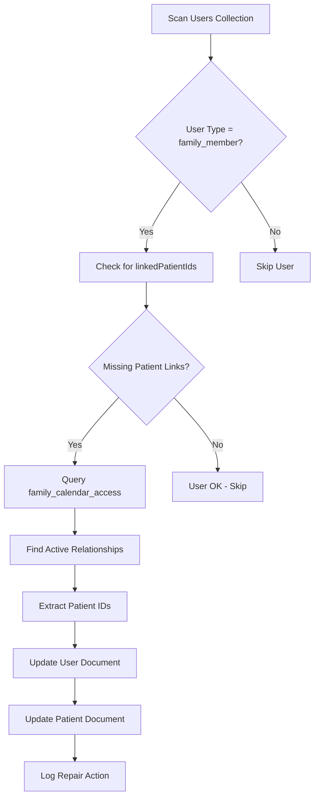

# Family Member Patient ID Solution Summary

## Issue Identified ✅

Family member user documents are missing critical patient ID linking fields that should connect them to the patients they have access to.

### Specific Problem
- **Family Member User**: `w4xCmegqmQfqToGp432r9MrG3293` (Nathan Nguyen, fookwin@gmail.com)
- **User Type**: ✅ Correctly set to `family_member`
- **Missing Fields**: ❌ `linkedPatientIds` and `primaryPatientId`

### Root Cause ✅
Transaction logic flaw in invitation acceptance process ([`functions/src/index.ts:1028-1048`](functions/src/index.ts:1028-1048)) where reciprocal linking operations use stale user document reference.

## Solution Architecture

### Phase 1: Immediate Repair (Priority: HIGH)
**Repair existing broken family member relationships**



### Phase 2: Prevention Fix (Priority: HIGH)
**Fix invitation acceptance transaction to prevent future issues**

#### Current Problematic Code
```typescript
// Lines 1028-1048: PROBLEMATIC
const familyMemberLinkUpdates: any = {
    linkedPatientIds: admin.firestore.FieldValue.arrayUnion(invitation.patientId),
    updatedAt: admin.firestore.Timestamp.now()
};

// Uses stale userDoc reference
if (!userDoc.exists || !(userDoc.data() as any)?.primaryPatientId) {
    familyMemberLinkUpdates.primaryPatientId = invitation.patientId;
}

transaction.set(userRef, familyMemberLinkUpdates, { merge: true });
```

#### Fixed Code Logic
```typescript
// Get fresh user document reference within transaction
const freshUserDoc = await transaction.get(userRef);
const currentUserData = freshUserDoc.data();

const familyMemberLinkUpdates: any = {
    linkedPatientIds: admin.firestore.FieldValue.arrayUnion(invitation.patientId),
    updatedAt: admin.firestore.Timestamp.now()
};

// Use fresh data for conditional logic
if (!currentUserData?.primaryPatientId) {
    familyMemberLinkUpdates.primaryPatientId = invitation.patientId;
}

// Use update instead of set for existing documents
if (freshUserDoc.exists) {
    transaction.update(userRef, familyMemberLinkUpdates);
} else {
    transaction.set(userRef, {
        id: userId,
        email: invitation.familyMemberEmail,
        name: invitation.familyMemberName || 'Family Member',
        userType: 'family_member',
        ...familyMemberLinkUpdates,
        createdAt: admin.firestore.Timestamp.now()
    });
}
```

### Phase 3: Enhanced Monitoring (Priority: MEDIUM)
**Add proactive detection and repair capabilities**

#### Health Check Enhancement
Add checks for missing patient ID links to existing health check endpoint:

```typescript
// Check for family members missing patient links
const familyMembersQuery = await firestore.collection('users')
    .where('userType', '==', 'family_member')
    .get();

for (const familyMemberDoc of familyMembersQuery.docs) {
    const data = familyMemberDoc.data();
    if (!data.linkedPatientIds || !data.primaryPatientId) {
        // Auto-repair missing links
        await repairFamilyMemberLinks(familyMemberDoc.id);
    }
}
```

## Implementation Files Required

### Scripts to Create (Code Mode Required)
1. **`repair-family-member-patient-links.cjs`**
   - Repair existing broken family member relationships
   - Target: Nathan Nguyen and any other affected family members

2. **`test-family-member-patient-links.cjs`**
   - Verify repair script results
   - Test new invitation flow after fix

### Backend Code to Modify (Code Mode Required)
1. **[`functions/src/index.ts`](functions/src/index.ts:1028-1048)**
   - Fix invitation acceptance transaction logic
   - Add post-transaction verification
   - Improve error handling

2. **[`functions/src/index.ts`](functions/src/index.ts:657-728)**
   - Enhance health check endpoint
   - Add proactive detection of missing patient links

## Expected Results After Implementation

### Database State
```typescript
// Family Member User Document (FIXED)
{
  "id": "w4xCmegqmQfqToGp432r9MrG3293",
  "email": "fookwin@gmail.com",
  "name": "Nathan Nguyen",
  "userType": "family_member",
  "linkedPatientIds": ["3u7bMygdjIMdWEQxMZwW1DIw5zI1"], // ✅ ADDED
  "primaryPatientId": "3u7bMygdjIMdWEQxMZwW1DIw5zI1",   // ✅ ADDED
  "createdAt": "2025-09-16T14:44:46Z",
  "updatedAt": "2025-09-16T14:44:46Z"
}

// Patient User Document (FIXED)
{
  "id": "3u7bMygdjIMdWEQxMZwW1DIw5zI1",
  "familyMemberIds": ["w4xCmegqmQfqToGp432r9MrG3293"], // ✅ ADDED
  // ... other patient fields
}
```

### Functional Verification
1. ✅ Nathan Nguyen can log in as family member
2. ✅ Frontend correctly identifies patient to display
3. ✅ Patient dashboard loads with correct patient data
4. ✅ All API endpoints work with proper patient ID resolution
5. ✅ Future family member invitations work correctly

## Testing Plan

### Test 1: Repair Verification
```bash
# Run repair script
node repair-family-member-patient-links.cjs

# Expected output:
# ✅ Repaired family member: Nathan Nguyen (fookwin@gmail.com)
# ✅ Added linkedPatientIds: ["3u7bMygdjIMdWEQxMZwW1DIw5zI1"]
# ✅ Set primaryPatientId: "3u7bMygdjIMdWEQxMZwW1DIw5zI1"
```

### Test 2: Family Member Login
```bash
# Test family member access
node test-family-member-patient-links.cjs

# Expected output:
# ✅ Family member login successful
# ✅ Patient ID correctly resolved
# ✅ Dashboard loads patient data
```

### Test 3: New Invitation Flow
1. Create new family member invitation
2. Accept invitation
3. Verify reciprocal links are created immediately
4. Test family member access

## Risk Assessment

### Low Risk ✅
- **Repair script**: Only adds missing fields, doesn't modify existing data
- **Health check enhancement**: Read-only operations with optional auto-repair

### Medium Risk ⚠️
- **Transaction fix**: Modifies critical invitation acceptance logic
- **Mitigation**: Thorough testing before deployment

### High Risk ❌
- None identified - changes are targeted and well-understood

## Deployment Strategy

### Step 1: Repair (Safe)
1. Deploy and run repair script
2. Verify existing family members are fixed
3. Test family member access

### Step 2: Prevention (Controlled)
1. Deploy fixed invitation acceptance logic
2. Test with new invitation
3. Monitor for any issues

### Step 3: Monitoring (Safe)
1. Deploy enhanced health checks
2. Set up proactive monitoring
3. Document maintenance procedures

## Ready for Implementation

The analysis is complete and the solution is well-defined. The next step is to switch to **Code mode** to implement:

1. **Repair script** for existing family members
2. **Transaction fix** for invitation acceptance
3. **Enhanced monitoring** for future prevention

---

*Analysis completed: 2025-09-16*  
*Issue: Missing patient ID links in family member user documents*  
*Solution: Repair existing + fix transaction + enhance monitoring*  
*Ready for Code mode implementation*