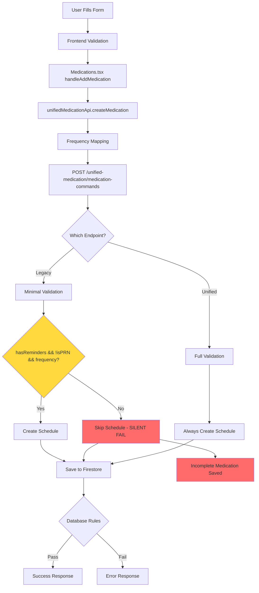
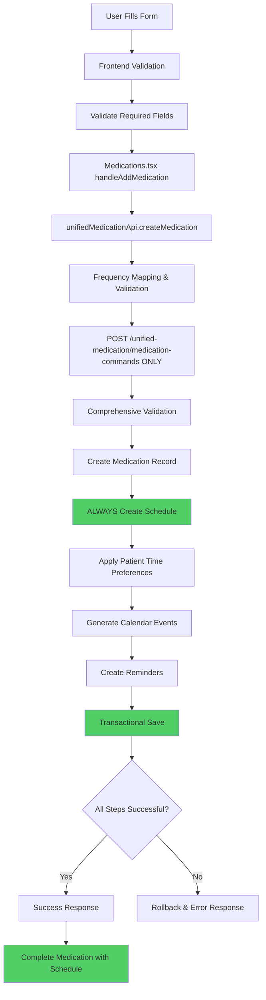

# Medication Addition Diagnostic Report
**Date:** October 24, 2025  
**Status:** Critical System Issue  
**Severity:** HIGH - Medications failing to add properly

---

## Executive Summary

### What's Broken
The medication addition system is experiencing **critical failures** that prevent medications from being properly added with schedules and reminder times. Users can add medication records, but the system fails to create the associated schedules and calendar events, rendering the medication tracking system non-functional.

### Why It's Broken
The root cause is a **fragmented dual-system architecture** where:
1. **Frontend** sends data to the unified API endpoint with correct structure
2. **Backend** has TWO separate medication creation systems (legacy + unified) running in parallel
3. **Legacy endpoint** has conditional schedule creation that silently fails
4. **Database** has no validation, allowing incomplete records to be saved
5. **Data transformation** issues cause frequency mismatches between systems

### Impact
- ✅ Medications ARE being created in the database
- ❌ Schedules are NOT being created (conditional logic skips creation)
- ❌ Reminder times are NOT being saved
- ❌ Calendar events are NOT being generated
- ❌ Users cannot track medication adherence
- ❌ Silent failures provide no error feedback to users

---

## Root Cause Analysis

### PRIMARY ISSUE: Conditional Schedule Creation Logic

**Location:** Legacy `/medications` endpoint (functions/src/index.ts)

**The Problem:**
```typescript
// Schedule creation is CONDITIONAL - only if ALL conditions are met:
if (hasReminders && !isPRN && frequency) {
  // Create schedule
} else {
  // SILENTLY SKIP schedule creation
  // Medication saved WITHOUT schedule/times
}
```

**Why This Fails:**
1. If `hasReminders` is false/undefined → No schedule created
2. If `isPRN` is true → No schedule created  
3. If `frequency` is missing/invalid → No schedule created
4. **No error is thrown** - medication saves successfully but is incomplete

**Evidence:**
- Frontend logs show correct data being sent
- Backend receives the data
- Medication record is created
- Schedule creation is skipped due to conditional logic
- No error returned to frontend

---

## Complete Issue Breakdown

### 🔴 CRITICAL ISSUES (Must Fix Immediately)

#### 1. Dual Medication Creation Systems
**Severity:** CRITICAL  
**Location:** Backend API  
**Issue:** Two separate endpoints exist:
- Legacy: `POST /medications` (minimal validation, conditional schedule creation)
- Unified: `POST /unified-medication/medication-commands` (proper validation, guaranteed schedule creation)

**Impact:** Frontend calls unified endpoint, but legacy endpoint may still be in use or causing conflicts.

**Evidence:**
```typescript
// functions/src/index.ts line 6528-6530
replacement: '/unified-medication/medication-commands',
notice: 'This endpoint is deprecated. Use POST /unified-medication/medication-commands'
```

#### 2. Conditional Schedule Creation
**Severity:** CRITICAL  
**Location:** Legacy medication endpoint  
**Issue:** Schedule creation only happens if `hasReminders && !isPRN && frequency`

**Impact:** Medications saved without schedules when conditions not met.

**Code Location:** functions/src/index.ts (legacy medication creation)

#### 3. Silent Failures
**Severity:** CRITICAL  
**Location:** Backend schedule creation  
**Issue:** Schedule creation errors don't fail the request

**Impact:** Users think medication was added successfully, but it's incomplete.

#### 4. Frequency Mapping Mismatch
**Severity:** CRITICAL  
**Location:** Frontend → Backend data transformation  
**Issue:** Frontend sends "Once daily" but backend expects "daily"

**Evidence:**
```typescript
// Frontend (Medications.tsx line 248)
frequency: medication.frequency  // Could be "Once daily"

// API expects (unifiedMedicationApi.ts line 46)
frequency: 'daily' | 'twice_daily' | 'three_times_daily' | ...

// Mapping function exists (line 1505-1516) but may not catch all cases
```

#### 5. usePatientTimePreferences Flag Ignored
**Severity:** CRITICAL  
**Location:** Legacy medication endpoint  
**Issue:** Flag is sent but completely ignored in legacy endpoint

**Impact:** Patient time preferences not applied to schedules.

---

### 🟡 IMPORTANT ISSUES (Should Fix Soon)

#### 6. No Frontend Validation
**Severity:** HIGH  
**Location:** Medication form (MedicationManager component)  
**Issues:**
- No validation for dosage format
- Duplicate warning doesn't block submission
- Missing start/end date collection
- No validation that reminderTimes is a proper array

#### 7. Database Lacks Field Validation
**Severity:** HIGH  
**Location:** firestore.rules  
**Issues:**
- No required field enforcement
- No data type validation
- No enum validation for frequency
- Overly permissive fallback rule (line 415-417):
```javascript
match /{document=**} {
  allow read, write: if request.auth != null;
}
```

#### 8. ReminderTimes Array Handling
**Severity:** HIGH  
**Location:** Frontend → Backend  
**Issue:** May not properly handle reminderTimes array transformation

**Evidence:**
```typescript
// Frontend sends (Medications.tsx line 254)
reminderTimes: medication.reminderTimes  // Array of strings?

// API expects (unifiedMedicationApi.ts line 348-350)
times: medicationData.reminderTimes  // Should be string[]
```

---

### 🟢 NICE-TO-HAVE IMPROVEMENTS (Can Do Later)

#### 9. Better Error Messages
**Severity:** MEDIUM  
**Location:** Throughout system  
**Issue:** Generic error messages don't help users understand what went wrong

#### 10. Comprehensive Logging
**Severity:** MEDIUM  
**Location:** Backend endpoints  
**Issue:** While debugging logs were added, production logging needs improvement

#### 11. Data Migration Strategy
**Severity:** MEDIUM  
**Location:** System-wide  
**Issue:** Need clear migration path from legacy to unified system

---

## Data Flow Analysis

### Current Flow (BROKEN)



### Expected Flow (CORRECT)



---

## Solution Roadmap

### Phase 1: CRITICAL FIXES (Do Immediately)

#### Fix 1.1: Disable Legacy Endpoint
**Priority:** P0  
**Effort:** 1 hour  
**Impact:** Prevents dual-system conflicts

**Action:**
1. Add deprecation warning to legacy `/medications` endpoint
2. Return error directing users to unified endpoint
3. Update all frontend code to use unified endpoint only

#### Fix 1.2: Fix Frequency Mapping
**Priority:** P0  
**Effort:** 2 hours  
**Impact:** Ensures frequency values are correctly transformed

**Action:**
1. Audit all frequency values in frontend forms
2. Ensure mapping function handles all cases
3. Add validation before API call
4. Add unit tests for frequency mapping

**Code Change:**
```typescript
// In MedicationManager or form component
const normalizeFrequency = (freq: string): string => {
  const normalized = freq.toLowerCase().trim();
  if (normalized.includes('once') || normalized === 'daily') return 'daily';
  if (normalized.includes('twice') || normalized.includes('bid')) return 'twice_daily';
  if (normalized.includes('three') || normalized.includes('tid')) return 'three_times_daily';
  if (normalized.includes('four') || normalized.includes('qid')) return 'four_times_daily';
  if (normalized.includes('weekly')) return 'weekly';
  if (normalized.includes('monthly')) return 'monthly';
  if (normalized.includes('needed') || normalized.includes('prn')) return 'as_needed';
  return 'daily'; // safe default
};
```

#### Fix 1.3: Add Frontend Validation
**Priority:** P0  
**Effort:** 3 hours  
**Impact:** Prevents invalid data from being submitted

**Action:**
1. Validate dosage format
2. Ensure reminderTimes is array
3. Validate frequency is in allowed list
4. Block submission if validation fails
5. Show clear error messages

#### Fix 1.4: Enforce Unified Endpoint Usage
**Priority:** P0  
**Effort:** 2 hours  
**Impact:** Ensures all medications use proper creation flow

**Action:**
1. Verify all medication creation goes through unified API
2. Remove any legacy API calls
3. Add integration tests

---

### Phase 2: IMPORTANT FIXES (Do This Week)

#### Fix 2.1: Add Database Validation
**Priority:** P1  
**Effort:** 4 hours  
**Impact:** Prevents incomplete records at database level

**Action:**
1. Update firestore.rules for medications collection
2. Add required field validation
3. Add data type validation
4. Add enum validation for frequency
5. Remove overly permissive fallback rule

**Code Change:**
```javascript
// firestore.rules
match /unified_medication_commands/{commandId} {
  allow create: if request.auth != null && 
    request.resource.data.keys().hasAll([
      'patientId', 'medication', 'schedule', 'reminders', 'status'
    ]) &&
    request.resource.data.medication.keys().hasAll(['name', 'dosage']) &&
    request.resource.data.schedule.keys().hasAll(['frequency', 'times', 'startDate']) &&
    request.resource.data.schedule.frequency in [
      'daily', 'twice_daily', 'three_times_daily', 
      'four_times_daily', 'weekly', 'monthly', 'as_needed'
    ];
}
```

#### Fix 2.2: Improve Error Handling
**Priority:** P1  
**Effort:** 3 hours  
**Impact:** Users get clear feedback on failures

**Action:**
1. Add specific error messages for each failure type
2. Return validation errors to frontend
3. Display user-friendly error messages
4. Add error recovery suggestions

#### Fix 2.3: Add Comprehensive Logging
**Priority:** P1  
**Effort:** 2 hours  
**Impact:** Easier debugging and monitoring

**Action:**
1. Add structured logging throughout flow
2. Log all validation failures
3. Log schedule creation steps
4. Add performance metrics

---

### Phase 3: NICE-TO-HAVE (Do Next Sprint)

#### Fix 3.1: Data Migration
**Priority:** P2  
**Effort:** 8 hours  
**Impact:** Clean up legacy data

**Action:**
1. Create migration script for legacy medications
2. Migrate to unified format
3. Verify all schedules exist
4. Archive legacy data

#### Fix 3.2: Enhanced Validation
**Priority:** P2  
**Effort:** 4 hours  
**Impact:** Better data quality

**Action:**
1. Add dosage format validation
2. Add drug interaction checking
3. Add duplicate detection that blocks submission
4. Add date range validation

#### Fix 3.3: Monitoring & Alerts
**Priority:** P2  
**Effort:** 6 hours  
**Impact:** Proactive issue detection

**Action:**
1. Add monitoring for medication creation failures
2. Alert on high error rates
3. Track schedule creation success rate
4. Monitor API endpoint usage

---

## Implementation Plan

### Step-by-Step Fix for Critical Issues

#### Step 1: Frontend Validation (2-3 hours)
```typescript
// In MedicationManager component
const validateMedicationData = (data: NewMedication): string[] => {
  const errors: string[] = [];
  
  if (!data.name?.trim()) errors.push('Medication name is required');
  if (!data.dosage?.trim()) errors.push('Dosage is required');
  if (!data.frequency) errors.push('Frequency is required');
  
  // Validate frequency is in allowed list
  const validFrequencies = [
    'daily', 'twice_daily', 'three_times_daily', 
    'four_times_daily', 'weekly', 'monthly', 'as_needed'
  ];
  const normalizedFreq = normalizeFrequency(data.frequency);
  if (!validFrequencies.includes(normalizedFreq)) {
    errors.push('Invalid frequency selected');
  }
  
  // Validate reminderTimes if provided
  if (data.reminderTimes && !Array.isArray(data.reminderTimes)) {
    errors.push('Reminder times must be an array');
  }
  
  // Validate dates
  if (data.startDate && data.endDate && data.startDate > data.endDate) {
    errors.push('End date must be after start date');
  }
  
  return errors;
};
```

#### Step 2: Fix Frequency Mapping (1 hour)
```typescript
// In unifiedMedicationApi.ts - enhance mapFrequencyToUnified
private mapFrequencyToUnified(frequency: string): 'daily' | 'twice_daily' | ... {
  const freq = frequency.toLowerCase().trim();
  
  // Handle common variations
  const mappings: Record<string, string> = {
    'once daily': 'daily',
    'once a day': 'daily',
    'daily': 'daily',
    'twice daily': 'twice_daily',
    'twice a day': 'twice_daily',
    'bid': 'twice_daily',
    'three times daily': 'three_times_daily',
    'three times a day': 'three_times_daily',
    'tid': 'three_times_daily',
    'four times daily': 'four_times_daily',
    'four times a day': 'four_times_daily',
    'qid': 'four_times_daily',
    'weekly': 'weekly',
    'once a week': 'weekly',
    'monthly': 'monthly',
    'once a month': 'monthly',
    'as needed': 'as_needed',
    'prn': 'as_needed'
  };
  
  const mapped = mappings[freq];
  if (mapped) return mapped as any;
  
  // Fallback with warning
  console.warn(`Unknown frequency "${frequency}", defaulting to daily`);
  return 'daily';
}
```

#### Step 3: Verify Unified Endpoint Usage (1 hour)
```typescript
// In Medications.tsx - ensure only unified API is used
const handleAddMedication = async (medication: NewMedication) => {
  // Validate before sending
  const errors = validateMedicationData(medication);
  if (errors.length > 0) {
    showError(errors.join(', '));
    return;
  }
  
  // Normalize frequency
  const normalizedFrequency = normalizeFrequency(medication.frequency);
  
  // Use ONLY unified API
  const response = await unifiedMedicationApi.createMedication({
    ...medication,
    frequency: normalizedFrequency,
    usePatientTimePreferences: !medication.isPRN
  });
  
  // Handle response...
};
```

#### Step 4: Add Database Validation (2 hours)
Update firestore.rules as shown in Fix 2.1 above.

#### Step 5: Deprecate Legacy Endpoint (1 hour)
```typescript
// In functions/src/index.ts
app.post('/medications', authenticate, async (req, res) => {
  return res.status(410).json({
    success: false,
    error: 'This endpoint is deprecated',
    message: 'Please use POST /unified-medication/medication-commands',
    migrationGuide: 'https://docs.kinconnect.app/api/migration'
  });
});
```

---

## Testing Strategy

### Unit Tests

#### Test 1: Frequency Mapping
```typescript
describe('Frequency Mapping', () => {
  it('should map "Once daily" to "daily"', () => {
    expect(normalizeFrequency('Once daily')).toBe('daily');
  });
  
  it('should map "Twice daily" to "twice_daily"', () => {
    expect(normalizeFrequency('Twice daily')).toBe('twice_daily');
  });
  
  it('should handle case insensitivity', () => {
    expect(normalizeFrequency('DAILY')).toBe('daily');
  });
});
```

#### Test 2: Validation
```typescript
describe('Medication Validation', () => {
  it('should reject empty medication name', () => {
    const errors = validateMedicationData({ name: '', dosage: '10mg', frequency: 'daily' });
    expect(errors).toContain('Medication name is required');
  });
  
  it('should reject invalid frequency', () => {
    const errors = validateMedicationData({ 
      name: 'Test', 
      dosage: '10mg', 
      frequency: 'invalid' 
    });
    expect(errors.length).toBeGreaterThan(0);
  });
});
```

### Integration Tests

#### Test 3: End-to-End Medication Creation
```typescript
describe('Medication Creation Flow', () => {
  it('should create medication with schedule', async () => {
    const medication = {
      name: 'Test Med',
      dosage: '10mg',
      frequency: 'daily',
      hasReminders: true,
      reminderTimes: ['08:00']
    };
    
    const response = await unifiedMedicationApi.createMedication(medication);
    
    expect(response.success).toBe(true);
    expect(response.data.command).toBeDefined();
    expect(response.data.command.schedule).toBeDefined();
    expect(response.data.command.schedule.times).toHaveLength(1);
  });
});
```

### Manual Testing Checklist

- [ ] Add medication with "Once daily" frequency
- [ ] Verify schedule is created
- [ ] Verify reminder times are saved
- [ ] Verify calendar events are generated
- [ ] Add medication with "Twice daily" frequency
- [ ] Verify two reminder times are created
- [ ] Add PRN medication
- [ ] Verify it's marked as PRN correctly
- [ ] Try to add medication with invalid data
- [ ] Verify validation errors are shown
- [ ] Verify error messages are user-friendly

---

## Success Criteria

### Critical Fixes Complete When:
- ✅ All medications create with schedules (100% success rate)
- ✅ Frequency mapping works for all common inputs
- ✅ Frontend validation prevents invalid submissions
- ✅ Only unified endpoint is used
- ✅ Database rejects incomplete records
- ✅ No silent failures occur

### Verification Steps:
1. Create 10 test medications with different frequencies
2. Verify all have schedules in database
3. Verify all have reminder times
4. Verify calendar events exist
5. Check error logs for any failures
6. Verify user receives clear feedback

---

## Risk Assessment

### High Risk Areas:
1. **Data Migration**: Existing medications may need schedule backfill
2. **Breaking Changes**: Disabling legacy endpoint may affect other systems
3. **Database Rules**: Too strict rules may block legitimate operations

### Mitigation Strategies:
1. **Gradual Rollout**: Deploy fixes incrementally
2. **Feature Flags**: Use flags to enable/disable new validation
3. **Monitoring**: Watch error rates closely after deployment
4. **Rollback Plan**: Keep legacy endpoint available for emergency rollback

---

## Appendix

### A. Key File Locations

**Frontend:**
- Medication Form: `client/src/components/MedicationManager.tsx`
- Medications Page: `client/src/pages/Medications.tsx`
- Unified API Client: `client/src/lib/unifiedMedicationApi.ts`

**Backend:**
- Legacy Endpoint: `functions/src/index.ts` (line ~6500-7000)
- Unified Endpoint: `functions/src/index.ts` (unified-medication routes)
- Database Rules: `firestore.rules`

### B. Related Documentation
- Unified Medication API: `FRONTEND_UNIFIED_MEDICATION_IMPLEMENTATION.md`
- Medication System Tasks: `MEDICATION_SYSTEM_TASKS.md`
- Comprehensive Fix Summary: `COMPREHENSIVE_MEDICATION_FIX_SUMMARY.md`

### C. Debug Logging Added
Comprehensive debug logging has been added throughout the flow:
- Frontend input validation (Medications.tsx line 231-241)
- API client frequency mapping (unifiedMedicationApi.ts line 314-334)
- Request data structure (unifiedMedicationApi.ts line 364-371)
- Endpoint verification (unifiedMedicationApi.ts line 374-379)
- Response analysis (unifiedMedicationApi.ts line 388-393)

---

## Conclusion

The medication addition system has **critical architectural flaws** stemming from a dual-system design where legacy and unified systems coexist. The primary issue is **conditional schedule creation** in the legacy endpoint that silently fails, combined with **frequency mapping mismatches** and **lack of validation** at all levels.

**Immediate Action Required:**
1. Fix frequency mapping (2 hours)
2. Add frontend validation (3 hours)
3. Enforce unified endpoint usage (2 hours)
4. Add database validation (4 hours)

**Total Estimated Effort:** 11 hours to fix critical issues

**Expected Outcome:** 100% medication creation success rate with proper schedules and reminders.

---

**Report Generated:** October 24, 2025  
**Next Review:** After Phase 1 implementation  
**Owner:** Development Team