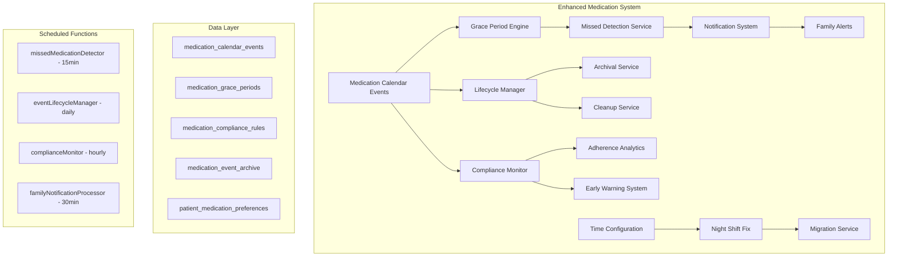

# Medication System Enhancements - Comprehensive Design

## Executive Summary

This document outlines comprehensive enhancements to the KinConnect medication system to address critical gaps in time configuration, missed medication detection, event lifecycle management, grace period configuration, and compliance monitoring.

## Current System Analysis

### Strengths (Already Implemented)
- ✅ Comprehensive status tracking (`scheduled`, `taken`, `missed`, `skipped`, `late`)
- ✅ User interactions (mark taken, snooze, skip, reschedule)
- ✅ Adherence tracking and reporting
- ✅ Time bucket organization
- ✅ PRN medication logging
- ✅ Safety alerts and duplicate detection
- ✅ Family member access control
- ✅ Enhanced medication calendar events with action history

### Critical Issues Identified
1. **Night Shift Time Configuration Bug**: Evening slot incorrectly configured as `01:00-04:00` with `defaultTime: 02:00`
2. **No Automatic Missed Detection**: Events remain `scheduled` indefinitely
3. **No Old Reminder Cleanup**: Events accumulate without lifecycle management
4. **No Grace Period Configuration**: Hard-coded logic with no flexibility
5. **Limited Compliance Monitoring**: No automated alerts or family notifications

## Architecture Overview



---

## 1. Night Shift Time Configuration Fix

### Problem Analysis
- Current night shift evening slot: `01:00-04:00` with `defaultTime: 02:00`
- This causes medications to default to 2 AM instead of appropriate evening times
- Affects both [`shared/types.ts`](shared/types.ts:1635) and [`functions/src/index.ts`](functions/src/index.ts:3450)

### Solution Design

#### Corrected Time Slots
```typescript
night_shift: {
  morning: { start: '14:00', end: '18:00', defaultTime: '15:00', label: 'Morning' },
  noon: { start: '19:00', end: '22:00', defaultTime: '20:00', label: 'Noon' },
  evening: { start: '23:00', end: '02:00', defaultTime: '00:00', label: 'Evening' }, // FIXED
  bedtime: { start: '05:00', end: '08:00', defaultTime: '06:00', label: 'Bedtime' }
}
```

#### Migration Strategy
1. **Detection**: Identify affected patients with night shift preferences and 2 AM medication times
2. **User Notification**: Send email/in-app notification about the fix
3. **Manual Migration**: Provide UI for users to review and approve time changes
4. **Validation**: Ensure no automatic changes without user consent

### Data Structures

#### Migration Tracking
```typescript
interface NightShiftMigration {
  id: string;
  patientId: string;
  detectedAt: Date;
  affectedMedications: Array<{
    medicationId: string;
    medicationName: string;
    currentTimes: string[];
    suggestedTimes: string[];
  }>;
  migrationStatus: 'detected' | 'notified' | 'user_reviewed' | 'completed' | 'declined';
  userNotifiedAt?: Date;
  userReviewedAt?: Date;
  migratedAt?: Date;
  declinedAt?: Date;
  notes?: string;
}
```

---

## 2. Automatic Missed Medication Detection System

### Architecture Design

#### Core Components
1. **Grace Period Engine**: Configurable grace periods per medication/patient
2. **Missed Detection Service**: Scheduled function to identify missed medications
3. **Status Transition Manager**: Handles `scheduled` → `missed` transitions
4. **Notification Dispatcher**: Sends alerts for missed medications

### Grace Period Configuration

#### Enhanced Data Structure
```typescript
interface MedicationGracePeriod {
  id: string;
  patientId: string;
  medicationId?: string; // null = default for patient
  
  // Grace Period Rules
  gracePeriodMinutes: number;
  timeOfDayRules?: Array<{
    timeSlot: 'morning' | 'noon' | 'evening' | 'bedtime';
    gracePeriodMinutes: number;
  }>;
  
  // Medication-Specific Rules
  medicationTypeRules?: Array<{
    medicationType: 'critical' | 'standard' | 'prn' | 'vitamin';
    gracePeriodMinutes: number;
  }>;
  
  // Special Conditions
  weekendGracePeriodMinutes?: number;
  holidayGracePeriodMinutes?: number;
  
  // Metadata
  isActive: boolean;
  createdAt: Date;
  updatedAt: Date;
}
```

#### Default Grace Period Matrix
```typescript
const DEFAULT_GRACE_PERIODS = {
  critical: {
    morning: 15,   // Heart meds, diabetes
    noon: 20,
    evening: 15,
    bedtime: 30
  },
  standard: {
    morning: 30,   // Blood pressure, cholesterol
    noon: 45,
    evening: 30,
    bedtime: 60
  },
  vitamin: {
    morning: 120,  // Vitamins, supplements
    noon: 180,
    evening: 120,
    bedtime: 240
  },
  prn: {
    all: 0         // No grace period for as-needed meds
  }
};
```

### Missed Detection Service

#### Scheduled Function Design
```typescript
// Firebase Function: runs every 15 minutes
export const missedMedicationDetector = functions
  .runWith({
    memory: '256MB',
    timeoutSeconds: 540, // 9 minutes
  })
  .pubsub.schedule('every 15 minutes')
  .onRun(async (context) => {
    const now = new Date();
    const cutoffTime = new Date(now.getTime() - (15 * 60 * 1000)); // 15 minutes ago
    
    // Query for scheduled events that are past their grace period
    const overdueQuery = await firestore.collection('medication_calendar_events')
      .where('status', '==', 'scheduled')
      .where('scheduledDateTime', '<=', admin.firestore.Timestamp.fromDate(cutoffTime))
      .limit(500) // Process in batches
      .get();
    
    const batch = firestore.batch();
    const missedEvents = [];
    
    for (const doc of overdueQuery.docs) {
      const event = doc.data();
      const gracePeriod = await getGracePeriodForEvent(event);
      const gracePeriodEnd = new Date(
        event.scheduledDateTime.toDate().getTime() + (gracePeriod * 60 * 1000)
      );
      
      if (now > gracePeriodEnd) {
        // Mark as missed
        batch.update(doc.ref, {
          status: 'missed',
          missedAt: admin.firestore.Timestamp.now(),
          missedReason: 'automatic_detection',
          updatedAt: admin.firestore.Timestamp.now()
        });
        
        missedEvents.push({
          eventId: doc.id,
          ...event,
          gracePeriodMinutes: gracePeriod
        });
      }
    }
    
    await batch.commit();
    
    // Process notifications for missed medications
    if (missedEvents.length > 0) {
      await processMissedMedicationNotifications(missedEvents);
    }
    
    console.log(`✅ Processed ${missedEvents.length} missed medications`);
  });
```

---

## 3. Medication Event Lifecycle Management

### Archival System Design

#### Data Structures
```typescript
interface MedicationEventArchive {
  id: string;
  originalEventId: string;
  patientId: string;
  medicationId: string;
  
  // Original Event Data (compressed)
  eventData: Partial<MedicationCalendarEvent>;
  
  // Archival Metadata
  archivedAt: Date;
  archivedReason: 'retention_policy' | 'medication_discontinued' | 'manual_archive';
  originalCreatedAt: Date;
  originalUpdatedAt: Date;
  
  // Retention Information
  retentionCategory: 'standard' | 'critical' | 'legal_hold';
  deleteAfter?: Date; // null = permanent retention
  
  // Compliance Data (for analytics)
  finalStatus: 'taken' | 'missed' | 'skipped';
  adherenceImpact: number; // -1 to 1 scale
}
```

#### Lifecycle Manager Function
```typescript
export const eventLifecycleManager = functions
  .runWith({
    memory: '512MB',
    timeoutSeconds: 540,
  })
  .pubsub.schedule('every 24 hours')
  .onRun(async (context) => {
    const now = new Date();
    const archiveThreshold = new Date(now.getTime() - (365 * 24 * 60 * 60 * 1000)); // 365 days ago
    
    // Archive old events
    await archiveOldEvents(archiveThreshold);
    
    // Clean up discontinued medication events
    await cleanupDiscontinuedMedicationEvents();
    
    // Optimize database performance
    await optimizeEventCollections();
  });
```

### Retention Policies
```typescript
const RETENTION_POLICIES = {
  standard: {
    archiveAfterDays: 365,
    deleteAfterDays: 2555, // 7 years for medical records
  },
  critical: {
    archiveAfterDays: 365,
    deleteAfterDays: null, // Never delete critical medication history
  },
  discontinued: {
    archiveAfterDays: 90,
    deleteAfterDays: 1095, // 3 years
  },
  prn: {
    archiveAfterDays: 180,
    deleteAfterDays: 1095, // 3 years
  }
};
```

---

## 4. Enhanced Grace Period Configuration

### Patient-Level Configuration
```typescript
interface PatientMedicationGraceConfig {
  id: string;
  patientId: string;
  
  // Default Grace Periods by Time Slot
  defaultGracePeriods: {
    morning: number;
    noon: number;
    evening: number;
    bedtime: number;
  };
  
  // Medication-Specific Overrides
  medicationOverrides: Array<{
    medicationId: string;
    medicationName: string;
    gracePeriodMinutes: number;
    reason: string;
  }>;
  
  // Condition-Based Rules
  conditionRules: Array<{
    condition: 'diabetes' | 'heart_disease' | 'hypertension' | 'mental_health';
    gracePeriodMinutes: number;
    affectedMedications: string[];
  }>;
  
  // Special Circumstances
  weekendMultiplier: number; // 1.5 = 50% longer grace period on weekends
  holidayMultiplier: number;
  sickDayMultiplier: number;
  
  // Emergency Contacts for Critical Misses
  emergencyNotificationThreshold: number; // minutes after grace period
  emergencyContacts: string[]; // family member IDs
  
  createdAt: Date;
  updatedAt: Date;
}
```

### Grace Period Calculation Engine
```typescript
class GracePeriodEngine {
  async calculateGracePeriod(
    event: MedicationCalendarEvent,
    patientConfig: PatientMedicationGraceConfig,
    currentTime: Date = new Date()
  ): Promise<{
    gracePeriodMinutes: number;
    gracePeriodEnd: Date;
    isWeekend: boolean;
    isHoliday: boolean;
    appliedRules: string[];
  }> {
    const scheduledTime = event.scheduledDateTime;
    const timeSlot = this.getTimeSlot(scheduledTime, patientConfig);
    
    // Start with default grace period for time slot
    let gracePeriod = patientConfig.defaultGracePeriods[timeSlot];
    const appliedRules = [`default_${timeSlot}`];
    
    // Apply medication-specific override
    const medicationOverride = patientConfig.medicationOverrides.find(
      override => override.medicationId === event.medicationId
    );
    if (medicationOverride) {
      gracePeriod = medicationOverride.gracePeriodMinutes;
      appliedRules.push(`medication_override_${medicationOverride.reason}`);
    }
    
    // Apply condition-based rules
    const conditionRule = await this.getApplicableConditionRule(
      event.medicationId,
      patientConfig.conditionRules
    );
    if (conditionRule) {
      gracePeriod = Math.min(gracePeriod, conditionRule.gracePeriodMinutes);
      appliedRules.push(`condition_${conditionRule.condition}`);
    }
    
    // Apply special circumstance multipliers
    const isWeekend = this.isWeekend(currentTime);
    const isHoliday = await this.isHoliday(currentTime);
    
    if (isWeekend) {
      gracePeriod *= patientConfig.weekendMultiplier;
      appliedRules.push('weekend_multiplier');
    }
    
    if (isHoliday) {
      gracePeriod *= patientConfig.holidayMultiplier;
      appliedRules.push('holiday_multiplier');
    }
    
    const gracePeriodEnd = new Date(
      scheduledTime.getTime() + (gracePeriod * 60 * 1000)
    );
    
    return {
      gracePeriodMinutes: Math.round(gracePeriod),
      gracePeriodEnd,
      isWeekend,
      isHoliday,
      appliedRules
    };
  }
}
```

---

## 5. Improved Compliance Monitoring System

### Compliance Analytics Engine
```typescript
interface MedicationComplianceRule {
  id: string;
  patientId: string;
  
  // Rule Configuration
  ruleName: string;
  ruleType: 'adherence_threshold' | 'consecutive_missed' | 'pattern_detection' | 'critical_medication';
  
  // Thresholds
  adherenceThresholdPercent?: number; // e.g., 80%
  consecutiveMissedThreshold?: number; // e.g., 3 doses
  timeWindowDays: number; // evaluation period
  
  // Affected Medications
  medicationIds: string[]; // empty = all medications
  medicationTypes: string[]; // 'critical', 'standard', etc.
  
  // Notification Rules
  notificationRules: {
    notifyPatient: boolean;
    notifyFamily: boolean;
    notifyProvider: boolean;
    escalationDelayHours: number;
    maxNotificationsPerDay: number;
  };
  
  // Actions
  autoActions: Array<{
    actionType: 'create_reminder' | 'schedule_followup' | 'flag_for_review';
    triggerCondition: string;
    actionData: any;
  }>;
  
  isActive: boolean;
  createdAt: Date;
  updatedAt: Date;
}
```

### Compliance Monitoring Service
```typescript
export const complianceMonitor = functions
  .runWith({
    memory: '512MB',
    timeoutSeconds: 540,
  })
  .pubsub.schedule('every 1 hours')
  .onRun(async (context) => {
    console.log('🔍 Starting compliance monitoring sweep...');
    
    // Get all active patients with compliance rules
    const patientsWithRules = await getPatientComplianceRules();
    
    for (const patient of patientsWithRules) {
      await evaluatePatientCompliance(patient);
    }
    
    // Generate weekly compliance reports
    if (isWeeklyReportTime()) {
      await generateWeeklyComplianceReports();
    }
  });

async function evaluatePatientCompliance(patient: {
  patientId: string;
  rules: MedicationComplianceRule[];
}) {
  const now = new Date();
  
  for (const rule of patient.rules) {
    const evaluationStart = new Date(now.getTime() - (rule.timeWindowDays * 24 * 60 * 60 * 1000));
    
    // Get medication events for evaluation period
    const events = await getMedicationEventsForCompliance(
      patient.patientId,
      rule,
      evaluationStart,
      now
    );
    
    // Evaluate rule
    const evaluation = await evaluateComplianceRule(rule, events);
    
    if (evaluation.triggered) {
      await processComplianceViolation(patient.patientId, rule, evaluation);
    }
  }
}
```

### Early Warning System
```typescript
interface ComplianceAlert {
  id: string;
  patientId: string;
  alertType: 'adherence_declining' | 'consecutive_missed' | 'pattern_concern' | 'critical_missed';
  severity: 'info' | 'warning' | 'critical' | 'emergency';
  
  // Alert Details
  title: string;
  description: string;
  affectedMedications: Array<{
    medicationId: string;
    medicationName: string;
    currentAdherenceRate: number;
    missedDoses: number;
    lastTaken?: Date;
  }>;
  
  // Recommendations
  recommendations: string[];
  suggestedActions: Array<{
    actionType: 'contact_patient' | 'adjust_schedule' | 'provider_consultation';
    priority: number;
    description: string;
  }>;
  
  // Notification Status
  notificationsSent: Array<{
    recipientType: 'patient' | 'family' | 'provider';
    recipientId: string;
    sentAt: Date;
    method: 'email' | 'sms' | 'push' | 'in_app';
  }>;
  
  // Resolution
  status: 'active' | 'acknowledged' | 'resolved' | 'escalated';
  acknowledgedBy?: string;
  acknowledgedAt?: Date;
  resolvedAt?: Date;
  resolutionNotes?: string;
  
  createdAt: Date;
  updatedAt: Date;
}
```

---

## 6. Family Notification System Enhancement

### Notification Rules Engine
```typescript
interface FamilyNotificationRule {
  id: string;
  patientId: string;
  familyMemberId: string;
  
  // Notification Triggers
  triggers: {
    missedMedication: {
      enabled: boolean;
      immediateNotification: boolean;
      consecutiveThreshold: number; // notify after N consecutive misses
      criticalMedicationsOnly: boolean;
    };
    adherenceDecline: {
      enabled: boolean;
      thresholdPercent: number; // notify when adherence drops below X%
      evaluationPeriodDays: number;
    };
    medicationChanges: {
      enabled: boolean;
      notifyOnAdd: boolean;
      notifyOnRemove: boolean;
      notifyOnScheduleChange: boolean;
    };
  };
  
  // Notification Preferences
  preferences: {
    methods: Array<'email' | 'sms' | 'push'>;
    quietHours: {
      start: string;
      end: string;
      enabled: boolean;
    };
    frequency: 'immediate' | 'hourly' | 'daily' | 'weekly';
    maxPerDay: number;
  };
  
  // Emergency Escalation
  emergencyEscalation: {
    enabled: boolean;
    criticalMissedThreshold: number; // escalate after N critical misses
    escalationDelayHours: number;
    escalationMethods: Array<'phone' | 'sms' | 'email'>;
  };
  
  isActive: boolean;
  createdAt: Date;
  updatedAt: Date;
}
```

### Notification Processor
```typescript
export const familyNotificationProcessor = functions
  .runWith({
    memory: '256MB',
    timeoutSeconds: 300,
  })
  .pubsub.schedule('every 30 minutes')
  .onRun(async (context) => {
    // Process pending notifications
    await processPendingNotifications();
    
    // Check for escalation conditions
    await checkEmergencyEscalations();
    
    // Send digest notifications
    await sendDigestNotifications();
  });
```

---

## 7. API Endpoints Design

### New Endpoints

#### Grace Period Management
```typescript
// Get grace period configuration
GET /api/patients/grace-periods
GET /api/patients/grace-periods/:medicationId

// Update grace period configuration
PUT /api/patients/grace-periods
POST /api/patients/grace-periods/medication/:medicationId

// Reset to defaults
POST /api/patients/grace-periods/reset-defaults
```

#### Missed Medication Management
```typescript
// Get missed medications
GET /api/medication-calendar/missed
GET /api/medication-calendar/missed/:patientId

// Manual missed detection trigger
POST /api/medication-calendar/detect-missed

// Mark medication as missed manually
POST /api/medication-calendar/events/:eventId/mark-missed
```

#### Compliance Monitoring
```typescript
// Get compliance rules
GET /api/patients/compliance-rules
POST /api/patients/compliance-rules
PUT /api/patients/compliance-rules/:ruleId
DELETE /api/patients/compliance-rules/:ruleId

// Get compliance alerts
GET /api/patients/compliance-alerts
POST /api/patients/compliance-alerts/:alertId/acknowledge
POST /api/patients/compliance-alerts/:alertId/resolve

// Get compliance reports
GET /api/patients/compliance-reports/weekly
GET /api/patients/compliance-reports/monthly
```

#### Family Notifications
```typescript
// Get notification rules
GET /api/family/notification-rules/:familyMemberId
PUT /api/family/notification-rules/:familyMemberId

// Get notification history
GET /api/family/notifications
GET /api/family/notifications/:patientId

// Notification preferences
POST /api/family/notifications/test
POST /api/family/notifications/unsubscribe/:token
```

#### Night Shift Migration
```typescript
// Detect migration needs
GET /api/patients/night-shift-migration/detect
POST /api/patients/night-shift-migration/preview

// Execute migration
POST /api/patients/night-shift-migration/execute
POST /api/patients/night-shift-migration/decline
```

---

## 8. Database Schema Enhancements

### New Collections

#### medication_grace_periods
```typescript
{
  id: string,
  patientId: string,
  medicationId?: string, // null = patient default
  gracePeriodMinutes: number,
  timeOfDayRules?: Array<{
    timeSlot: 'morning' | 'noon' | 'evening' | 'bedtime',
    gracePeriodMinutes: number
  }>,
  medicationTypeRules?: Array<{
    medicationType: 'critical' | 'standard' | 'prn' | 'vitamin',
    gracePeriodMinutes: number
  }>,
  weekendMultiplier: number,
  holidayMultiplier: number,
  isActive: boolean,
  createdAt: Timestamp,
  updatedAt: Timestamp
}
```

#### medication_compliance_rules
```typescript
{
  id: string,
  patientId: string,
  ruleName: string,
  ruleType: 'adherence_threshold' | 'consecutive_missed' | 'pattern_detection',
  adherenceThresholdPercent?: number,
  consecutiveMissedThreshold?: number,
  timeWindowDays: number,
  medicationIds: string[],
  medicationTypes: string[],
  notificationRules: {
    notifyPatient: boolean,
    notifyFamily: boolean,
    notifyProvider: boolean,
    escalationDelayHours: number,
    maxNotificationsPerDay: number
  },
  autoActions: Array<{
    actionType: string,
    triggerCondition: string,
    actionData: any
  }>,
  isActive: boolean,
  createdAt: Timestamp,
  updatedAt: Timestamp
}
```

#### medication_event_archive
```typescript
{
  id: string,
  originalEventId: string,
  patientId: string,
  medicationId: string,
  eventData: any, // Compressed original event data
  archivedAt: Timestamp,
  archivedReason: string,
  originalCreatedAt: Timestamp,
  originalUpdatedAt: Timestamp,
  retentionCategory: string,
  deleteAfter?: Timestamp,
  finalStatus: string,
  adherenceImpact: number
}
```

#### family_notification_rules
```typescript
{
  id: string,
  patientId: string,
  familyMemberId: string,
  triggers: {
    missedMedication: {
      enabled: boolean,
      immediateNotification: boolean,
      consecutiveThreshold: number,
      criticalMedicationsOnly: boolean
    },
    adherenceDecline: {
      enabled: boolean,
      thresholdPercent: number,
      evaluationPeriodDays: number
    }
  },
  preferences: {
    methods: string[],
    quietHours: {
      start: string,
      end: string,
      enabled: boolean
    },
    frequency: string,
    maxPerDay: number
  },
  emergencyEscalation: {
    enabled: boolean,
    criticalMissedThreshold: number,
    escalationDelayHours: number,
    escalationMethods: string[]
  },
  isActive: boolean,
  createdAt: Timestamp,
  updatedAt: Timestamp
}
```

#### night_shift_migrations
```typescript
{
  id: string,
  patientId: string,
  detectedAt: Timestamp,
  affectedMedications: Array<{
    medicationId: string,
    medicationName: string,
    currentTimes: string[],
    suggestedTimes: string[]
  }>,
  migrationStatus: 'detected' | 'notified' | 'user_reviewed' | 'completed' | 'declined',
  userNotifiedAt?: Timestamp,
  userReviewedAt?: Timestamp,
  migratedAt?: Timestamp,
  declinedAt?: Timestamp,
  notes?: string,
  createdAt: Timestamp,
  updatedAt: Timestamp
}
```

### Enhanced Existing Collections

#### medication_calendar_events (additions)
```typescript
{
  // ... existing fields ...
  
  // Grace Period Tracking
  gracePeriodMinutes?: number,
  gracePeriodEnd?: Timestamp,
  gracePeriodRules?: string[], // Applied rules for audit
  
  // Missed Detection
  missedAt?: Timestamp,
  missedReason?: 'automatic_detection' | 'manual_mark' | 'family_report',
  missedDetectionAttempts?: number,
  
  // Compliance Impact
  adherenceImpact?: number, // -1 to 1 scale
  complianceFlags?: string[],
  
  // Archival Status
  archivalEligibleAt?: Timestamp,
  archivalStatus?: 'eligible' | 'archived' | 'retained',
}
```

---

## 9. Implementation Strategy

### Phase 1: Foundation (Week 1-2)
1. **Night Shift Time Configuration Fix**
   - Update [`shared/types.ts`](shared/types.ts:1635) with corrected time slots
   - Update [`functions/src/index.ts`](functions/src/index.ts:3450) server-side defaults
   - Create migration detection service
   - Build user notification system

2. **Grace Period Infrastructure**
   - Create `medication_grace_periods` collection
   - Implement `GracePeriodEngine` class
   - Add grace period configuration API endpoints
   - Update existing medication event handling

### Phase 2: Missed Detection (Week 3-4)
1. **Missed Detection Service**
   - Implement `missedMedicationDetector` scheduled function
   - Create status transition logic
   - Add missed medication API endpoints
   - Integrate with existing event handling

2. **Basic Compliance Rules**
   - Create `medication_compliance_rules` collection
   - Implement basic adherence threshold monitoring
   - Add consecutive missed dose detection

### Phase 3: Advanced Features (Week 5-6)
1. **Lifecycle Management**
   - Implement `eventLifecycleManager` scheduled function
   - Create archival system
   - Add cleanup services
   - Performance optimization

2. **Enhanced Notifications**
   - Create `family_notification_rules` collection
   - Implement notification processor
   - Add emergency escalation
   - Build notification preferences UI

### Phase 4: Integration & Testing (Week 7-8)
1. **Frontend Integration**
   - Update medication calendar components
   - Add grace period configuration UI
   - Implement compliance dashboard
   - Add family notification settings

2. **Testing & Optimization**
   - Comprehensive testing of all new features
   - Performance optimization
   - Security audit
   - Documentation completion

---

## 10. Migration Strategy

### Night Shift Time Configuration Migration

#### Detection Algorithm
```typescript
async function detectNightShiftMigrationNeeds(): Promise<NightShiftMigration[]> {
  const migrations: NightShiftMigration[] = [];
  
  // Find patients with night shift preferences
  const nightShiftPatients = await firestore.collection('patient_medication_preferences')
    .where('workSchedule', '==', 'night_shift')
    .get();
  
  for (const patientDoc of nightShiftPatients.docs) {
    const patientData = patientDoc.data();
    const patientId = patientDoc.id;
    
    // Check for medications scheduled at 2 AM (the problematic time)
    const problematicEvents = await firestore.collection('medication_calendar_events')
      .where('patientId', '==', patientId)
      .where('status', '==', 'scheduled')
      .get();
    
    const affectedMedications = [];
    
    for (const eventDoc of problematicEvents.docs) {
      const event = eventDoc.data();
      const scheduledTime = event.scheduledDateTime.toDate();
      
      // Check if scheduled at 2 AM (the bug time)
      if (scheduledTime.getHours() === 2 && scheduledTime.getMinutes() === 0) {
        const medicationId = event.medicationId;
        
        if (!affectedMedications.find(m => m.medicationId === medicationId)) {
          affectedMedications.push({
            medicationId,
            medicationName: event.medicationName,
            currentTimes: ['02:00'],
            suggestedTimes: ['00:00'] // Midnight instead of 2 AM
          });
        }
      }
    }
    
    if (affectedMedications.length > 0) {
      migrations.push({
        id: `migration_${patientId}_${Date.now()}`,
        patientId,
        detectedAt: new Date(),
        affectedMedications,
        migrationStatus: 'detected'
      });
    }
  }
  
  return migrations;
}
```

### Data Migration Process
1. **Detection Phase**: Identify affected patients and medications
2. **Notification Phase**: Send email/in-app notifications to affected users
3. **Review Phase**: Allow users to review and approve changes
4. **Execution Phase**: Apply approved changes with full audit trail
5. **Verification Phase**: Confirm successful migration and user satisfaction

---

## 11. Security Considerations

### Access Control
- Grace period configuration: Patient and authorized family members only
- Compliance rules: Patient-controlled with family view permissions
- Missed medication data: Follows existing family access patterns
- Migration data: Patient-only access for approval decisions

### Data Privacy
- Compliance alerts: Configurable detail levels for family members
- Notification content: Sanitized based on family member permissions
- Archival data: Encrypted and access-logged
- Migration data: Temporary storage with automatic cleanup

### Audit Trail
- All grace period changes logged with user attribution
- Compliance rule modifications tracked
- Missed medication detection events recorded
- Family notification delivery confirmations stored

---

## 12. Performance Considerations

### Scheduled Function Optimization
- **Batch Processing**: Process events in batches of 500
- **Intelligent Querying**: Use composite indexes for efficient queries
- **Caching**: Cache grace period configurations and compliance rules
- **Error Handling**: Robust retry logic with exponential backoff

### Database Optimization
- **Indexes**: Add composite indexes for missed detection queries
- **Partitioning**: Consider date-based partitioning for large event collections
- **Cleanup**: Regular cleanup of processed notifications and temporary data
- **Monitoring**: Track query performance and optimize as needed

### Frontend Performance
- **Lazy Loading**: Load compliance data on-demand
- **Caching**: Cache grace period settings and notification preferences
- **Real-time Updates**: Use Firebase listeners for immediate UI updates
- **Debouncing**: Prevent excessive API calls during user interactions

---

## 13. Monitoring and Alerting

### System Health Metrics
- Missed detection accuracy rate
- Grace period calculation performance
- Notification delivery success rate
- Compliance rule evaluation time
- Migration completion rate

### Business Metrics
- Patient adherence improvement
- Family engagement with notifications
- Medication timing accuracy
- User satisfaction with new features
- Support ticket reduction

### Alerting Thresholds
- Missed detection failures > 5%
- Notification delivery failures > 10%
- Grace period calculation errors > 1%
- Compliance rule evaluation timeouts > 2%

---

## 14. Testing Strategy

### Unit Testing
- Grace period calculation engine
- Missed detection logic
- Compliance rule evaluation
- Notification rule processing
- Migration detection algorithms

### Integration Testing
- End-to-end medication lifecycle
- Family notification workflows
- Grace period configuration changes
- Compliance alert generation
- Migration execution process

### Performance Testing
- Scheduled function execution under load
- Database query performance with large datasets
- Notification system throughput
- Frontend responsiveness with new features

### User Acceptance Testing
- Night shift worker medication scheduling
- Family member notification preferences
- Compliance monitoring dashboard
- Grace period customization interface
- Migration approval workflow

---

## 15. Rollout Plan

### Phase 1: Infrastructure (Week 1-2)
- Deploy new database collections
- Implement grace period engine
- Add basic missed detection
- Create migration detection service

### Phase 2: Core Features (Week 3-4)
- Enable automatic missed detection
- Launch compliance monitoring
- Deploy family notification system
- Release night shift migration tool

### Phase 3: Advanced Features (Week 5-6)
- Advanced compliance rules
- Emergency escalation system
- Comprehensive reporting
- Performance optimizations

### Phase 4: Full Deployment (Week 7-8)
- Complete frontend integration
- User training and documentation
- Performance monitoring
- Feedback collection and iteration

---

## 16. Success Metrics

### Technical Metrics
- 99.9% uptime for scheduled functions
- < 100ms average grace period calculation time
- < 5% false positive rate for missed detection
- 95% notification delivery success rate

### User Experience Metrics
- 90% user satisfaction with new features
- 50% reduction in manual medication tracking
- 30% improvement in medication adherence
- 80% family member engagement with notifications

### Business Metrics
- 25% reduction in medication-related support tickets
- 40% increase in family member app usage
- 60% improvement in medication compliance reporting
- 90% successful migration completion rate

This comprehensive design addresses all identified gaps while leveraging existing system strengths and maintaining backward compatibility.