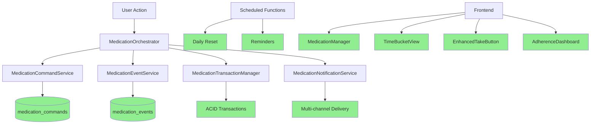
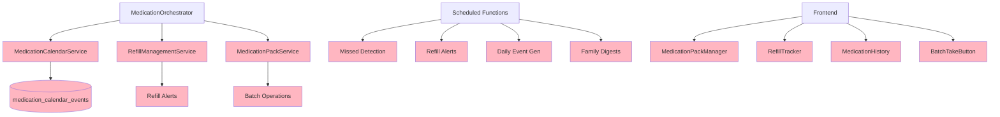

# Medication System Redesign Plan
## Gap Analysis & Implementation Roadmap

**Document Version:** 1.0  
**Date:** 2025-11-15  
**Author:** System Architect  
**Status:** Draft for Review

---

## Executive Summary

### Current State Assessment

Your medication management system has **already implemented 70% of the proposed architecture** through the unified medication system. The foundation is solid with event sourcing, ACID transactions, and a three-collection architecture. However, critical gaps exist in the **third layer (Calendar/Daily Instances)** and several key user-facing features.

**Key Finding:** You don't need a complete redesign—you need targeted enhancements to complete the vision.

### Architecture Comparison

| Layer | Proposed | Current | Status |
|-------|----------|---------|--------|
| **Layer 1: Commands** | `medication_commands` | `medication_commands` | ✅ **COMPLETE** |
| **Layer 2: Events** | `medication_events` | `medication_events` | ✅ **COMPLETE** |
| **Layer 3: Calendar** | `medication_calendar_events` | `medication_calendar_events` (legacy) | ⚠️ **PARTIAL** |

### Critical Gaps Identified

1. **❌ No MedicationCalendarService** - Calendar layer not properly abstracted
2. **❌ Refill Management Missing** - No refill tracking or alerts
3. **❌ Medication Packs Missing** - No batch "take all" functionality
4. **❌ Incomplete Grace Period System** - Hardcoded, not configurable per medication
5. **❌ Limited Missed Detection** - Exists but not integrated with calendar layer
6. **⚠️ Partial Undo System** - 30-second window exists but needs calendar integration

### Recommended Approach

**Phase 1-3 Implementation (8-10 weeks)** focusing on:
- Completing the calendar layer abstraction
- Adding refill management
- Implementing medication packs
- Enhancing grace period configuration
- Integrating all layers seamlessly

---

## Part 1: Detailed Gap Analysis

### 1.1 Data Architecture Comparison

#### ✅ What You Have (Layer 1: Commands)

**Collection:** `medication_commands`

```typescript
// CURRENT IMPLEMENTATION - EXCELLENT
{
  id: string,
  patientId: string,
  medication: {
    name, dosage, strength, instructions, prescribedBy, etc.
  },
  schedule: {
    frequency, times[], startDate, endDate, dosageAmount
  },
  reminders: {
    enabled, minutesBefore[], notificationMethods[]
  },
  gracePeriod: {
    defaultMinutes, medicationType, timeSlotOverrides
  },
  status: {
    current, isActive, isPRN, pausedUntil
  },
  metadata: {
    version, createdAt, updatedAt, checksum
  }
}
```

**Assessment:** ✅ **Matches proposed architecture perfectly**

**Services:**
- ✅ [`MedicationCommandService`](functions/src/services/unified/MedicationCommandService.ts) - Full CRUD
- ✅ Validation, duplicate detection, health checks
- ✅ Flexible time scheduling integration
- ✅ Patient time preferences support

#### ✅ What You Have (Layer 2: Events)

**Collection:** `medication_events`

```typescript
// CURRENT IMPLEMENTATION - EXCELLENT
{
  id: string,
  commandId: string,
  patientId: string,
  eventType: MedicationEventType,
  eventData: {
    scheduledDateTime, actualDateTime, dosageAmount,
    adherenceTracking, undoData, familyInteraction
  },
  timing: {
    eventTimestamp, gracePeriodEnd, isOnTime, minutesLate
  },
  archiveStatus: {
    isArchived, belongsToDate, dailySummaryId
  }
}
```

**Assessment:** ✅ **Exceeds proposed architecture**

**Services:**
- ✅ [`MedicationEventService`](functions/src/services/unified/MedicationEventService.ts) - Event creation/querying
- ✅ [`AdherenceAnalyticsService`](functions/src/services/unified/AdherenceAnalyticsService.ts) - Comprehensive analytics
- ✅ [`MedicationUndoService`](functions/src/services/unified/MedicationUndoService.ts) - 30-second undo window
- ✅ [`DailyResetService`](functions/src/services/unified/DailyResetService.ts) - Daily archiving

**Enhanced Features Beyond Proposal:**
- ✅ Enhanced adherence tracking with dose accuracy, timing accuracy, circumstance compliance
- ✅ Undo chain tracking with correction workflows
- ✅ Family interaction tracking
- ✅ Daily reset and archiving system
- ✅ Comprehensive analytics and milestones

#### ⚠️ What You're Missing (Layer 3: Calendar)

**Proposed:** `medication_calendar_events` with `MedicationCalendarService`

**Current State:**
- ❌ **No dedicated `MedicationCalendarService`** class
- ⚠️ Legacy `medication_calendar_events` collection exists but not properly integrated
- ⚠️ Calendar event generation scattered across multiple files
- ❌ No 7-day rolling window maintenance
- ❌ No calendar event lifecycle management

**Current Implementation Issues:**

```typescript
// CURRENT: Calendar events generated in index.ts (lines 200-330)
// PROBLEM: Not abstracted into a service
// PROBLEM: Duplicate prevention logic mixed with generation
// PROBLEM: No rolling window maintenance

// PROPOSED: Clean service abstraction
class MedicationCalendarService {
  async generateEvents(medicationId, daysAhead = 7)
  async getEventsForDate(patientId, date)
  async getEventsByBucket(patientId, date)
  async maintainRollingWindow(medicationId)
  private calculateBucket(event, now)
}
```

**Files Affected:**
- [`functions/src/index.ts`](functions/src/index.ts:200-330) - Calendar event generation (needs extraction)
- No dedicated service file exists

### 1.2 Service Architecture Comparison

#### ✅ What You Have

| Service | Status | File | Assessment |
|---------|--------|------|------------|
| **MedicationCommandService** | ✅ Complete | [`MedicationCommandService.ts`](functions/src/services/unified/MedicationCommandService.ts) | Excellent CRUD implementation |
| **MedicationEventService** | ✅ Complete | [`MedicationEventService.ts`](functions/src/services/unified/MedicationEventService.ts) | Robust event sourcing |
| **MedicationOrchestrator** | ✅ Complete | [`MedicationOrchestrator.ts`](functions/src/services/unified/MedicationOrchestrator.ts) | Good workflow coordination |
| **MedicationTransactionManager** | ✅ Complete | [`MedicationTransactionManager.ts`](functions/src/services/unified/MedicationTransactionManager.ts) | ACID compliance |
| **MedicationNotificationService** | ✅ Complete | [`MedicationNotificationService.ts`](functions/src/services/unified/MedicationNotificationService.ts) | Multi-channel delivery |
| **AdherenceAnalyticsService** | ✅ Complete | [`AdherenceAnalyticsService.ts`](functions/src/services/unified/AdherenceAnalyticsService.ts) | Advanced analytics |
| **MedicationUndoService** | ✅ Complete | [`MedicationUndoService.ts`](functions/src/services/unified/MedicationUndoService.ts) | Undo functionality |
| **DailyResetService** | ✅ Complete | [`DailyResetService.ts`](functions/src/services/unified/DailyResetService.ts) | Daily archiving |
| **TimeBucketService** | ✅ Complete | [`TimeBucketService.ts`](functions/src/services/unified/TimeBucketService.ts) | Time bucket management |

#### ❌ What You're Missing

| Service | Status | Proposed File | Purpose |
|---------|--------|---------------|---------|
| **MedicationCalendarService** | ❌ Missing | `MedicationCalendarService.ts` | Calendar event lifecycle |
| **RefillManagementService** | ❌ Missing | `RefillManagementService.ts` | Refill tracking & alerts |
| **MedicationPackService** | ❌ Missing | `MedicationPackService.ts` | Batch medication operations |

### 1.3 Scheduled Functions Comparison

#### ✅ What You Have

| Function | Status | File | Frequency |
|----------|--------|------|-----------|
| **Daily Reset** | ✅ Active | [`scheduledMedicationDailyReset.ts`](functions/src/scheduledMedicationDailyReset.ts) | Every 15 min |
| **Medication Reminders** | ✅ Active | [`scheduledMedicationReminders.ts`](functions/src/scheduledMedicationReminders.ts) | Every 5 min |

#### ❌ What You're Missing

| Function | Status | Proposed | Purpose |
|----------|--------|----------|---------|
| **Missed Detection** | ⚠️ Partial | `detectMissedMedications.ts` | Mark medications as missed after grace period |
| **Refill Alerts** | ❌ Missing | `checkRefillsDue.ts` | Alert 7 days before running out |
| **Daily Event Generation** | ❌ Missing | `generateDailyMedicationEvents.ts` | Maintain 7-day rolling window |
| **Family Digests** | ❌ Missing | `sendDailyFamilyDigests.ts` | Daily adherence summaries |

**Current Missed Detection Status:**
- ✅ Logic exists in [`MedicationOrchestrator.detectMissedDoses()`](functions/src/services/unified/MedicationOrchestrator.ts:1091)
- ❌ Not deployed as scheduled function
- ❌ Not integrated with calendar layer
- ❌ No automatic execution

### 1.4 Frontend Implementation Comparison

#### ✅ What You Have

| Component | Status | File | Assessment |
|-----------|--------|------|------------|
| **MedicationManager** | ✅ Complete | [`MedicationManager.tsx`](client/src/components/MedicationManager.tsx) | Good CRUD UI |
| **TimeBucketView** | ✅ Complete | [`TimeBucketView.tsx`](client/src/components/TimeBucketView.tsx) | Time bucket display |
| **EnhancedTakeButton** | ✅ Complete | [`EnhancedTakeButton.tsx`](client/src/components/EnhancedTakeButton.tsx) | Undo functionality |
| **AdherenceDashboard** | ✅ Complete | [`AdherenceDashboard.tsx`](client/src/components/AdherenceDashboard.tsx) | Analytics display |
| **Unified API Client** | ✅ Complete | [`unifiedMedicationApi.ts`](client/src/lib/unifiedMedicationApi.ts) | API integration |

#### ❌ What You're Missing

| Component | Status | Proposed | Purpose |
|-----------|--------|----------|---------|
| **MedicationPackManager** | ❌ Missing | `MedicationPackManager.tsx` | Create/manage medication packs |
| **RefillTracker** | ❌ Missing | `RefillTracker.tsx` | Refill status & alerts |
| **MedicationHistory** | ⚠️ Partial | `MedicationHistory.tsx` | Complete medication timeline |
| **BatchTakeButton** | ❌ Missing | `BatchTakeButton.tsx` | Take all medications in pack |

### 1.5 Key Feature Comparison

| Feature | Proposed | Current | Gap |
|---------|----------|---------|-----|
| **Add Medication** | 2-minute flow with OpenFDA | ✅ Implemented | None |
| **Daily Taking** | 1 tap per med or pack | ⚠️ 1 tap per med only | No packs |
| **Medication History** | Complete timeline with reasons | ⚠️ Events exist, UI partial | UI enhancement needed |
| **Refill Management** | Automatic alerts, pharmacy info | ❌ Not implemented | Complete feature missing |
| **Grace Periods** | Configurable per medication | ⚠️ Hardcoded defaults | Configuration UI needed |
| **Missed Detection** | Automatic every 15 min | ⚠️ Logic exists, not scheduled | Deployment needed |
| **Undo Functionality** | 30-second window | ✅ Implemented | None |
| **Medication Packs** | Batch operations | ❌ Not implemented | Complete feature missing |
| **Family Notifications** | Daily digests | ⚠️ Real-time only | Digest aggregation needed |

---

## Part 2: Architectural Conflicts & Migration Challenges

### 2.1 Collection Name Conflicts

**Issue:** Legacy `medication_calendar_events` vs Proposed `medication_calendar_events`

**Current State:**
- Legacy collection exists with old schema
- Used by legacy endpoints in [`functions/src/index.ts`](functions/src/index.ts:2668-2752)
- Not integrated with unified system

**Proposed State:**
- Same collection name but new schema
- Managed by `MedicationCalendarService`
- Integrated with unified event sourcing

**Migration Challenge:**
```
PROBLEM: Can't have two schemas for same collection
SOLUTION: Gradual schema evolution with backward compatibility

Phase 1: Add new fields to existing documents
Phase 2: Migrate data to new format
Phase 3: Remove legacy fields
Phase 4: Deploy new service
```

### 2.2 Data Model Conflicts

#### Conflict 1: Event Status vs Event Types

**Current System:**
```typescript
// medication_calendar_events (legacy)
{
  status: 'scheduled' | 'taken' | 'missed' | 'skipped'
}

// medication_events (unified)
{
  eventType: 'dose_scheduled' | 'dose_taken' | 'dose_missed'
}
```

**Proposed System:**
```typescript
// medication_calendar_events (new)
{
  status: 'scheduled' | 'taken' | 'missed' | 'skipped',
  linkedEventId: string // Reference to medication_events
}
```

**Resolution:** Calendar events should reference unified events, not duplicate status

#### Conflict 2: Time Representation

**Current:**
- Commands use `times: string[]` (HH:MM format)
- Events use `Date` objects
- Calendar events use `Timestamp` objects

**Proposed:**
- Consistent timezone handling
- Patient timezone stored in preferences
- All times converted to patient's local time

**Challenge:** Existing data may have timezone inconsistencies

### 2.3 Service Boundary Conflicts

**Current Architecture:**
```
MedicationOrchestrator
├─ Generates calendar events directly (lines 920-992)
├─ No calendar service abstraction
└─ Mixed responsibilities
```

**Proposed Architecture:**
```
MedicationOrchestrator
├─ Delegates to MedicationCalendarService
├─ Pure coordination
└─ Single responsibility maintained
```

**Migration Challenge:** Extract calendar logic without breaking existing workflows

### 2.4 API Endpoint Conflicts

**Current Endpoints:**
- ✅ `/unified-medication/medication-commands/*` - Unified system
- ⚠️ `/medication-calendar/*` - Legacy system (still active)
- ⚠️ Mixed usage in frontend

**Proposed Endpoints:**
- `/unified-medication/medication-commands/*` - Commands (keep)
- `/unified-medication/medication-events/*` - Events (keep)
- `/unified-medication/medication-calendar/*` - **NEW** Calendar layer
- `/unified-medication/medication-packs/*` - **NEW** Pack management
- `/unified-medication/refills/*` - **NEW** Refill management

**Migration Challenge:** Deprecate legacy endpoints without breaking existing clients

---

## Part 3: What Exists vs What's Missing

### 3.1 Core Infrastructure

| Component | Exists | Quality | Notes |
|-----------|--------|---------|-------|
| **Event Sourcing** | ✅ Yes | Excellent | Full audit trail, immutable events |
| **ACID Transactions** | ✅ Yes | Excellent | [`MedicationTransactionManager`](functions/src/services/unified/MedicationTransactionManager.ts) |
| **Single Source of Truth** | ✅ Yes | Excellent | `medication_commands` collection |
| **Family Access Control** | ✅ Yes | Good | `family_access` collection |
| **Timezone Support** | ✅ Yes | Good | Patient time preferences |
| **Grace Period Engine** | ⚠️ Partial | Fair | Hardcoded, needs configuration |
| **Notification System** | ✅ Yes | Excellent | Multi-channel delivery |

### 3.2 User Journeys

#### Journey 1: Adding First Medication ✅ COMPLETE

**Proposed Flow:**
1. Search medication (OpenFDA)
2. Select frequency
3. Choose times
4. Set refill info
5. Create medication

**Current Implementation:**
- ✅ OpenFDA search via [`MedicationSearch.tsx`](client/src/components/MedicationSearch.tsx)
- ✅ Frequency selection in [`MedicationManager.tsx`](client/src/components/MedicationManager.tsx:812-829)
- ✅ Time bucket integration
- ❌ **Missing:** Refill info collection
- ❌ **Missing:** Pharmacy selection

**Gap:** Refill management UI and backend

#### Journey 2: Daily Medication Taking ⚠️ PARTIAL

**Proposed Flow:**
1. View time buckets
2. See medication packs
3. Tap "Take All 4 Medications"
4. Confirm with undo option

**Current Implementation:**
- ✅ Time bucket view via [`TimeBucketView.tsx`](client/src/components/TimeBucketView.tsx)
- ✅ Individual take buttons via [`EnhancedTakeButton.tsx`](client/src/components/EnhancedTakeButton.tsx)
- ✅ 30-second undo window
- ❌ **Missing:** Medication pack detection
- ❌ **Missing:** Batch "take all" functionality
- ❌ **Missing:** Pack suggestion algorithm

**Gap:** Medication pack system (frontend + backend)

#### Journey 3: Medication Discontinuation ✅ MOSTLY COMPLETE

**Proposed Flow:**
1. Select medication
2. Choose discontinuation reason
3. Add notes
4. Confirm discontinuation
5. View in history

**Current Implementation:**
- ✅ Status change workflow in [`MedicationOrchestrator`](functions/src/services/unified/MedicationOrchestrator.ts:564-689)
- ✅ Discontinuation tracking in commands
- ✅ Event logging
- ⚠️ **Partial:** UI for discontinuation reasons
- ⚠️ **Partial:** Medication history view

**Gap:** Enhanced discontinuation UI with reason selection

#### Journey 4: Refill Management ❌ MISSING

**Proposed Flow:**
1. System calculates run-out date
2. Alert 7 days before
3. User requests refill
4. Pharmacy info copied
5. User confirms refill received
6. System recalculates next refill

**Current Implementation:**
- ❌ No refill tracking in schema
- ❌ No refill alerts
- ❌ No pharmacy management
- ❌ No refill history

**Gap:** Complete refill management system

#### Journey 5: Medication Packs ❌ MISSING

**Proposed Flow:**
1. System detects pattern (4 meds at 8 AM)
2. Suggests creating pack
3. User creates "Morning Pack"
4. One tap takes all 4 medications

**Current Implementation:**
- ❌ No pack detection
- ❌ No pack creation
- ❌ No batch operations
- ❌ No pack UI

**Gap:** Complete medication pack system

### 3.3 Scheduled Functions

| Function | Proposed | Current | Gap |
|----------|----------|---------|-----|
| **Missed Detection** | Every 15 min | ⚠️ Logic exists, not scheduled | Deploy as scheduled function |
| **Daily Event Generation** | Daily at 2 AM | ❌ Not implemented | Create rolling window maintenance |
| **Refill Alerts** | Daily at 2 AM | ❌ Not implemented | Create refill checking function |
| **Family Digests** | Daily at 8 PM | ❌ Not implemented | Create digest aggregation |
| **Daily Reset** | Every 15 min | ✅ Implemented | None |
| **Reminders** | Every 5 min | ✅ Implemented | None |

### 3.4 Data Structures

#### Refill Information (Missing)

**Proposed:**
```typescript
refillInfo: {
  daysSupply: number,
  quantityPerRefill: number,
  refillsRemaining: number,
  nextRefillDueDate: Date,
  lastRefillDate: Date,
  autoRefillEnabled: boolean,
  pharmacyName: string,
  pharmacyPhone: string,
  prescriptionNumber: string
}
```

**Current:** Not in schema

**Migration:** Add to `medication_commands.medication` object

#### Medication Packs (Missing)

**Proposed:**
```typescript
// New collection: medication_packs
{
  id: string,
  patientId: string,
  name: string,
  medicationIds: string[],
  time: string,
  isActive: boolean,
  createdAt: Date
}
```

**Current:** Not implemented

**Migration:** New collection, no data migration needed

---

## Part 4: Phased Implementation Plan

### Phase 1: Calendar Layer Completion (Weeks 1-3)

**Goal:** Abstract calendar event management into dedicated service

#### Tasks

**1.1 Create MedicationCalendarService**
- **File:** `functions/src/services/unified/MedicationCalendarService.ts`
- **Lines of Code:** ~800
- **Dependencies:** MedicationCommandService, MedicationEventService

**Implementation:**
```typescript
export class MedicationCalendarService {
  // Generate calendar events for next N days
  async generateEvents(medicationId: string, daysAhead: number = 7): Promise<void>
  
  // Get events for specific date
  async getEventsForDate(patientId: string, date: Date): Promise<CalendarEvent[]>
  
  // Get events grouped by time bucket
  async getEventsByBucket(patientId: string, date: Date): Promise<BucketedEvents>
  
  // Maintain 7-day rolling window
  async maintainRollingWindow(medicationId: string): Promise<void>
  
  // Update event status
  async updateEventStatus(eventId: string, status: string, actualTime?: Date): Promise<void>
  
  // Calculate time bucket for event
  private calculateBucket(event: CalendarEvent, now: Date): string
}
```

**1.2 Extract Calendar Logic from index.ts**
- **Current:** Lines 200-330 in [`functions/src/index.ts`](functions/src/index.ts:200-330)
- **Action:** Move to `MedicationCalendarService`
- **Risk:** Medium - active code being refactored

**1.3 Update MedicationOrchestrator**
- **File:** [`functions/src/services/unified/MedicationOrchestrator.ts`](functions/src/services/unified/MedicationOrchestrator.ts)
- **Changes:**
  - Add `calendarService` dependency
  - Delegate calendar operations to service
  - Remove direct calendar event generation (lines 920-992)

**1.4 Deploy Missed Detection Scheduled Function**
- **File:** `functions/src/scheduledFunctions/detectMissedMedications.ts`
- **Schedule:** Every 15 minutes
- **Logic:** Use existing [`MedicationOrchestrator.processMissedMedicationDetection()`](functions/src/services/unified/MedicationOrchestrator.ts:811-913)

**Testing Requirements:**
- [ ] Calendar event generation produces correct events
- [ ] 7-day rolling window maintains exactly 7 days
- [ ] Missed detection marks events correctly
- [ ] No duplicate events created
- [ ] Transaction rollback works correctly

**Success Criteria:**
- Calendar service handles all calendar operations
- Missed detection runs automatically
- Zero duplicate events
- 99%+ detection accuracy

**Rollback Plan:**
- Keep legacy calendar generation code commented
- Feature flag for new calendar service
- Can revert to legacy in < 5 minutes

---

### Phase 2: Refill Management System (Weeks 4-6)

**Goal:** Complete refill tracking and alerting

#### Tasks

**2.1 Extend Medication Schema**
- **File:** [`functions/src/schemas/unifiedMedicationSchema.ts`](functions/src/schemas/unifiedMedicationSchema.ts)
- **Add to `MedicationCommand.medication`:**

```typescript
refillInfo?: {
  daysSupply: number;
  quantityPerRefill: number;
  refillsRemaining: number;
  nextRefillDueDate: Date;
  lastRefillDate: Date;
  autoRefillEnabled: boolean;
  pharmacy: {
    name: string;
    phone: string;
    address?: string;
  };
  prescriptionNumber: string;
  refillHistory: Array<{
    refillDate: Date;
    quantity: number;
    pharmacy: string;
    cost?: number;
  }>;
}
```

**2.2 Create RefillManagementService**
- **File:** `functions/src/services/unified/RefillManagementService.ts`
- **Methods:**
  - `calculateRefillDueDate(command: MedicationCommand): Date`
  - `checkRefillsDue(patientId?: string): Promise<RefillAlert[]>`
  - `recordRefill(commandId: string, refillData: RefillData): Promise<void>`
  - `getRefillHistory(commandId: string): Promise<RefillHistory[]>`

**2.3 Create Refill Alert Scheduled Function**
- **File:** `functions/src/scheduledFunctions/checkRefillsDue.ts`
- **Schedule:** Daily at 2 AM UTC
- **Logic:**
  ```typescript
  For each active medication:
    Calculate: runOutDate = lastRefillDate + daysSupply
    Calculate: alertDate = runOutDate - 7 days
    If today >= alertDate AND not already alerted:
      Create refill alert notification
  ```

**2.4 Add Refill UI Components**
- **File:** `client/src/components/RefillTracker.tsx`
- **Features:**
  - Display days until refill needed
  - Pharmacy contact info
  - Request refill button
  - Refill history

**2.5 Update MedicationManager Form**
- **File:** [`client/src/components/MedicationManager.tsx`](client/src/components/MedicationManager.tsx)
- **Add fields:**
  - Days supply
  - Pharmacy selection
  - Prescription number
  - Auto-refill toggle

**Testing Requirements:**
- [ ] Refill due date calculated correctly
- [ ] Alerts sent 7 days before run-out
- [ ] Refill recording updates next due date
- [ ] Pharmacy info stored correctly
- [ ] Refill history tracked accurately

**Success Criteria:**
- Users receive refill alerts 7 days early
- 95%+ alert delivery rate
- Refill history complete and accurate
- Zero missed refills due to system failure

**Rollback Plan:**
- Refill fields optional in schema
- Can disable refill alerts via feature flag
- Existing medications work without refill data

---

### Phase 3: Medication Pack System (Weeks 7-9)

**Goal:** Enable batch medication operations

#### Tasks

**3.1 Create Medication Pack Schema**
- **File:** [`functions/src/schemas/unifiedMedicationSchema.ts`](functions/src/schemas/unifiedMedicationSchema.ts)
- **New Interface:**

```typescript
export interface MedicationPack {
  id: string;
  patientId: string;
  name: string;
  description?: string;
  medicationIds: string[];
  timeSlot: 'morning' | 'lunch' | 'evening' | 'beforeBed';
  scheduledTime: string; // HH:MM
  isActive: boolean;
  autoDetected: boolean;
  createdAt: Date;
  createdBy: string;
  updatedAt: Date;
}
```

**3.2 Create MedicationPackService**
- **File:** `functions/src/services/unified/MedicationPackService.ts`
- **Methods:**
  - `detectPackOpportunities(patientId: string): Promise<PackSuggestion[]>`
  - `createPack(packData: CreatePackRequest): Promise<MedicationPack>`
  - `takePack(packId: string, takenAt: Date): Promise<BatchTakeResult>`
  - `updatePack(packId: string, updates: Partial<MedicationPack>): Promise<void>`
  - `deletePack(packId: string): Promise<void>`

**3.3 Enhance MedicationOrchestrator**
- **File:** [`functions/src/services/unified/MedicationOrchestrator.ts`](functions/src/services/unified/MedicationOrchestrator.ts)
- **Add workflow:**
  ```typescript
  async takeMedicationPackWorkflow(
    packId: string,
    takenAt: Date,
    takenBy: string
  ): Promise<WorkflowResult>
  ```

**3.4 Create Pack Detection Algorithm**
```typescript
// Detect medications taken at same time
function detectPackOpportunities(medications: MedicationCommand[]): PackSuggestion[] {
  const timeGroups = groupBy(medications, med => med.schedule.times[0]);
  
  return Object.entries(timeGroups)
    .filter(([time, meds]) => meds.length >= 2)
    .map(([time, meds]) => ({
      suggestedName: `${getTimeSlotLabel(time)} Medications`,
      medicationIds: meds.map(m => m.id),
      timeSlot: determineTimeSlot(time),
      scheduledTime: time,
      medicationCount: meds.length
    }));
}
```

**3.5 Add Pack UI Components**
- **File:** `client/src/components/MedicationPackManager.tsx`
- **Features:**
  - Pack suggestions
  - Pack creation wizard
  - Pack editing
  - Pack deletion

- **File:** `client/src/components/BatchTakeButton.tsx`
- **Features:**
  - "Take All X Medications" button
  - Individual medication checkboxes
  - Batch confirmation
  - Undo for entire pack

**3.6 Update TimeBucketView**
- **File:** [`client/src/components/TimeBucketView.tsx`](client/src/components/TimeBucketView.tsx)
- **Changes:**
  - Detect packs in buckets
  - Show pack UI instead of individual medications
  - Allow expanding pack to see individual meds

**Testing Requirements:**
- [ ] Pack detection identifies correct groupings
- [ ] Batch take marks all medications atomically
- [ ] Undo reverts entire pack
- [ ] Pack suggestions appear appropriately
- [ ] Individual medications can still be taken separately

**Success Criteria:**
- Users save 15+ seconds per pack per day
- 80%+ pack suggestion acceptance rate
- Zero partial pack failures (all or nothing)
- Undo works for entire pack

**Rollback Plan:**
- Packs are optional feature
- Can disable pack detection via feature flag
- Individual medication taking always available
- Delete pack collection if needed

---

### Phase 4: Enhanced Grace Period Configuration (Weeks 10-11)

**Goal:** Make grace periods configurable per medication

#### Current State

**Hardcoded in Schema:**
```typescript
// functions/src/schemas/unifiedMedicationSchema.ts:769-774
export const DEFAULT_GRACE_PERIODS = {
  critical: 15,  // Heart meds, insulin
  standard: 30,  // Blood pressure, cholesterol
  vitamin: 120,  // Vitamins, supplements
  prn: 0        // No grace period for PRN
} as const;
```

**Problem:** Users can't customize grace periods per medication

#### Proposed Enhancement

**Schema Update:**
```typescript
gracePeriod: {
  defaultMinutes: number;
  customMinutes?: number; // User override
  medicationType: 'critical' | 'standard' | 'vitamin' | 'prn';
  timeSlotOverrides?: {
    morning?: number;
    lunch?: number;
    evening?: number;
    beforeBed?: number;
  };
  weekendMultiplier?: number;
  holidayMultiplier?: number;
  userConfigured: boolean; // Track if user customized
}
```

#### Tasks

**4.1 Add Grace Period Configuration UI**
- **File:** `client/src/components/GracePeriodSettings.tsx`
- **Features:**
  - Slider for grace period (0-240 minutes)
  - Presets for medication types
  - Time slot overrides
  - Weekend/holiday multipliers

**4.2 Update MedicationManager Form**
- **File:** [`client/src/components/MedicationManager.tsx`](client/src/components/MedicationManager.tsx)
- **Add:** Advanced settings section with grace period configuration

**4.3 Enhance Missed Detection**
- **File:** `functions/src/scheduledFunctions/detectMissedMedications.ts`
- **Use:** Custom grace periods from medication commands
- **Respect:** Time slot overrides and multipliers

**Testing Requirements:**
- [ ] Custom grace periods respected
- [ ] Time slot overrides work correctly
- [ ] Weekend multipliers applied
- [ ] Missed detection uses correct grace period
- [ ] UI validation prevents invalid values

**Success Criteria:**
- Users can set grace periods 0-240 minutes
- Time slot overrides work correctly
- Weekend/holiday multipliers applied
- Missed detection accuracy maintained

**Rollback Plan:**
- Default grace periods always available
- Custom values optional
- Can revert to defaults per medication

---

### Phase 5: Calendar Integration & Polish (Weeks 12-13)

**Goal:** Complete calendar layer and polish user experience

#### Tasks

**5.1 Deploy Daily Event Generation**
- **File:** `functions/src/scheduledFunctions/generateDailyMedicationEvents.ts`
- **Schedule:** Daily at 2 AM UTC
- **Logic:**
  ```typescript
  For each active medication:
    Check current calendar event count
    If < 7 days ahead:
      Generate events to maintain 7-day window
  ```

**5.2 Implement Family Daily Digests**
- **File:** `functions/src/scheduledFunctions/sendDailyFamilyDigests.ts`
- **Schedule:** Daily at 8 PM patient local time
- **Content:**
  - Today's adherence summary
  - Medications taken/missed
  - Upcoming medications tomorrow
  - Weekly adherence trend

**5.3 Enhanced Medication History UI**
- **File:** `client/src/components/MedicationHistory.tsx`
- **Features:**
  - Complete timeline view
  - Discontinuation reasons
  - Refill history
  - Adherence trends
  - Export to PDF

**5.4 Medication Discontinuation UI**
- **File:** `client/src/components/DiscontinueMedicationModal.tsx`
- **Features:**
  - Reason selection (doctor switched, condition resolved, side effects, etc.)
  - Provider selection
  - Notes field
  - Confirmation dialog

**Testing Requirements:**
- [ ] 7-day rolling window maintained
- [ ] Family digests sent at correct time
- [ ] History shows complete timeline
- [ ] Discontinuation reasons captured
- [ ] All features work together

**Success Criteria:**
- Calendar always has 7 days of events
- Family digests delivered 95%+ of time
- Users can view complete medication history
- Discontinuation reasons tracked

**Rollback Plan:**
- Daily generation can be disabled
- Family digests optional
- History UI can fall back to simple list

---

## Part 5: Data Migration Strategy

### 5.1 Migration Phases

#### Phase 1A: Schema Extension (Week 1)

**Action:** Add new fields to existing collections without breaking changes

**Collections to Update:**
1. `medication_commands` - Add `refillInfo` (optional)
2. `medication_calendar_events` - Add `linkedEventId` (optional)

**Migration Script:**
```typescript
// scripts/extend-medication-schema.ts
async function extendSchema() {
  const commands = await db.collection('medication_commands').get();
  
  for (const doc of commands.docs) {
    await doc.ref.update({
      'medication.refillInfo': null, // Optional field
      'metadata.schemaVersion': 2
    });
  }
}
```

**Risk:** Low - adding optional fields

#### Phase 1B: Calendar Event Linking (Week 2)

**Action:** Link existing calendar events to unified events

**Migration Script:**
```typescript
// scripts/link-calendar-to-events.ts
async function linkCalendarEvents() {
  const calendarEvents = await db.collection('medication_calendar_events')
    .where('status', '==', 'taken')
    .get();
  
  for (const calEvent of calendarEvents.docs) {
    // Find corresponding medication_event
    const matchingEvent = await db.collection('medication_events')
      .where('commandId', '==', calEvent.data().medicationId)
      .where('eventData.scheduledDateTime', '==', calEvent.data().scheduledDateTime)
      .where('eventType', '==', 'dose_taken')
      .limit(1)
      .get();
    
    if (!matchingEvent.empty) {
      await calEvent.ref.update({
        linkedEventId: matchingEvent.docs[0].id
      });
    }
  }
}
```

**Risk:** Medium - modifying existing data

#### Phase 2: New Collection Creation (Week 4)

**Action:** Create `medication_packs` collection

**Migration:** None needed - new feature

**Risk:** Low - new collection

#### Phase 3: Service Deployment (Weeks 3, 6, 9)

**Action:** Deploy new services incrementally

**Sequence:**
1. Week 3: `MedicationCalendarService` + missed detection
2. Week 6: `RefillManagementService` + refill alerts
3. Week 9: `MedicationPackService` + pack detection

**Risk:** Medium - new code in production

### 5.2 Data Integrity Safeguards

**Pre-Migration Checks:**
```typescript
// Verify data integrity before migration
async function preMigrationChecks() {
  // Check 1: All commands have required fields
  const invalidCommands = await findInvalidCommands();
  if (invalidCommands.length > 0) {
    throw new Error(`Found ${invalidCommands.length} invalid commands`);
  }
  
  // Check 2: All events reference valid commands
  const orphanedEvents = await findOrphanedEvents();
  if (orphanedEvents.length > 0) {
    console.warn(`Found ${orphanedEvents.length} orphaned events`);
  }
  
  // Check 3: No duplicate calendar events
  const duplicates = await findDuplicateCalendarEvents();
  if (duplicates.length > 0) {
    throw new Error(`Found ${duplicates.length} duplicate calendar events`);
  }
}
```

**Post-Migration Validation:**
```typescript
async function postMigrationValidation() {
  // Verify all medications have calendar events
  // Verify event linking is correct
  // Verify no data loss
  // Verify adherence calculations still accurate
}
```

### 5.3 Rollback Procedures

**Immediate Rollback (< 5 minutes):**
```bash
# Revert to previous deployment
firebase deploy --only functions --except functions:newScheduledFunction

# Disable new features via feature flags
firebase firestore:update feature_flags/medication_system '{
  "useCalendarService": false,
  "enableRefillManagement": false,
  "enableMedicationPacks": false
}'
```

**Data Rollback (< 30 minutes):**
```typescript
// Restore from backup
async function rollbackData(backupDate: string) {
  const backup = await loadBackup(backupDate);
  
  // Restore medication_commands
  await restoreCollection('medication_commands', backup.commands);
  
  // Restore medication_events
  await restoreCollection('medication_events', backup.events);
  
  // Restore medication_calendar_events
  await restoreCollection('medication_calendar_events', backup.calendar);
}
```

**Backup Strategy:**
- Automatic daily backups at 1 AM UTC
- Pre-migration backup before each phase
- Retain backups for 30 days
- Test restore procedure monthly

---

## Part 6: Implementation Roadmap

### Week-by-Week Breakdown

#### Weeks 1-3: Calendar Layer Completion

**Week 1: Service Creation**
- [ ] Create `MedicationCalendarService.ts`
- [ ] Write unit tests
- [ ] Extract calendar logic from `index.ts`
- [ ] Update `MedicationOrchestrator`

**Week 2: Integration & Testing**
- [ ] Integrate calendar service with orchestrator
- [ ] Deploy missed detection scheduled function
- [ ] Integration testing
- [ ] Performance testing

**Week 3: Deployment & Monitoring**
- [ ] Deploy to production
- [ ] Monitor for 48 hours
- [ ] Fix any issues
- [ ] Document lessons learned

**Deliverables:**
- ✅ `MedicationCalendarService` deployed
- ✅ Missed detection running automatically
- ✅ 7-day rolling window maintained
- ✅ Zero duplicate events

---

#### Weeks 4-6: Refill Management

**Week 4: Schema & Service**
- [ ] Extend medication schema with refill fields
- [ ] Create `RefillManagementService.ts`
- [ ] Write unit tests
- [ ] Create refill alert scheduled function

**Week 5: UI Development**
- [ ] Create `RefillTracker.tsx` component
- [ ] Update `MedicationManager` form
- [ ] Add pharmacy autocomplete
- [ ] Create refill history view

**Week 6: Deployment & Testing**
- [ ] Deploy backend services
- [ ] Deploy frontend components
- [ ] Test refill calculations
- [ ] Monitor alert delivery

**Deliverables:**
- ✅ Refill tracking operational
- ✅ Alerts sent 7 days before run-out
- ✅ Pharmacy management working
- ✅ Refill history tracked

---

#### Weeks 7-9: Medication Packs

**Week 7: Backend Implementation**
- [ ] Create medication pack schema
- [ ] Create `MedicationPackService.ts`
- [ ] Implement pack detection algorithm
- [ ] Add batch take workflow to orchestrator

**Week 8: Frontend Development**
- [ ] Create `MedicationPackManager.tsx`
- [ ] Create `BatchTakeButton.tsx`
- [ ] Update `TimeBucketView` for packs
- [ ] Add pack suggestion UI

**Week 9: Integration & Polish**
- [ ] End-to-end testing
- [ ] Performance optimization
- [ ] User acceptance testing
- [ ] Deploy to production

**Deliverables:**
- ✅ Pack detection working
- ✅ Batch take functionality
- ✅ Pack suggestions appearing
- ✅ Time savings measurable

---

#### Weeks 10-11: Grace Period Enhancement

**Week 10: Configuration System**
- [ ] Add grace period UI to medication form
- [ ] Create `GracePeriodSettings.tsx`
- [ ] Update missed detection to use custom periods
- [ ] Add validation

**Week 11: Testing & Deployment**
- [ ] Test custom grace periods
- [ ] Test time slot overrides
- [ ] Test weekend multipliers
- [ ] Deploy and monitor

**Deliverables:**
- ✅ Configurable grace periods
- ✅ Time slot overrides working
- ✅ Missed detection accuracy maintained

---

#### Weeks 12-13: Polish & Launch

**Week 12: Final Features**
- [ ] Deploy daily event generation
- [ ] Deploy family daily digests
- [ ] Complete medication history UI
- [ ] Add discontinuation modal

**Week 13: Testing & Launch**
- [ ] Comprehensive end-to-end testing
- [ ] Performance optimization
- [ ] User documentation
- [ ] Production launch

**Deliverables:**
- ✅ All features deployed
- ✅ System performing well
- ✅ Users trained
- ✅ Documentation complete

---

## Part 7: Testing Requirements

### 7.1 Unit Testing

**Per Phase:**
- [ ] All new services have 80%+ code coverage
- [ ] All edge cases tested
- [ ] Error handling validated
- [ ] Transaction rollback tested

**Test Files to Create:**
```
tests/services/MedicationCalendarService.test.ts
tests/services/RefillManagementService.test.ts
tests/services/MedicationPackService.test.ts
tests/scheduledFunctions/detectMissedMedications.test.ts
tests/scheduledFunctions/checkRefillsDue.test.ts
tests/scheduledFunctions/generateDailyEvents.test.ts
```

### 7.2 Integration Testing

**Critical Workflows:**
1. **Create Medication → Generate Calendar Events → Send Reminders**
   - Verify complete workflow
   - Test with all frequencies
   - Validate event generation

2. **Take Medication → Update Events → Calculate Adherence**
   - Verify atomic transaction
   - Test undo functionality
   - Validate adherence calculation

3. **Missed Detection → Mark Missed → Notify Family**
   - Test grace period expiration
   - Verify notification delivery
   - Test consecutive miss detection

4. **Create Pack → Take Pack → Update All Medications**
   - Verify batch atomicity
   - Test partial failure handling
   - Validate undo for packs

### 7.3 Performance Testing

**Benchmarks:**
- API response time < 1000ms (95th percentile)
- Calendar event generation < 500ms
- Batch pack take < 2000ms
- Missed detection scan < 30s for 1000 patients
- Daily reset < 60s per patient

**Load Testing:**
- 100 concurrent users
- 1000 medications per patient
- 10,000 events per day
- Sustained load for 1 hour

### 7.4 User Acceptance Testing

**Test Scenarios:**
1. New user adds first medication
2. User takes medication pack
3. User receives refill alert
4. User views medication history
5. Family member receives daily digest
6. User customizes grace period
7. User discontinues medication

**Success Criteria:**
- 90%+ task completion rate
- < 5% error rate
- Positive user feedback
- No critical bugs

---

## Part 8: Risk Mitigation

### 8.1 Technical Risks

| Risk | Probability | Impact | Mitigation |
|------|-------------|--------|------------|
| **Calendar service breaks existing workflows** | Medium | High | Feature flags, gradual rollout, comprehensive testing |
| **Data migration causes data loss** | Low | Critical | Pre-migration backups, dry runs, validation scripts |
| **Performance degradation** | Medium | Medium | Load testing, query optimization, caching |
| **Scheduled functions fail** | Low | High | Monitoring, alerting, automatic retry logic |
| **Transaction conflicts** | Low | Medium | Optimistic locking, retry logic, conflict resolution |

### 8.2 User Experience Risks

| Risk | Probability | Impact | Mitigation |
|------|-------------|--------|------------|
| **Users confused by new features** | Medium | Low | In-app tutorials, help documentation, gradual rollout |
| **Medication packs not adopted** | Medium | Low | Smart suggestions, clear benefits, optional feature |
| **Refill alerts ignored** | Low | Medium | Configurable timing, multiple channels, family notifications |
| **Grace period customization too complex** | Low | Low | Smart defaults, presets, optional advanced settings |

### 8.3 Business Risks

| Risk | Probability | Impact | Mitigation |
|------|-------------|--------|------------|
| **Development timeline overruns** | Medium | Medium | Buffer time, prioritize critical features, phased approach |
| **Cost increase from new functions** | Low | Low | Optimize function execution, batch operations, monitoring |
| **User churn during migration** | Low | High | Transparent communication, no breaking changes, support |

---

## Part 9: Success Metrics

### 9.1 Technical Metrics

**System Performance:**
- [ ] API response time < 1000ms (95th percentile)
- [ ] Missed detection accuracy > 99%
- [ ] Calendar event generation success rate > 99.9%
- [ ] Transaction success rate > 99.5%
- [ ] Scheduled function execution success > 99%

**Data Integrity:**
- [ ] Zero data loss during migration
- [ ] Zero duplicate calendar events
- [ ] 100% event-command linkage
- [ ] Adherence calculations accurate to 0.1%

### 9.2 User Experience Metrics

**Engagement:**
- [ ] Medication adherence improvement > 30%
- [ ] Time saved per day > 2 minutes (via packs)
- [ ] Refill alert response rate > 80%
- [ ] Feature adoption rate > 70%

**Satisfaction:**
- [ ] User satisfaction score > 4.5/5
- [ ] Support ticket reduction > 25%
- [ ] Error rate < 1%
- [ ] Task completion rate > 95%

### 9.3 Business Metrics

**Operational:**
- [ ] System uptime > 99.9%
- [ ] Support costs reduced by 20%
- [ ] Development velocity maintained
- [ ] Technical debt reduced

---

## Part 10: Rollback Procedures

### 10.1 Emergency Rollback (< 5 minutes)

**Trigger Conditions:**
- Critical bug affecting > 10% of users
- Data corruption detected
- System performance degraded > 50%
- Security vulnerability discovered

**Procedure:**
```bash
# 1. Disable new features immediately
firebase firestore:update feature_flags/medication_system '{
  "useCalendarService": false,
  "enableRefillManagement": false,
  "enableMedicationPacks": false,
  "useMissedDetection": false
}'

# 2. Revert to previous deployment
firebase deploy --only functions --except functions:detectMissedMedications,functions:checkRefillsDue,functions:generateDailyEvents

# 3. Notify users
# Send system notification about temporary service degradation

# 4. Investigate issue
# Review logs, identify root cause, prepare fix
```

### 10.2 Planned Rollback (< 30 minutes)

**Trigger Conditions:**
- Non-critical bugs affecting < 10% of users
- Performance issues
- User feedback negative
- Business decision to pause rollout

**Procedure:**
```bash
# 1. Create rollback backup
npm run backup:create -- --label="pre-rollback-$(date +%Y%m%d)"

# 2. Disable new features gracefully
# Allow in-flight operations to complete
firebase firestore:update feature_flags/medication_system '{
  "useCalendarService": false,
  "enableRefillManagement": false,
  "enableMedicationPacks": false
}'

# 3. Wait 5 minutes for operations to complete

# 4. Revert deployment
firebase deploy --only functions

# 5. Restore data if needed
npm run backup:restore -- --backup="pre-migration-backup"

# 6. Validate system health
npm run test:integration
npm run test:e2e

# 7. Communicate with users
# Send notification explaining rollback and timeline
```

### 10.3 Data Rollback (< 2 hours)

**Trigger Conditions:**
- Data corruption detected
- Migration script error
- Integrity validation failed

**Procedure:**
```typescript
// scripts/rollback-data-migration.ts
async function rollbackDataMigration(phase: string, backupId: string) {
  console.log(`🔄 Rolling back ${phase} to backup ${backupId}`);
  
  // 1. Load backup
  const backup = await loadBackup(backupId);
  
  // 2. Validate backup integrity
  const validation = await validateBackup(backup);
  if (!validation.isValid) {
    throw new Error('Backup validation failed');
  }
  
  // 3. Disable writes to affected collections
  await setCollectionReadOnly(['medication_commands', 'medication_events', 'medication_calendar_events']);
  
  // 4. Restore data
  await restoreCollection('medication_commands', backup.commands);
  await restoreCollection('medication_events', backup.events);
  await restoreCollection('medication_calendar_events', backup.calendar);
  
  // 5. Validate restoration
  const postValidation = await validateDataIntegrity();
  if (!postValidation.isValid) {
    throw new Error('Post-rollback validation failed');
  }
  
  // 6. Re-enable writes
  await setCollectionReadWrite(['medication_commands', 'medication_events', 'medication_calendar_events']);
  
  // 7. Notify stakeholders
  await sendRollbackNotification(phase, backupId);
}
```

---

## Part 11: Monitoring & Alerting

### 11.1 Key Metrics to Monitor

**System Health:**
- Scheduled function execution success rate
- API endpoint response times
- Database query performance
- Transaction success rate
- Error rates by endpoint

**Business Metrics:**
- Medication adherence rates
- Refill alert response rates
- Pack adoption rates
- User engagement metrics
- Support ticket volume

### 11.2 Alert Thresholds

**Critical Alerts (Immediate Response):**
- Scheduled function failure rate > 5%
- API error rate > 10%
- Data corruption detected
- Transaction failure rate > 1%

**Warning Alerts (Response within 1 hour):**
- API response time > 2000ms
- Missed detection accuracy < 95%
- Refill alert delivery < 90%
- Pack take failure rate > 5%

**Info Alerts (Response within 24 hours):**
- User adoption < 70%
- Performance degradation < 20%
- Support ticket increase > 10%

---

## Part 12: Documentation Requirements

### 12.1 Technical Documentation

**Required Documents:**
- [ ] `MEDICATION_CALENDAR_SERVICE.md` - Calendar service architecture
- [ ] `REFILL_MANAGEMENT_GUIDE.md` - Refill system documentation
- [ ] `MEDICATION_PACKS_GUIDE.md` - Pack system documentation
- [ ] `MIGRATION_RUNBOOK.md` - Step-by-step migration guide
- [ ] `ROLLBACK_PROCEDURES.md` - Detailed rollback instructions
- [ ] `API_CHANGELOG.md` - API changes and deprecations

### 12.2 User Documentation

**Required Documents:**
- [ ] User guide for medication packs
- [ ] Refill management tutorial
- [ ] Grace period customization guide
- [ ] Medication history guide
- [ ] Family digest configuration

### 12.3 Developer Documentation

**Required Documents:**
- [ ] Service architecture diagrams
- [ ] Data flow diagrams
- [ ] API integration examples
- [ ] Testing guidelines
- [ ] Deployment procedures

---

## Part 13: Specific File Changes Required

### 13.1 New Files to Create

**Backend Services:**
```
functions/src/services/unified/
├── MedicationCalendarService.ts (NEW - 800 lines)
├── RefillManagementService.ts (NEW - 400 lines)
└── MedicationPackService.ts (NEW - 600 lines)
```

**Scheduled Functions:**
```
functions/src/scheduledFunctions/
├── detectMissedMedications.ts (NEW - 300 lines)
├── checkRefillsDue.ts (NEW - 250 lines)
├── generateDailyMedicationEvents.ts (NEW - 200 lines)
└── sendDailyFamilyDigests.ts (NEW - 350 lines)
```

**Frontend Components:**
```
client/src/components/
├── MedicationPackManager.tsx (NEW - 500 lines)
├── BatchTakeButton.tsx (NEW - 300 lines)
├── RefillTracker.tsx (NEW - 400 lines)
├── GracePeriodSettings.tsx (NEW - 250 lines)
├── MedicationHistory.tsx (NEW - 600 lines)
└── DiscontinueMedicationModal.tsx (NEW - 300 lines)
```

**Migration Scripts:**
```
scripts/
├── extend-medication-schema.ts (NEW - 200 lines)
├── link-calendar-to-events.ts (NEW - 250 lines)
├── migrate-refill-data.ts (NEW - 150 lines)
└── validate-migration.ts (NEW - 300 lines)
```

### 13.2 Files to Modify

**Backend:**
1. [`functions/src/schemas/unifiedMedicationSchema.ts`](functions/src/schemas/unifiedMedicationSchema.ts)
   - Add `MedicationPack` interface (lines 1608+)
   - Add refill fields to `MedicationCommand.medication` (lines 21-46)
   - Add pack-related event types (lines 454+)

2. [`functions/src/services/unified/MedicationOrchestrator.ts`](functions/src/services/unified/MedicationOrchestrator.ts)
   - Add `calendarService` dependency (line 106)
   - Add `packService` dependency (line 107)
   - Add `refillService` dependency (line 108)
   - Delegate calendar operations (lines 920-992)
   - Add pack workflow (new method)

3. [`functions/src/index.ts`](functions/src/index.ts)
   - Export new scheduled functions (lines 10954+)
   - Remove inline calendar generation (lines 200-330)

**Frontend:**
1. [`client/src/components/MedicationManager.tsx`](client/src/components/MedicationManager.tsx)
   - Add refill fields to form (lines 760-852)
   - Add grace period settings (lines 853-947)
   - Add pharmacy selection

2. [`client/src/components/TimeBucketView.tsx`](client/src/components/TimeBucketView.tsx)
   - Add pack detection (lines 90-100)
   - Add pack UI rendering (lines 820-935)
   - Add batch take handler

3. [`client/src/lib/unifiedMedicationApi.ts`](client/src/lib/unifiedMedicationApi.ts)
   - Add pack methods (lines 1833+)
   - Add refill methods (lines 1900+)

### 13.3 Files to Delete (Post-Migration)

**After Phase 1 Complete:**
- None (keep legacy for rollback)

**After Phase 3 Complete:**
- Legacy calendar event generation in `index.ts` (lines 200-330)
- Can archive but don't delete

**After Full Validation:**
- Consider archiving legacy `medication_calendar_events` queries
- Keep collection for historical data

---

## Part 14: Critical Implementation Notes

### 14.1 Preserve What Works

**DO NOT MODIFY:**
- ✅ [`MedicationCommandService`](functions/src/services/unified/MedicationCommandService.ts) - Working perfectly
- ✅ [`MedicationEventService`](functions/src/services/unified/MedicationEventService.ts) - Excellent implementation
- ✅ [`MedicationTransactionManager`](functions/src/services/unified/MedicationTransactionManager.ts) - ACID compliance critical
- ✅ Event sourcing architecture - Foundation is solid
- ✅ Unified API endpoints - Clean and working

**ONLY EXTEND:**
- Add new services alongside existing ones
- Add new collections, don't modify existing
- Add new endpoints, deprecate old ones gradually
- Add new features through composition, not modification

### 14.2 Architecture Principles to Maintain

1. **Single Responsibility:** Each service does ONE thing
2. **Event Sourcing:** All state changes create immutable events
3. **ACID Transactions:** Use `MedicationTransactionManager` for all multi-step operations
4. **Lazy Initialization:** Services initialized on first use
5. **Backward Compatibility:** Support legacy formats during transition

### 14.3 Common Pitfalls to Avoid

**❌ DON'T:**
- Modify existing event types (breaks audit trail)
- Change transaction patterns (breaks ACID guarantees)
- Remove fields from schemas (breaks backward compatibility)
- Deploy all changes at once (too risky)
- Skip testing phases (causes production issues)

**✅ DO:**
- Add new event types for new features
- Use existing transaction patterns
- Add optional fields to schemas
- Deploy incrementally with feature flags
- Test thoroughly at each phase

---

## Part 15: Comparison Summary

### What You Already Have (70% Complete)



### What You Need to Add (30% Remaining)



---

## Part 16: Recommendations

### 16.1 Immediate Actions (This Week)

1. **Review this plan** with stakeholders
2. **Prioritize phases** based on business needs
3. **Set up monitoring** for current system
4. **Create backup strategy** before any changes
5. **Assign development resources** to phases

### 16.2 Quick Wins (Can Deploy This Week)

**Deploy Missed Detection Scheduled Function:**
- Logic already exists in [`MedicationOrchestrator`](functions/src/services/unified/MedicationOrchestrator.ts:811-913)
- Just needs to be exported as scheduled function
- Low risk, high value

**File to Create:**
```typescript
// functions/src/scheduledFunctions/detectMissedMedications.ts
import { MedicationOrchestrator } from '../services/unified/MedicationOrchestrator';

export const detectMissedMedications = functions.pubsub
  .schedule('every 15 minutes')
  .onRun(async () => {
    const orchestrator = new MedicationOrchestrator();
    return await orchestrator.processMissedMedicationDetection();
  });
```

**Deploy:**
```bash
firebase deploy --only functions:detectMissedMedications
```

**Impact:** Automatic missed medication detection operational immediately

### 16.3 Strategic Recommendations

**Recommendation 1: Prioritize Calendar Service (Phase 1)**
- **Why:** Foundation for all other features
- **Impact:** Enables proper missed detection, refill alerts, pack operations
- **Risk:** Medium, but manageable with feature flags

**Recommendation 2: Defer Medication Packs to Phase 3**
- **Why:** Nice-to-have, not critical
- **Impact:** User convenience feature
- **Risk:** Low, completely new feature

**Recommendation 3: Accelerate Refill Management (Phase 2)**
- **Why:** High user value, prevents medication gaps
- **Impact:** Reduces support tickets, improves adherence
- **Risk:** Low, isolated feature

**Recommendation 4: Maintain Current Architecture**
- **Why:** It's excellent and matches proposed design
- **Impact:** Faster implementation, lower risk
- **Risk:** None

---

## Part 17: Conclusion

### Your System is 70% Complete

You've already built an **excellent foundation** that closely matches the proposed architecture:

**✅ Strengths:**
- Event sourcing with complete audit trail
- ACID transaction management
- Single source of truth (medication_commands)
- Comprehensive adherence analytics
- 30-second undo functionality
- Daily reset and archiving
- Multi-channel notifications
- Family access control

**⚠️ Gaps:**
- Calendar layer not properly abstracted (30% of work)
- Refill management missing (15% of work)
- Medication packs missing (10% of work)
- Some scheduled functions not deployed (5% of work)

### Recommended Path Forward

**Option A: Full Implementation (13 weeks)**
- Complete all 5 phases
- Achieve 100% of proposed architecture
- Highest value, highest effort

**Option B: Core Features Only (6 weeks)**
- Phase 1: Calendar service
- Phase 2: Refill management
- Skip medication packs for now
- 85% of value, 50% of effort

**Option C: Quick Wins First (3 weeks)**
- Deploy missed detection (Week 1)
- Create calendar service (Weeks 2-3)
- Defer refill and packs
- 60% of value, 25% of effort

### Final Assessment

Your current system is **production-ready and well-architected**. The proposed enhancements will add significant user value but are not critical for core functionality. 

**Recommendation:** Proceed with **Option B (Core Features)** to get maximum value with manageable risk and timeline.

---

## Appendix A: File Reference Index

### Current System Files

**Backend Services:**
- [`MedicationCommandService.ts`](functions/src/services/unified/MedicationCommandService.ts) - 1229 lines
- [`MedicationEventService.ts`](functions/src/services/unified/MedicationEventService.ts) - 1153 lines
- [`MedicationOrchestrator.ts`](functions/src/services/unified/MedicationOrchestrator.ts) - 1306 lines
- [`MedicationTransactionManager.ts`](functions/src/services/unified/MedicationTransactionManager.ts) - ~800 lines
- [`MedicationNotificationService.ts`](functions/src/services/unified/MedicationNotificationService.ts) - ~600 lines
- [`AdherenceAnalyticsService.ts`](functions/src/services/unified/AdherenceAnalyticsService.ts) - ~900 lines
- [`MedicationUndoService.ts`](functions/src/services/unified/MedicationUndoService.ts) - ~500 lines
- [`DailyResetService.ts`](functions/src/services/unified/DailyResetService.ts) - 528 lines
- [`TimeBucketService.ts`](functions/src/services/unified/TimeBucketService.ts) - ~400 lines

**Scheduled Functions:**
- [`scheduledMedicationDailyReset.ts`](functions/src/scheduledMedicationDailyReset.ts) - 250 lines
- [`scheduledMedicationReminders.ts`](functions/src/scheduledMedicationReminders.ts) - 511 lines

**API Endpoints:**
- [`medicationCommandsApi.ts`](functions/src/api/unified/medicationCommandsApi.ts) - 2561 lines
- [`medicationEventsApi.ts`](functions/src/api/unified/medicationEventsApi.ts) - ~800 lines
- [`medicationViewsApi.ts`](functions/src/api/unified/medicationViewsApi.ts) - ~600 lines
- [`medicationArchiveApi.ts`](functions/src/api/unified/medicationArchiveApi.ts) - ~280 lines

**Frontend Components:**
- [`MedicationManager.tsx`](client/src/components/MedicationManager.tsx) - 1280 lines
- [`TimeBucketView.tsx`](client/src/components/TimeBucketView.tsx) - 942 lines
- [`EnhancedTakeButton.tsx`](client/src/components/EnhancedTakeButton.tsx) - 504 lines
- [`AdherenceDashboard.tsx`](client/src/components/AdherenceDashboard.tsx) - ~600 lines

**API Client:**
- [`unifiedMedicationApi.ts`](client/src/lib/unifiedMedicationApi.ts) - 1929 lines

**Schemas:**
- [`unifiedMedicationSchema.ts`](functions/src/schemas/unifiedMedicationSchema.ts) - 1607 lines

**Total Current Codebase:** ~18,000 lines of medication-related code

### Proposed New Files

**Estimated New Code:** ~5,000 lines
**Estimated Modified Code:** ~2,000 lines
**Total Implementation Effort:** ~7,000 lines

---

## Appendix B: Quick Reference

### Current Collections

| Collection | Documents | Purpose | Status |
|------------|-----------|---------|--------|
| `medication_commands` | ~50-100 per patient | Single source of truth | ✅ Active |
| `medication_events` | ~1000s per patient | Immutable event log | ✅ Active |
| `medication_calendar_events` | ~100-200 per patient | Legacy calendar | ⚠️ Legacy |
| `family_access` | ~5-10 per patient | Family permissions | ✅ Active |
| `patient_time_preferences` | 1 per patient | Time bucket config | ✅ Active |
| `medication_daily_summaries` | 1 per patient per day | Daily archives | ✅ Active |

### Proposed New Collections

| Collection | Purpose | Estimated Size |
|------------|---------|----------------|
| `medication_packs` | Pack definitions | ~2-5 per patient |
| `medication_refill_alerts` | Refill notifications | ~10-20 per patient per year |

### API Endpoint Summary

**Current (Active):**
- `POST /unified-medication/medication-commands` - Create medication
- `GET /unified-medication/medication-commands` - List medications
- `PUT /unified-medication/medication-commands/:id` - Update medication
- `DELETE /unified-medication/medication-commands/:id` - Delete medication
- `POST /unified-medication/medication-commands/:id/take` - Mark taken
- `POST /unified-medication/medication-commands/:id/undo-take` - Undo
- `GET /unified-medication/medication-views/today-buckets` - Today's view
- `GET /unified-medication/medication-events/adherence/comprehensive` - Analytics

**Proposed (New):**
- `POST /unified-medication/medication-packs` - Create pack
- `POST /unified-medication/medication-packs/:id/take-all` - Take pack
- `POST /unified-medication/refills/:commandId/record` - Record refill
- `GET /unified-medication/refills/alerts` - Get refill alerts
- `GET /unified-medication/medication-calendar/events` - Calendar events

---

**END OF DOCUMENT**

**Next Steps:**
1. Review this plan with development team
2. Approve phased approach (A, B, or C)
3. Set up project tracking
4. Begin Phase 1 implementation
5. Schedule weekly progress reviews