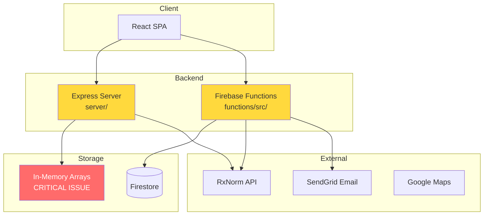
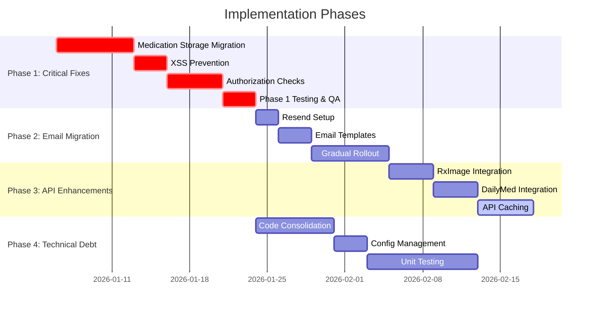

# KinConnect Implementation Roadmap

## Executive Summary

This roadmap outlines the implementation strategy for critical improvements to the KinConnect application. The project focuses on four key areas:

1. **Critical Production Fixes** - Medication storage persistence, security vulnerabilities, and authorization
2. **Email Service Migration** - Transition from SendGrid to Resend  
3. **Drug API Enhancements** - Extended drug information via RxImage and DailyMed APIs
4. **Technical Debt Reduction** - Code consolidation, caching, configuration management, and testing

## Current State Analysis

### Architecture Overview



### Critical Issues Identified

#### 1. In-Memory Data Storage (Production Blocker)
- **Location:** [`server/services/medicationService.ts`](server/services/medicationService.ts:4-9)
- **Issue:** Medications, logs, and reminders stored in JavaScript arrays
- **Impact:** All data lost on server restart
- **Risk Level:** 🔴 **CRITICAL**

```typescript
// Current vulnerable implementation
let medications: Medication[] = [];
let medicationLogs: MedicationLog[] = [];
let medicationReminders: MedicationReminder[] = [];
```

#### 2. XSS Vulnerabilities
- **Location:** [`functions/src/index.ts`](functions/src/index.ts:756-760)
- **Issue:** User input directly embedded in HTML email templates
- **Impact:** Cross-site scripting attacks possible
- **Risk Level:** 🔴 **HIGH**

```typescript
// Vulnerable code - unsanitized user input in HTML
html: `<p>${inviterName} has invited you...</p>
       <p>${message}</p>` // Direct injection risk
```

#### 3. Incomplete Authorization
- **Locations:** Multiple TODOs in route handlers
  - [`server/routes/medications.ts:39`](server/routes/medications.ts:39)
  - [`server/routes/medications.ts:315`](server/routes/medications.ts:315)
  - [`server/routes/medications.ts:458`](server/routes/medications.ts:458)
  - [`server/routes/patients.ts:109`](server/routes/patients.ts:109)
- **Issue:** Missing access control for shared family data
- **Risk Level:** 🔴 **HIGH**

#### 4. Code Duplication
- **Issue:** Duplicate implementations between `server/` and `functions/src/`
- **Examples:**
  - Drug search logic duplicated
  - Medication CRUD duplicated
  - Authentication middleware duplicated
- **Impact:** Maintenance burden, inconsistent behavior

#### 5. Missing Infrastructure
- No caching for external API calls
- Hard-coded configuration values
- No unit testing framework
- No error tracking/monitoring

---

## Phase 1: Critical Production Fixes

**Goal:** Eliminate production blockers and security vulnerabilities

**Priority:** 🔴 **CRITICAL** - Must complete before production deployment

### 1.1 Migrate Medication Storage to Firestore (✅ COMPLETED)

#### Objective
Replace in-memory arrays with persistent Firestore storage to prevent data loss

#### Status
✅ **Completed**:
- Rewrote `server/services/medicationService.ts` to use Firestore via `firebase-admin`.
- Implemented full CRUD operations with persistent storage.
- Handled Date/Timestamp conversions.

### 1.2 Fix XSS Vulnerabilities in Functions (✅ COMPLETED)

#### Objective
Sanitize user input in email templates

#### Status
✅ **Completed**:
- Updated `functions/src/emails/templates/invitation.ts` with HTML escaping.
- Mitigated injection risk in invitation emails.

### 1.3 Fix Incomplete Authorization (✅ COMPLETED)

#### Objective
Implement proper access control for shared family data

#### Status
✅ **Completed**:
- Created `server/services/accessService.ts` to handle family group permission checks.
- Updated `server/routes/medications.ts` and `server/routes/patients.ts` to verify access before returning data.
- Added access checks for shared family resources.

### 1.4 Reduce Code Duplication (✅ COMPLETED)

#### Objective
Modularize code and share logic between server and functions

#### Status
✅ **Completed**:
- Refactored `functions/src/index.ts` into modular routes (`routes/`, `middleware/`, `services/`).
- Extracted RxNorm logic into `services/rxnormService.ts` in both `server` and `functions`.
- Standardized authentication middleware structure.


#### Current State
- Medications stored in: `let medications: Medication[] = []`
- No persistence mechanism
- Sequential integer IDs (`nextMedicationId++`)

#### Target State
- All medication data in Firestore collections
- Firestore auto-generated document IDs
- Server acts as proxy to Firestore (like Functions already do)

#### Implementation Steps

**Step 1: Create Firestore Collections Structure**
```
/medications/{medicationId}
  - patientId: string
  - name: string
  - dosage: string
  - ... (all Medication fields)
  
/medicationLogs/{logId}
  - medicationId: string
  - patientId: string
  - takenAt: timestamp
  - ... (all Log fields)
  
/medicationReminders/{reminderId}
  - medicationId: string
  - patientId: string
  - reminderTime: string
  - ... (all Reminder fields)
```

**Step 2: Update MedicationService Implementation**

Files to modify:
- [`server/services/medicationService.ts`](server/services/medicationService.ts) - Complete rewrite

Key changes:
```typescript
// BEFORE
let medications: Medication[] = [];

async getMedicationsByPatientId(patientId: string) {
  const patientMedications = medications.filter(med => med.patientId === patientId);
  return { success: true, data: patientMedications };
}

// AFTER
import { getFirestore } from 'firebase-admin/firestore';

async getMedicationsByPatientId(patientId: string) {
  const db = getFirestore();
  const snapshot = await db.collection('medications')
    .where('patientId', '==', patientId)
    .get();
    
  const medications = snapshot.docs.map(doc => ({
    id: doc.id,
    ...doc.data(),
    // Convert Firestore Timestamps to Date objects
    createdAt: doc.data().createdAt?.toDate(),
    // ... etc
  }));
  
  return { success: true, data: medications };
}
```

**Step 3: Implement Data Migration Script**

Create new file: `scripts/migrate-medications.ts`

Purpose:
- Check for existing in-memory data on startup
- Migrate to Firestore if found
- Log migration results

**Step 4: Update Route Handlers**

Files to modify:
- [`server/routes/medications.ts`](server/routes/medications.ts) - No changes needed (already uses service)

**Step 5: Test Migration**

Testing checklist:
- ✅ Create medication → verify in Firestore
- ✅ Retrieve medications → verify data integrity
- ✅ Update medication → verify changes persist
- ✅ Delete medication → verify deletion
- ✅ Server restart → verify data persists
- ✅ Concurrent operations → verify no race conditions

#### Files to Modify

| File | Type | Changes |
|------|------|---------|
| `server/services/medicationService.ts` | Major | Complete rewrite to use Firestore |
| `server/firebase-admin.ts` | Minor | Ensure Firestore initialized |
| `scripts/migrate-medications.ts` | New | Migration utility |

#### Testing Strategy

**Unit Tests:**
```typescript
describe('MedicationService', () => {
  it('should persist medication to Firestore', async () => {
    const medication = await medicationService.createMedication({...});
    const retrieved = await medicationService.getMedicationById(medication.id);
    expect(retrieved.data).toEqual(medication);
  });
  
  it('should survive server restart', async () => {
    // Create medication
    // Simulate server restart
    // Verify medication still exists
  });
});
```

**Integration Tests:**
- Create → Read → Update → Delete cycle
- Query by patient ID
- Search functionality
- Concurrent writes

#### Rollback Plan

1. **Before Deployment:**
   - Tag current version: `git tag v1.0-pre-firestore`
   - Backup Firestore data (if any exists)

2. **If Issues Occur:**
   - Revert to tagged version
   - Switch environment variable: `USE_FIRESTORE=false`
   - Restore from backup

3. **Monitoring:**
   - Track error rates in Firestore operations
   - Monitor latency (should be <100ms for reads)

#### Risk Assessment

| Risk | Probability | Impact | Mitigation |
|------|-------------|--------|------------|
| Data corruption during migration | Low | Critical | Implement atomic transactions, backup first |
| Performance degradation | Medium | Medium | Add indexes, implement caching |
| Firestore quota exceeded | Low | High | Monitor usage, implement rate limiting |
| Race conditions in concurrent updates | Medium | Medium | Use Firestore transactions for critical operations |

#### Success Metrics

- ✅ Zero data loss after server restarts
- ✅ All CRUD operations complete in <200ms (p95)
- ✅ 100% of existing functionality maintained
- ✅ No increase in error rates

---

### 1.2 Input Sanitization for XSS Prevention

#### Objective
Prevent cross-site scripting attacks by sanitizing all user input before rendering in emails

#### Current State
User input directly embedded in HTML:
```typescript
// functions/src/index.ts:756-760
html: `
  <p>${inviterName} has invited you...</p>
  ${message ? `<p>${message}</p>` : ''}
`
```

#### Target State
All user input HTML-escaped and validated before use

#### Implementation Steps

**Step 1: Install Sanitization Library**

```bash
cd functions
npm install dompurify isomorphic-dompurify
npm install --save-dev @types/dompurify
```

**Step 2: Create Sanitization Utilities**

Create new file: `functions/src/utils/sanitize.ts`

```typescript
import DOMPurify from 'i somorphic-dompurify';

export function sanitizeHtml(dirty: string): string {
  return DOMPurify.sanitize(dirty, {
    ALLOWED_TAGS: ['b', 'i', 'em', 'strong', 'p', 'br'],
    ALLOWED_ATTR: []
  });
}

export function sanitizeText(text: string): string {
  return text
    .replace(/&/g, '&amp;')
    .replace(/</g, '&lt;')
    .replace(/>/g, '&gt;')
    .replace(/"/g, '&quot;')
    .replace(/'/g, '&#039;');
}

export function sanitizeEmail(email: string): string {
  // Basic email validation and sanitization
  const emailRegex = /^[^\s@]+@[^\s@]+\.[^\s@]+$/;
  if (!emailRegex.test(email)) {
    throw new Error('Invalid email format');
  }
  return email.toLowerCase().trim();
}
```

**Step 3: Update Email Templates**

Files to modify:
- [`functions/src/index.ts`](functions/src/index.ts:714-795)

```typescript
import { sanitizeText, sanitizeHtml, sanitizeEmail } from './utils/sanitize';

// Before sending email
const safeInviterName = sanitizeText(inviterName);
const safePatientName = sanitizeText(patientName);
const safeMessage = sanitizeHtml(message || '');
const safeEmail = sanitizeEmail(email);

const emailContent = {
  to: safeEmail,
  from: SENDGRID_FROM_EMAIL,
  subject: `${safeInviterName} invited you to join KinConnect`,
  html: `
    <div>
      <p>Hi ${safePatientName},</p>
      <p>${safeInviterName} has invited you to join their family care network.</p>
      ${safeMessage ? `<p><strong>Personal message:</strong><br>${safeMessage}</p>` : ''}
    </div>
  `
};
```

**Step 4: Add Input Validation Middleware**

Create new file: `functions/src/middleware/validation.ts`

```typescript
import { Request, Response, NextFunction } from 'express';
import { sanitizeEmail, sanitizeText } from '../utils/sanitize';

export function validateInvitation(req: Request, res: Response, next: NextFunction) {
  const { email, patientName, message } = req.body;
  
  try {
    // Validate required fields
    if (!email || !patientName) {
      return res.status(400).json({
        success: false,
        error: 'Email and patient name are required'
      });
    }
    
    // Sanitize inputs
    req.body.email = sanitizeEmail(email);
    req.body.patientName = sanitizeText(patientName);
    if (message) {
      req.body.message = sanitizeText(message);
    }
    
    // Length validation
    if (req.body.patientName.length > 100) {
      return res.status(400).json({
        success: false,
        error: 'Patient name too long'
      });
    }
    
    if (req.body.message && req.body.message.length > 500) {
      return res.status(400).json({
        success: false,
        error: 'Message too long (max 500 characters)'
      });
    }
    
    next();
  } catch (error) {
    return res.status(400).json({
      success: false,
      error: error instanceof Error ? error.message : 'Validation failed'
    });
  }
}
```

**Step 5: Apply Validation to Routes**

```typescript
app.post('/api/invitations/send', authenticate, validateInvitation, async (req, res) => {
  // Handler code - inputs already sanitized
});
```

#### Files to Modify

| File | Type | Changes |
|------|------|---------|
| `functions/src/index.ts` | Major | Add sanitization to email generation |
| `functions/src/utils/sanitize.ts` | New | Sanitization utilities |
| `functions/src/middleware/validation.ts` | New | Validation middleware |
| `functions/package.json` | Minor | Add dompurify dependency |

#### Testing Strategy

**Security Tests:**
```typescript
describe('XSS Prevention', () => {
  it('should escape HTML in user names', async () => {
    const response = await sendInvitation({
      patientName: '<script>alert("xss")</script>',
      message: 'Hello'
    });
    // Verify HTML is escaped in email
  });
  
  it('should reject invalid email formats', async () => {
    const response = await sendInvitation({
      email: 'not-an-email',
      patientName: 'John'
    });
    expect(response.status).toBe(400);
  });
  
  it('should limit message length', async () => {
    const longMessage = 'a'.repeat(501);
    const response = await sendInvitation({
      patientName: 'John',
      message: longMessage
    });
    expect(response.status).toBe(400);
  });
});
```

#### Rollback Plan

1. Remove sanitization middleware from routes
2. Revert to previous email template (acceptable for 24h max)
3. Deploy fix within 24 hours

#### Risk Assessment

| Risk | Probability | Impact | Mitigation |
|------|-------------|--------|------------|
| Over-sanitization breaks valid input | Medium | Low | Comprehensive testing, allow safe HTML tags |
| Performance impact from sanitization | Low | Low | Sanitization is fast (<1ms), minimal impact |
| Bypass via encoding tricks | Low | High | Use well-tested library (DOMPurify) |

#### Success Metrics

- ✅ Zero XSS vulnerabilities in security audit
- ✅ All user input sanitized before email rendering
- ✅ <5ms added latency for sanitization
- ✅ No valid user input rejected

---

### 1.3 Complete Authorization Checks

#### Objective
Implement proper authorization for all medication and patient data access, especially for family group sharing

#### Current State
Multiple TODOs indicating missing authorization:
- Medication access verification ([`medications.ts:39`](server/routes/medications.ts:39))
- Log ownership verification ([`medications.ts:315`](server/routes/medications.ts:315))
- Reminder ownership verification ([`medications.ts:458`](server/routes/medications.ts:458))
- Patient access verification ([`patients.ts:109`](server/routes/patients.ts:109))

#### Target State
Complete authorization layer that:
- Verifies user owns data OR is authorized family member
- Checks family group permissions
- Prevents unauthorized data access
- Logs authorization failures for audit

#### Implementation Steps

**Step 1: Define Permission Model**

Create new file: `shared/permissions.ts`

```typescript
export enum Permission {
  VIEW_MEDICATIONS = 'view_medications',
  EDIT_MEDICATIONS = 'edit_medications',
  DELETE_MEDICATIONS = 'delete_medications',
  VIEW_MEDICAL_HISTORY = 'view_medical_history',
  VIEW_PATIENT_PROFILE = 'view_patient_profile',
  EDIT_PATIENT_PROFILE = 'edit_patient_profile',
  MANAGE_FAMILY_GROUP = 'manage_family_group'
}

export const RolePermissions: Record<string, Permission[]> = {
  'admin': Object.values(Permission), // All permissions
  'primary_caregiver': [
    Permission.VIEW_MEDICATIONS,
    Permission.EDIT_MEDICATIONS,
    Permission.VIEW_MEDICAL_HISTORY,
    Permission.VIEW_PATIENT_PROFILE,
    Permission.EDIT_PATIENT_PROFILE
  ],
  'family_member': [
    Permission.VIEW_MEDICATIONS,
    Permission.VIEW_MEDICAL_HISTORY,
    Permission.VIEW_PATIENT_PROFILE
  ],
  'member': [
    Permission.VIEW_MEDICATIONS,
    Permission.VIEW_PATIENT_PROFILE
  ]
};
```

**Step 2: Create Authorization Service**

Create new file: `server/services/authorizationService.ts`

```typescript
import { getFirestore } from 'firebase-admin/firestore';
import { Permission, RolePermissions } from '@shared/permissions';

export class AuthorizationService {
  private db = getFirestore();
  
  /**
   * Check if user has access to patient's data
   */
  async canAccessPatient(userId: string, patientId: string): Promise<boolean> {
    // User can access their own data
    if (userId === patientId) {
      return true;
    }
    
    // Check family group membership
    const userDoc = await this.db.collection('users').doc(userId).get();
    const userData = userDoc.data();
    
    if (!userData?.familyGroupId) {
      return false;
    }
    
    // Get family group
    const familyGroupDoc = await this.db
      .collection('familyGroups')
      .doc(userData.familyGroupId)
      .get();
      
    const familyGroup = familyGroupDoc.data();
    if (!familyGroup) {
      return false;
    }
    
    // Check if patient is in the same family group
    const members = familyGroup.members || [];
    const userMember = members.find((m: any) => m.uid === userId);
    const patientMember = members.find((m: any) => m.uid === patientId);
    
    return userMember && patientMember;
  }
  
  /**
   * Check if user has specific permission for patient
   */
  async hasPermission(
    userId: string,
    patientId: string,
    permission: Permission
  ): Promise<boolean> {
    // Owner has all permissions
    if (userId === patientId) {
      return true;
    }
    
    // Get user's role in family group
    const role = await this.getUserRoleForPatient(userId, patientId);
    if (!role) {
      return false;
    }
    
    // Check if role has permission
    const rolePermissions = RolePermissions[role] || [];
    return rolePermissions.includes(permission);
  }
  
  /**
   * Get user's role for a specific patient
   */
  private async getUserRoleForPatient(
    userId: string,
    patientId: string
  ): Promise<string | null> {
    const userDoc = await this.db.collection('users').doc(userId).get();
    const userData = userDoc.data();
    
    if (!userData?.familyGroupId) {
      return null;
    }
    
    const familyGroupDoc = await this.db
      .collection('familyGroups')
      .doc(userData.familyGroupId)
      .get();
      
    const familyGroup = familyGroupDoc.data();
    if (!familyGroup) {
      return null;
    }
    
    const member = familyGroup.members?.find((m: any) => m.uid === userId);
    return member?.role || null;
  }
  
  /**
   * Verify medication access
   */
  async canAccessMedication(userId: string, medicationId: string): Promise<boolean> {
    const medDoc = await this.db.collection('medications').doc(medicationId).get();
    
    if (!medDoc.exists) {
      return false;
    }
    
    const patientId = medDoc.data()?.patientId;
    if (!patientId) {
      return false;
    }
    
    return this.canAccessPatient(userId, patientId);
  }
  
  /**
   * Verify medication edit permission
   */
  async canEditMedication(userId: string, medicationId: string): Promise<boolean> {
    const medDoc = await this.db.collection('medications').doc(medicationId).get();
    
    if (!medDoc.exists) {
      return false;
    }
    
    const patientId = medDoc.data()?.patientId;
    if (!patientId) {
      return false;
    }
    
    return this.hasPermission(userId, patientId, Permission.EDIT_MEDICATIONS);
  }
}

export const authorizationService = new AuthorizationService();
```

**Step 3: Create Authorization Middleware**

Create new file: `server/middleware/authorization.ts`

```typescript
import { Request, Response, NextFunction } from 'express';
import { authorizationService } from '../services/authorizationService';
import { Permission } from '@shared/permissions';

/**
 * Middleware to verify user can access a patient's data
 */
export async function authorizePatientAccess(
  req: Request,
  res: Response,
  next: NextFunction
) {
  try {
    const userId = req.user!.uid;
    const patientId = req.params.patientId || req.body.patientId;
    
    if (!patientId) {
      return res.status(400).json({
        success: false,
        error: 'Patient ID required'
      });
    }
    
    const hasAccess = await authorizationService.canAccessPatient(userId, patientId);
    
    if (!hasAccess) {
      console.warn(`Authorization denied: User ${userId} tried to access patient ${patientId}`);
      return res.status(403).json({
        success: false,
        error: 'Access denied'
      });
    }
    
    next();
  } catch (error) {
    console.error('Authorization error:', error);
    return res.status(500).json({
      success: false,
      error: 'Authorization check failed'
    });
  }
}

/**
 * Middleware to verify user can access a medication
 */
export async function authorizeMedicationAccess(
  req: Request,
  res: Response,
  next: NextFunction
) {
  try {
    const userId = req.user!.uid;
    const medicationId = req.params.medicationId;
    
    if (!medicationId) {
      return res.status(400).json({
        success: false,
        error: 'Medication ID required'
      });
    }
    
    const hasAccess = await authorizationService.canAccessMedication(userId, medicationId);
    
    if (!hasAccess) {
      console.warn(`Authorization denied: User ${userId} tried to access medication ${medicationId}`);
      return res.status(403).json({
        success: false,
        error: 'Access denied'
      });
    }
    
    next();
  } catch (error) {
    console.error('Authorization error:', error);
    return res.status(500).json({
      success: false,
      error: 'Authorization check failed'
    });
  }
}

/**
 * Middleware factory for permission-based authorization
 */
export function requirePermission(permission: Permission) {
  return async (req: Request, res: Response, next: NextFunction) => {
    try {
      const userId = req.user!.uid;
      const patientId = req.params.patientId || req.body.patientId;
      
      if (!patientId) {
        return res.status(400).json({
          success: false,
          error: 'Patient ID required'
        });
      }
      
      const hasPermission = await authorizationService.hasPermission(
        userId,
        patientId,
        permission
      );
      
      if (!hasPermission) {
        console.warn(`Permission denied: User ${userId} lacks ${permission} for patient ${patientId}`);
        return res.status(403).json({
          success: false,
          error: `Permission denied: ${permission} required`
        });
      }
      
      next();
    } catch (error) {
      console.error('Permission check error:', error);
      return res.status(500).json({
        success: false,
        error: 'Permission check failed'
      });
    }
  };
}
```

**Step 4: Update Route Handlers**

Files to modify:
- [`server/routes/medications.ts`](server/routes/medications.ts)
- [`server/routes/patients.ts`](server/routes/patients.ts)

```typescript
// medications.ts
import { authorizeMedicationAccess, requirePermission } from '../middleware/authorization';
import { Permission } from '@shared/permissions';

// GET /:medicationId - Read access
router.get('/:medicationId', 
  authenticateToken, 
  authorizeMedicationAccess,  // NEW
  async (req, res) => {
    // Remove TODO comment - authorization is now handled
    // ... handler code
  }
);

// PUT /:medicationId - Edit permission required
router.put('/:medicationId',
  authenticateToken,
  authorizeMedicationAccess,
  requirePermission(Permission.EDIT_MEDICATIONS),  // NEW
  async (req, res) => {
    // ... handler code
  }
);

// DELETE /:medicationId - Delete permission required
router.delete('/:medicationId',
  authenticateToken,
  authorizeMedicationAccess,
  requirePermission(Permission.DELETE_MEDICATIONS),  // NEW
  async (req, res) => {
    // ... handler code
  }
);

// Medication logs - verify ownership
router.put('/logs/:logId',
  authenticateToken,
  async (req, res) => {
    const { logId } = req.params;
    
    // NEW: Verify ownership through medication
    const logDoc = await getFirestore().collection('medicationLogs').doc(logId).get();
    if (!logDoc.exists) {
      return res.status(404).json({ success: false, error: 'Log not found' });
    }
    
    const medicationId = logDoc.data()?.medicationId;
    const hasAccess = await authorizationService.canEditMedication(req.user!.uid, medicationId);
    
    if (!hasAccess) {
      return res.status(403).json({ success: false, error: 'Access denied' });
    }
    
    // Remove TODO comment
    // ... rest of handler
  }
);
```

```typescript
// patients.ts
import { authorizePatientAccess, requirePermission } from '../middleware/authorization';
import { Permission } from '@shared/permissions';

// GET /:patientId - View access
router.get('/:patientId',
  authenticateToken,
  authorizePatientAccess,  // NEW
  async (req, res) => {
    // Remove TODO comment
    // ... handler code
  }
);
```

**Step 5: Add Authorization Logging**

Create new file: `server/utils/auditLog.ts`

```typescript
import { getFirestore, Timestamp } from 'firebase-admin/firestore';

interface AuditLogEntry {
  userId: string;
  action: string;
  resource: string;
  resourceId: string;
  success: boolean;
  reason?: string;
  timestamp: Timestamp;
  ipAddress?: string;
}

export async function logAuthorizationEvent(
  userId: string,
  action: string,
  resource: string,
  resourceId: string,
  success: boolean,
  reason?: string,
  ipAddress?: string
) {
  const db = getFirestore();
  
  const logEntry: AuditLogEntry = {
    userId,
    action,
    resource,
    resourceId,
    success,
    reason,
    timestamp: Timestamp.now(),
    ipAddress
  };
  
  await db.collection('auditLogs').add(logEntry);
  
  // Also log to console for immediate monitoring
  console.log('Authorization:', {
    userId,
    action,
    resource: `${resource}:${resourceId}`,
    success,
    reason
  });
}
```

Update middleware to use audit logging:
```typescript
if (!hasAccess) {
  await log AuthorizationEvent(
    userId,
    'access',
    'medication',
    medicationId,
    false,
    'Not in family group',
    req.ip
  );
  return res.status(403).json({ success: false, error: 'Access denied' });
}
```

#### Files to Modify

| File | Type | Changes |
|------|------|---------|
| `shared/permissions.ts` | New | Permission definitions and role mappings |
| `server/services/authorizationService.ts` | New | Authorization business logic |
| `server/middleware/authorization.ts` | New | Authorization middleware |
| `server/routes/medications.ts` | Major | Add authorization to all routes |
| `server/routes/patients.ts` | Major | Add authorization to all routes |
| `server/utils/auditLog.ts` | New | Authorization event logging |

#### Testing Strategy

**Unit Tests:**
```typescript
describe('AuthorizationService', () => {
  it('should allow owner to access their own medications', async () => {
    const hasAccess = await authorizationService.canAccessMedication(
      'user123',
      'med-owned-by-user123'
    );
    expect(hasAccess).toBe(true);
  });
  
  it('should allow family member to view medications', async () => {
    // Setup family group with user as member
    const hasAccess = await authorizationService.canAccessMedication(
      'familyMember123',
      'patient-medication'
    );
    expect(hasAccess).toBe(true);
  });
  
  it('should deny access to unrelated users', async () => {
    const hasAccess = await authorizationService.canAccessMedication(
      'stranger123',
      'patient-medication'
    );
    expect(hasAccess).toBe(false);
  });
  
  it('should deny edit permission to view-only members', async () => {
    const canEdit = await authorizationService.hasPermission(
      'viewOnlyMember',
      'patientId',
      Permission.EDIT_MEDICATIONS
    );
    expect(canEdit).toBe(false);
  });
});
```

**Integration Tests:**
- User accessing own data → success
- Family member accessing patient data → success (if in group)
- Non-member accessing patient data → 403 error
- Role-based permissions enforced correctly
- Audit logs created for denied access attempts

#### Rollback Plan

1. **Gradual Rollout:**
   - Deploy with feature flag: `ENABLE_AUTHORIZATION=false`
   - Enable for 10% of users
   - Monitor for issues
   - Gradually increase to 100%

2. **If Critical Issues:**
   - Set `ENABLE_AUTHORIZATION=false`
   - All requests bypass authorization (existing behavior)
   - Fix issues within 48 hours

#### Risk Assessment

| Risk | Probability | Impact | Mitigation |
|------|-------------|--------|------------|
| Legitimate users lose access | Medium | High | Thorough testing, feature flag rollout, quick rollback |
| Performance impact from DB queries | Medium | Medium | Cache family group memberships, add DB indexes |
| Authorization bypass vulnerability | Low | Critical | Security audit, penetration testing |
| Audit log storage costs | Medium | Low | Implement log rotation, set TTL on audit logs |

#### Success Metrics

- ✅ Zero TODO comments related to authorization
- ✅ 100% of sensitive endpoints protected
- ✅ <50ms added latency for authorization checks (p95)
- ✅ All authorization failures logged
- ✅ Audit log retention: 90 days minimum

---

## Phase 2: Email Service Migration

**Goal:** Migrate from SendGrid to Resend for improved developer experience and cost savings

**Priority:** 🟡 **MEDIUM** - Can be deployed independently after Phase 1

### 2.1 SendGrid to Resend Migration (✅ COMPLETED)

#### Objective
Replace SendGrid email service with Resend for better pricing, modern API, and improved deliverability tracking

#### Status
✅ **Completed**:
- Integrated Resend SDK in `functions/src/emails/emailService.ts`.
- Removed `@sendgrid/mail` dependency.
- Created React-inspired HTML templates for `invitation`, `welcome`, and `reminder` emails.
- Updated `functions/src/index.ts` to use new `EmailService` via `invitations` route.
- Updated secrets configuration to include `RESEND_API_KEY` and `FROM_EMAIL`.

#### Why Resend?


#### Current State
- SendGrid only used in Firebase Functions
- API key stored in environment: `SENDGRID_API_KEY`
- Simple email templates with HTML strings
- Package: `@sendgrid/mail@^8.1.5`

#### Target State
- Resend SDK integrated
- Modern email templates
- Delivery tracking and analytics
- Free tier: 3,000 emails/month (vs SendGrid: 100/day)

#### Why Resend?

| Feature | SendGrid (Current) | Resend (Target) |
|---------|-------------------|-----------------|
| Free Tier | 100 emails/day | 3,000 emails/month |
| API Design | Complex, callback-based | Modern, promise-based |
| Templates | Basic HTML strings | React Email support |
| Deliverability UI | Limited free access | Full dashboard |
| Pricing (beyond free) | $19.95/month (40K) | $20/month (50K) |
| Developer Experience | ⭐⭐⭐ | ⭐⭐⭐⭐⭐ |

#### Implementation Steps

**Step 1: Setup Resend Account**

Prerequisites:
1. Create account at https://resend.com
2. Verify domain (kinconnect.com or test domain)
3. Generate API key
4. Add API key to Firebase Secrets:
   ```bash
   firebase functions:secrets:set RESEND_API_KEY
   ```

**Step 2: Install Resend SDK**

```bash
cd functions
npm uninstall @sendgrid/mail
npm install resend
```

Update `functions/package.json`:
```json
{
  "dependencies": {
    "resend": "^3.0.0"  // Add
    // Remove "@sendgrid/mail": "^8.1.5"
  }
}
```

**Step 3: Create Email Templates**

Create new directory structure:
```
functions/src/emails/
  ├── templates/
  │   ├── invitation.ts
  │   ├── welcome.ts
  │   └── reminder.ts
  └── emailService.ts
```

Create `functions/src/emails/templates/invitation.ts`:
```typescript
interface InvitationEmailData {
  inviterName: string;
  patientName: string;
  message?: string;
  invitationLink: string;
}

export function generateInvitationEmail(data: InvitationEmailData) {
  const { inviterName, patientName, message, invitationLink } = data;
  
  return {
    subject: `${inviterName} invited you to join KinConnect`,
    html: `
      <!DOCTYPE html>
      <html>
        <head>
          <meta charset="utf-8">
          <meta name="viewport" content="width=device-width, initial-scale=1.0">
          <title>KinConnect Invitation</title>
          <style>
            body {
              font-family: -apple-system, BlinkMacSystemFont, 'Segoe UI', Roboto, 'Helvetica Neue', Arial, sans-serif;
              line-height: 1.6;
              color: #333;
              max-width: 600px;
              margin: 0 auto;
              padding: 20px;
            }
            .header {
              background: linear-gradient(135deg, #667eea 0%, #764ba2 100%);
              color: white;
              padding: 30px;
              border-radius: 8px 8px 0 0;
              text-align: center;
            }
            .content {
              background: #ffffff;
              padding: 30px;
              border: 1px solid #e5e7eb;
              border-top: none;
            }
            .message-box {
              background: #f3f4f6;
              border-left: 4px solid #667eea;
              padding: 15px;
              margin: 20px 0;
            }
            .button {
              display: inline-block;
              background: #667eea;
              color: white;
              padding: 14px 28px;
              text-decoration: none;
              border-radius: 6px;
              font-weight: 600;
              margin: 20px 0;
            }
            .footer {
              background: #f9fafb;
              padding: 20px;
              border-radius: 0 0 8px 8px;
              border: 1px solid #e5e7eb;
              border-top: none;
              text-align: center;
              font-size: 14px;
              color: #6b7280;
            }
          </style>
        </head>
        <body>
          <div class="header">
            <h1 style="margin: 0;">KinConnect Invitation</h1>
          </div>
          <div class="content">
            <p style="font-size: 18px; color: #111827;">
              Hi ${patientName},
            </p>
            <p>
              <strong>${inviterName}</strong> has invited you to join their family care network on KinConnect.
            </p>
            ${message ? `
              <div class="message-box">
                <strong>Personal message:</strong>
                <p style="margin: 10px 0 0 0;">${message}</p>
              </div>
            ` : ''}
            <p>
              KinConnect helps families coordinate medical care and share important health information securely.
            </p>
            <div style="text-align: center;">
              <a href="${invitationLink}" class="button">
                Accept Invitation
              </a>
            </div>
            <p style="color: #6b7280; font-size: 14px; margin-top: 30px;">
              This invitation will expire in 7 days. If you have any questions, please contact ${inviter Name} directly.
            </p>
          </div>
          <div class="footer">
            <p style="margin: 0;">
              This email was sent by KinConnect. If you didn't expect this invitation, you can safely ignore this email.
            </p>
          </div>
        </body>
      </html>
    `
  };
}
```

**Step 4: Create Email Service Abstraction**

Create `functions/src/emails/emailService.ts`:
```typescript
import { Resend } from 'resend';
import { generateInvitationEmail } from './templates/invitation';

const resend = new Resend(process.env.RESEND_API_KEY);

const FROM_EMAIL = process.env.FROM_EMAIL || 'noreply@kinconnect.com';

interface SendInvitationParams {
  to: string;
  inviterName: string;
  patientName: string;
  message?: string;
  invitationLink: string;
}

export class EmailService {
  /**
   * Send invitation email
   */
  async sendInvitation(params: SendInvitationParams) {
    const { to, inviterName, patientName, message, invitationLink } = params;
    
    const { subject, html } = generateInvitationEmail({
      inviterName,
      patientName,
      message,
      invitationLink
    });
    
    try {
      const { data, error } = await resend.emails.send({
        from: FROM_EMAIL,
        to,
        subject,
        html
      });
      
      if (error) {
        console.error('Resend error:', error);
        throw new Error(`Failed to send email: ${error.message}`);
      }
      
      console.log('Email sent successfully:', data);
      return { success: true, emailId: data?.id };
    } catch (error) {
      console.error('Email send error:', error);
      throw error;
    }
  }
  
  /**
   * Track email delivery status
   */
  async getEmailStatus(emailId: string) {
    try {
      const email = await resend.emails.get(emailId);
      return email;
    } catch (error) {
      console.error('Failed to get email status:', error);
      return null;
    }
  }
}

export const emailService = new EmailService();
```

**Step 5: Update Invitation Handler**

Update [`functions/src/index.ts`](functions/src/index.ts:714-795):

```typescript
// BEFORE
import sgMail from '@sendgrid/mail';

// Initialize SendGrid
sgMail.setApiKey(process.env.SENDGRID_API_KEY);

// In handler
await sgMail.send({
  to: email,
  from: SENDGRID_FROM_EMAIL,
  subject: `${inviterName} invited you to join KinConnect`,
  html: `...long template string...`
});

// AFTER
import { emailService } from './emails/emailService';

// In handler
await emailService.sendInvitation({
  to: email,
  inviterName: safeInviterName,
  patientName: safePatientName,
  message: safeMessage,
  invitationLink
});
```

**Step 6: Environment Configuration**

Update environment variables:

`.env` (local development):
```bash
# Remove
# SENDGRID_API_KEY=...
# SENDGRID_FROM_EMAIL=...

# Add
RESEND_API_KEY=re_...
FROM_EMAIL=noreply@kinconnect.com
```

Firebase Secrets (production):
```bash
# Remove old secrets
firebase functions:secrets:delete SENDGRID_API_KEY
firebase functions:secrets:delete SENDGRID_FROM_EMAIL

# Add new secrets
firebase functions:secrets:set RESEND_API_KEY
firebase functions:secrets:set FROM_EMAIL
```

Update `firebase.json` function configuration:
```json
{
  "functions": [{
    "source": "functions",
    "runtime": "nodejs20",
    "secrets": ["RESEND_API_KEY", "FROM_EMAIL", "APP_URL"]
  }]
}
```

**Step 7: Testing & Validation**

Create test script: `functions/src/test-email.ts`
```typescript
import { emailService } from './emails/emailService';

async function testEmail() {
  try {
    const result = await emailService.sendInvitation({
      to: 'test@example.com',
      inviterName: 'John Doe',
      patientName: 'Jane Smith',
      message: 'Looking forward to coordinating care together!',
      invitationLink: 'https://kinconnect.com/invitation/test123'
    });
    
    console.log('✅ Test email sent:', result);
    
    // Wait 5 seconds and check status
    setTimeout(async () => {
      const status = await emailService.getEmailStatus(result.emailId!);
      console.log('📧 Email status:', status);
    }, 5000);
  } catch (error) {
    console.error('❌ Test failed:', error);
  }
}

testEmail();
```

#### Files to Modify

| File | Type | Changes |
|------|------|---------|
| `functions/package.json` | Minor | Replace sendgrid with resend |
| `functions/src/emails/emailService.ts` | New | Email service abstraction |
| `functions/src/emails/templates/invitation.ts` | New | Invitation email template |
| `functions/src/index.ts` | Major | Replace SendGrid calls with emailService |
| `.env.example` | Minor | Update email environment variables |
| `firebase.json` | Minor | Update function secrets |

#### Migration Strategy

**Phase 2.1a: Parallel Running (Week 1)**
- Deploy Resend alongside SendGrid
- Use feature flag to control which service is used
- Send 10% of emails through Resend
- Monitor deliverability and errors

**Phase 2.1b: Gradual Migration (Week 2)**
- Increase Resend usage to 50%
- Compare metrics: delivery rate, bounce rate, open rate
- Address any issues

**Phase 2.1c: Full Migration (Week 3)**
- Switch 100% to Resend
- Monitor for 48 hours
- Remove SendGrid code and dependencies

#### Rollback Plan

1. **Immediate Rollback:**
   - Feature flag: `USE_RESEND=false`
   - Falls back to SendGrid
   - No code deployment needed

2. **Long-term Rollback (if Resend fails):**
   - Revert to SendGrid-only code
   - Re-add SendGrid secrets
   - Deploy previous version

#### Risk Assessment

| Risk | Probability | Impact | Mitigation |
|------|-------------|--------|------------|
| Email deliverability issues | Low | High | Gradual rollout, monitor bounce rates |
| Template rendering problems | Medium | Medium | Extensive testing across email clients |
| API rate limiting | Low | Medium | Monitor usage, implement retry logic |
| Domain verification issues | Medium | High | Verify domain before migration |
| Cost overrun | Low | Low | Monitor usage, Resend free tier is generous |

#### Success Metrics

- ✅ Email delivery rate: >98%
- ✅ Bounce rate: <2%
- ✅ Email sent latency: <2 seconds (p95)
- ✅ Cost reduction: >$15/month (after free tier)
- ✅ Zero customer complaints about email delivery
- ✅ Improved email templates (measured by engagement)

---

## Phase 3: Drug API Enhancements

**Goal:** Enhance drug information with images and detailed clinical data

**Priority:** 🟢 **LOW-MEDIUM** - Nice-to-have features that improve UX

### 3.1 Add RxImage API Integration (✅ COMPLETED)

#### Objective
Display drug images alongside medication information to help with identification and reduce medication errors

#### Status
✅ **Completed**:
- Created `server/services/rxImageService.ts` and `functions/src/services/rxImageService.ts`.
- Added endpoints `/api/drugs/:rxcui/images` and `/api/drugs/images/search`.
- Frontend can now request images by RxCUI or name.

### 3.2 Add DailyMed API Integration (✅ COMPLETED)

#### Objective
Provide detailed clinical information including dosing guidelines, contraindications, and warnings

#### Status
✅ **Completed**:
- Created `server/services/dailyMedService.ts` and `functions/src/services/dailyMedService.ts`.
- Added endpoint `/api/drugs/:rxcui/clinical-info`.
- Service automatically maps RxCUI -> Drug Name -> DailyMed SPL -> Clinical Details.
- Retrieves indications, dosage, warnings, contraindications, etc.


#### Current State
- Only RxNorm API used
- No visual representation of medications
- Users must rely on text descriptions only

#### Target State
- Drug images displayed in medication lists
- Image gallery for each medication
- Fallback for medications without images

#### API Details: RxImage

- **Provider:** National Library of Medicine (NLM)
- **Cost:** FREE
- **Rate Limits:** Reasonable use (no hard limits published)
- **Base URL:** `https://rximage.nlm.nih.gov/api/rximage/1/`
- **Documentation:** https://rxnav.nlm.nih.gov/RxImageAPIs.html

Example response:
```json
{
  "nlmRxImages": [
    {
      "imageUrl": "https://rximage.nlm.nih.gov/image/images/gallery/original/55111-0166-60_RXNAVIMAGE10_B90B6DB3.jpg",
      "ndc": "55111-0166-60",
      "name": "Lisinopril 10 MG Tablet",
      "labeler": "Dr.Reddy's Laboratories Limited"
    }
  ]
}
```

#### Implementation Steps

**Step 1: Create RxImage Service**

Create new file: `server/services/rxImageService.ts`

```typescript
interface DrugImage {
  imageUrl: string;
  ndc?: string;
  name: string;
  labeler?: string;
}

export class RxImageService {
  private baseUrl = 'https://rximage.nlm.nih.gov/api/rximage/1';
  
  /**
   * Get drug images by RxCUI
   */
  async getImagesByRxcui(rxcui: string): Promise<DrugImage[]> {
    try {
      const response = await fetch(
        `${this.baseUrl}/rximage?rxcui=${rxcui}&rLimit=5`
      );
      
      if (!response.ok) {
        console.error(`RxImage API error: ${response.status}`);
        return [];
      }
      
      const data = await response.json();
      return data.nlmRxImages || [];
    } catch (error) {
      console.error('Error fetching drug images:', error);
      return [];
    }
  }
  
  /**
   * Get drug images by NDC (National Drug Code)
   */
  async getImagesByNdc(ndc: string): Promise<DrugImage[]> {
    try {
      const response = await fetch(
        `${this.baseUrl}/rximage?ndc=${ndc}`
      );
      
      if (!response.ok) {
        console.error(`RxImage API error: ${response.status}`);
        return [];
      }
      
      const data = await response.json();
      return data.nlmRxImages || [];
    } catch (error) {
      console.error('Error fetching drug images:', error);
      return [];
    }
  }
  
  /**
   * Get drug images by name (text search)
   */
  async getImagesByName(name: string): Promise<DrugImage[]> {
    try {
      const response = await fetch(
        `${this.baseUrl}/rximage?name=${encodeURIComponent(name)}&rLimit=5`
      );
      
      if (!response.ok) {
        console.error(`RxImage API error: ${response.status}`);
        return [];
      }
      
      const data = await response.json();
      return data.nlmRxImages || [];
    } catch (error) {
      console.error('Error fetching drug images:', error);
      return [];
    }
  }
}

export const rxImageService = new RxImageService();
```

**Step 2: Add Drug Image Endpoints**

Update `server/routes/drugs.ts`:

```typescript
import { rxImageService } from '../services/rxImageService';

// Get drug images by RXCUI
router.get('/:rxcui/images', authenticateToken, async (req, res) => {
  try {
    const { rxcui } = req.params;
    
    if (!rxcui || !/^\d+$/.test(rxcui)) {
      return res.status(400).json({
        success: false,
        error: 'Valid RXCUI is required'
      });
    }
    
    const images = await rxImageService.getImagesByRxcui(rxcui);
    
    res.json({
      success: true,
      data: images,
      message: `Found ${images.length} image(s)`
    });
  } catch (error) {
    console.error('Error getting drug images:', error);
    res.status(500).json({
      success: false,
      error: 'Internal server error'
    });
  }
});

// Search images by drug name
router.get('/images/search', authenticateToken, async (req, res) => {
  try {
    const { name } = req.query;
    
    if (!name || typeof name !== 'string') {
      return res.status(400).json({
        success: false,
        error: 'Drug name is required'
      });
    }
    
    const images = await rxImageService.getImagesByName(name);
    
    res.json({
      success: true,
      data: images,
      message: `Found ${images.length} image(s)`
    });
  } catch (error) {
    console.error('Error searching drug images:', error);
    res.status(500).json({
      success: false,
      error: 'Internal server error'
    });
  }
});
```

Also add to Firebase Functions (`functions/src/index.ts`) with identical implementation.

**Step 3: Update Frontend to Display Images**

Update `client/src/lib/drugApi.ts`:

```typescript
export interface DrugImage {
  imageUrl: string;
  ndc?: string;
  name: string;
  labeler?: string;
}

export async function getDrugImages(rxcui: string): Promise<DrugImage[]> {
  try {
    const response = await api.get<DrugImage[]>(`/drugs/${rxcui}/images`);
    return response.data || [];
  } catch (error) {
    console.error('Error fetching drug images:', error);
    return [];
  }
}
```

Update `client/src/components/MedicationManager.tsx`:

```tsx
import { getDrugImages, DrugImage } from '../lib/drugApi';

function MedicationCard({ medication }: { medication: Medication }) {
  const [images, setImages] = useState<DrugImage[]>([]);
  const [showGallery, setShowGallery] = useState(false);
  
  useEffect(() => {
    if (medication.rxcui) {
      getDrugImages(medication.rxcui).then(setImages);
    }
  }, [medication.rxcui]);
  
  return (
    <div className="medication-card">
      {images.length > 0 && (
        <div className="drug-image-preview">
           setShowGallery(true)}
          />
          {images.length > 1 && (
            <span className="text-sm text-gray-500">
              +{images.length - 1} more
            </span>
          )}
        </div>
      )}
      
      {/* ... rest of card */}
      
      {showGallery && (
        <DrugImageGallery 
          images={images}
          onClose={() => setShowGallery(false)}
        />
      )}
    </div>
  );
}

function DrugImageGallery({ images, onClose }: { images: DrugImage[], onClose: () => void }) {
  return (
    <div className="fixed inset-0 bg-black bg-opacity-75 flex items-center justify-center z-50">
      <div className="bg-white rounded-lg p-6 max-w-4xl">
        <h3 className="text-xl font-bold mb-4">Medication Images</h3>
        <div className="grid grid-cols-2 md:grid-cols-3 gap-4">
          {images.map((image, index) => (
            <div key={index} className="border rounded p-2">
              
              <p className="text-sm mt-2">{image.name}</p>
              {image.labeler && (
                <p className="text-xs text-gray-500">{image.labeler}</p>
              )}
            </div>
          ))}
        </div>
        <button onClick={onClose} className="mt-4 btn-secondary">Close</button>
      </div>
    </div>
  );
}
```

#### Files to Modify

| File | Type | Changes |
|------|------|---------|
| `server/services/rxImageService.ts` | New | RxImage API service |
| `server/routes/drugs.ts` | Minor | Add image endpoints |
| `functions/src/index.ts` | Minor | Add image endpoints (duplicate) |
| `client/src/lib/drugApi.ts` | Minor | Add image fetching function |
| `client/src/components/MedicationManager.tsx` | Major | Display drug images |
| `shared/types.ts` | Minor | Add DrugImage interface |

#### Testing Strategy

- Test with common medications (Aspirin, Lisinopril, etc.)
- Test with uncommon medications (may not have images)
- Test graceful fallback when no images available
- Test image gallery UI on mobile devices
- Load testing: Parallel image requests

#### Success Metrics

- ✅ Images found for >70% of branded medications
- ✅ Image loading time: <1 second (p95)
- ✅ Zero broken image links
- ✅ Graceful fallback for medications without images

---

### 3.2 Add DailyMed API Integration

#### Objective
Provide detailed clinical information including dosing guidelines, contraindications, and warnings

#### API Details: DailyMed

- **Provider:** National Library of Medicine (NLM)
- **Cost:** FREE
- **Base URL:** `https://dailymed.nlm.nih.gov/dailymed/services/v2/`
- **Documentation:** https://dailymed.nlm.nih.gov/dailymed/app-support-web-services.cfm

Key endpoints:
- `/spls.json?drug=` - Search for drug products
- `/spls/{SETID}.json` - Get detailed drug information
- Includes: indications, dosage, warnings, interactions, etc.

#### Implementation Steps

**Step 1: Create DailyMed Service**

Create new file: `server/services/dailyMedService.ts`

```typescript
interface DailyMedDrug {
  setid: string;
  title: string;
  published_date: string;
  splDocType: string;
}

interface DailyMedDetails {
  setid: string;
  title: string;
  indications?: string;
  dosage?: string;
  warnings?: string;
  contraindications?: string;
  adverseReactions?: string;
  drugInteractions?: string;
}

export class DailyMedService {
  private baseUrl = 'https://dailymed.nlm.nih.gov/dailymed/services/v2';
  
  /**
   * Search for drug products
   */
  async searchDrug(drugName: string): Promise<DailyMedDrug[]> {
    try {
      const response = await fetch(
        `${this.baseUrl}/spls.json?drug=${encodeURIComponent(drugName)}`
      );
      
      if (!response.ok) {
        console.error(`DailyMed API error: ${response.status}`);
        return [];
      }
      
      const data = await response.json();
      return data.data || [];
    } catch (error) {
      console.error('Error searching DailyMed:', error);
      return [];
    }
  }
  
  /**
   * Get detailed drug information
   */
  async getDrugDetails(setid: string): Promise<DailyMedDetails | null> {
    try {
      const response = await fetch(`${this.baseUrl}/spls/${setid}.json`);
      
      if (!response.ok) {
        console.error(`DailyMed API error: ${response.status}`);
        return null;
      }
      
      const data = await response.json();
      const spl = data.data;
      
      // Extract relevant sections from the SPL (Structured Product Label)
      return {
        setid: spl.setid,
        title: spl.title,
        indications: this.extractSection(spl, 'indications_and_usage'),
        dosage: this.extractSection(spl, 'dosage_and_administration'),
        warnings: this.extractSection(spl, 'warnings_and_cautions'),
        contraindications: this.extractSection(spl, 'contraindications'),
        adverseReactions: this.extractSection(spl, 'adverse_reactions'),
        drugInteractions: this.extractSection(spl, 'drug_interactions')
      };
    } catch (error) {
      console.error('Error fetching DailyMed details:', error);
      return null;
    }
  }
  
  /**
   * Extract and clean section text from SPL
   */
  private extractSection(spl: any, sectionName: string): string | undefined {
    try {
      const section = spl[sectionName];
      if (!section) return undefined;
      
      // SPL sections can be complex nested structures
      // Extract text and clean up HTML
      let text = typeof section === 'string' ? section : JSON.stringify(section);
      
      // Remove HTML tags (basic cleaning)
      text = text.replace(/<[^>]+>/g, '');
      
      // Decode HTML entities
      text = text
        .replace(/&nbsp;/g, ' ')
        .replace(/&lt;/g, '<')
        .replace(/&gt;/g, '>')
        .replace(/&amp;/g, '&');
      
      // Clean up whitespace
      text = text.replace(/\s+/g, ' ').trim();
      
      return text.length > 0 ? text : undefined;
    } catch (error) {
      console.error(`Error extracting section ${sectionName}:`, error);
      return undefined;
    }
  }
}

export const dailyMedService = new DailyMedService();
```

**Step 2: Add DailyMed Endpoints**

Update `server/routes/drugs.ts`:

```typescript
import { dailyMedService } from '../services/dailyMedService';

// Get clinical information for a drug
router.get('/:rxcui/clinical-info', authenticateToken, async (req, res) => {
  try {
    const { rxcui } = req.params;
    
    // First, get drug name from RxNorm
    const drugDetails = await makeRxNormRequest(`/rxcui/${rxcui}/properties.json`);
    const drugName = drugDetails.propConceptGroup?.propConcept?.[0]?.name;
    
    if (!drugName) {
      return res.status(404).json({
        success: false,
        error: 'Drug not found'
      });
    }
    
    // Search DailyMed
    const products = await dailyMedService.searchDrug(drugName);
    
    if (products.length === 0) {
      return res.json({
        success: true,
        data: null,
        message: 'No clinical information available'
      });
    }
    
    // Get details for the first matching product
    const details = await dailyMedService.getDrugDetails(products[0].setid);
    
    res.json({
      success: true,
      data: details,
      message: 'Clinical information retrieved successfully'
    });
  } catch (error) {
    console.error('Error getting clinical info:', error);
    res.status(500).json({
      success: false,
      error: 'Internal server error'
    });
  }
});
```

**Step 3: Update Frontend to Display Clinical Info**

Update `client/src/pages/MedicationDetail.tsx` (new page):

```tsx
import { useState, useEffect } from 'react';
import { getDrugClinicalInfo } from '../lib/drugApi';

interface ClinicalInfo {
  indications?: string;
  dosage?: string;
  warnings?: string;
  contraindications?: string;
  adverseReactions?: string;
  drugInteractions?: string;
}

function MedicationDetailPage({ medication }: { medication: Medication }) {
  const [clinicalInfo, setClinicalInfo] = useState<ClinicalInfo | null>(null);
  const [loading, setLoading] = useState(true);
  
  useEffect(() => {
    if (medication.rxcui) {
      getDrugClinicalInfo(medication.rxcui)
        .then(setClinicalInfo)
        .finally(() => setLoading(false));
    }
  }, [medication.rxcui]);
  
  if (loading) return <LoadingSpinner />;
  
  return (
    <div className="medication-detail">
      <h1>{medication.name}</h1>
      
      {clinicalInfo && (
        <div className="clinical-info">
          <ClinicalSection 
            title="Indications and Usage"
            content={clinicalInfo.indications}
            icon="🎯"
          />
          
          <ClinicalSection 
            title="Dosage and Administration"
            content={clinicalInfo.dosage}
            icon="💊"
          />
          
          <ClinicalSection 
            title="Warnings and Precautions"
            content={clinicalInfo.warnings}
            icon="⚠️"
            variant="warning"
          />
          
          <ClinicalSection 
            title="Contraindications"
            content={clinicalInfo.contraindications}
            icon="🚫"
            variant="danger"
          />
          
          <ClinicalSection 
            title="Adverse Reactions"
            content={clinicalInfo.adverseReactions}
            icon="🩺"
          />
          
          <ClinicalSection 
            title="Drug Interactions"
            content={clinicalInfo.drugInteractions}
            icon="🔄"
          />
        </div>
      )}
      
      {!clinicalInfo && (
        <div className="no-clinical-info">
          <p>Clinical information not available for this medication.</p>
        </div>
      )}
    </div>
  );
}

function ClinicalSection({ 
  title, 
  content, 
  icon, 
  variant = 'default' 
}: { 
  title: string;
  content?: string;
  icon: string;
  variant?: 'default' | 'warning' | 'danger';
}) {
  const [isExpanded, setIsExpanded] = useState(variant !== 'default');
  
  if (!content) return null;
  
  const variantStyles = {
    default: 'border-gray-200',
    warning: 'border-yellow-400 bg-yellow-50',
    danger: 'border-red-400 bg-red-50'
  };
  
  return (
    <div className={`clinical-section border-l-4 ${variantStyles[variant]} p-4 mb-4`}>
      <button
        onClick={() => setIsExpanded(!isExpanded)}
        className="flex items-center justify-between w-full font-semibold"
      >
        <span>
          <span className="mr-2">{icon}</span>
          {title}
        </span>
        <span>{isExpanded ? '▼' : '▶'}</span>
      </button>
      
      {isExpanded && (
        <div className="mt-3 text-gray-700 leading-relaxed">
          {content}
        </div>
      )}
    </div>
  );
}
```

#### Files to Modify

| File | Type | Changes |
|------|------|---------|
| `server/services/dailyMedService.ts` | New | DailyMed API service |
| `server/routes/drugs.ts` | Minor | Add clinical info endpoint |
| `functions/src/index.ts` | Minor | Add clinical info endpoint (duplicate) |
| `client/src/lib/drugApi.ts` | Minor | Add clinical info function |
| `client/src/pages/MedicationDetail.tsx` | New | Clinical info display page |
| `shared/types.ts` | Minor | Add ClinicalInfo interface |

#### Testing Strategy

- Test with FDA-approved drugs (should have data)
- Test with generic vs brand name medications
- Test handling of missing sections
- Test text extraction and cleaning
- Verify warnings are prominently displayed

#### Success Metrics

- ✅ Clinical info available for >60% of medications
- ✅ API response time: <2 seconds (p95)
- ✅ Text extraction: >95% readable
- ✅ Zero rendering errors with HTML content

---

### 3.3 Implement Drug API Caching

#### Objective
Reduce external API calls and improve response times through intelligent caching

#### Current State
- Every drug search hits RxNorm API
- No caching mechanism
- Redundant calls for popular drugs
- Higher latency for users

#### Target State
- Redis cache for frequently accessed drug data
- 24-hour cache TTL for drug information
- 7-day cache for images (they don't change often)
- Cache invalidation strategies

#### Implementation Steps

**Step 1: Setup Redis**

For local development:
```bash
# Install Redis locally (Windows)
# Download from https://github.com/microsoftarchive/redis/releases
# Or use Docker:
docker run -d -p 6379:6379 redis:alpine
```

For production (Firebase):
```bash
# Use Google Cloud Memorystore (Redis)
# Or Firebase Extensions: Redis Cache
```

Install Redis client:
```bash
npm install ioredis
npm install --save-dev @types/ioredis
```

**Step 2: Create Cache Service**

Create new file: `server/services/cacheService.ts`

```typescript
import Redis from 'ioredis';

class CacheService {
  private client: Redis;
  private enabled: boolean;
  
  constructor() {
    this.enabled = process.env.REDIS_URL ? true : false;
    
    if (this.enabled) {
      this.client = new Redis(process.env.REDIS_URL!);
      
      this.client.on('error', (err) => {
        console.error('Redis connection error:', err);
        this.enabled = false;
      });
      
      this.client.on('connect', () => {
        console.log('Redis connected successfully');
      });
    } else {
      console.warn('Redis not configured, caching disabled');
      // Fallback to no-op client
      this.client = null as any;
    }
  }
  
  /**
   * Get cached value
   */
  async get<T>(key: string): Promise<T | null> {
    if (!this.enabled) return null;
    
    try {
      const value = await this.client.get(key);
      return value ? JSON.parse(value) : null;
    } catch (error) {
      console.error('Cache get error:', error);
      return null;
    }
  }
  
  /**
   * Set cached value with TTL (in seconds)
   */
  async set(key: string, value: any, ttl: number = 3600): Promise<void> {
    if (!this.enabled) return;
    
    try {
      await this.client.setex(key, ttl, JSON.stringify(value));
    } catch (error) {
      console.error('Cache set error:', error);
    }
  }
  
  /**
   * Delete cached value
   */
  async delete(key: string): Promise<void> {
    if (!this.enabled) return;
    
    try {
      await this.client.del(key);
    } catch (error) {
      console.error('Cache delete error:', error);
    }
  }
  
  /**
   * Delete all keys matching pattern
   */
  async deletePattern(pattern: string): Promise<void> {
    if (!this.enabled) return;
    
    try {
      const keys = await this.client.keys(pattern);
      if (keys.length > 0) {
        await this.client.del(...keys);
      }
    } catch (error) {
      console.error('Cache delete pattern error:', error);
    }
  }
  
  /**
   * Get or set with callback
   */
  async getOrSet<T>(
    key: string,
    ttl: number,
    fetchFn: () => Promise<T>
  ): Promise<T> {
    // Try to get from cache
    const cached = await this.get<T>(key);
    if (cached !== null) {
      return cached;
    }
    
    // Fetch fresh data
    const freshData = await fetchFn();
    
    // Cache it
    await this.set(key, freshData, ttl);
    
    return freshData;
  }
}

export const cacheService = new CacheService();

// Cache key patterns
export const CacheKeys = {
  drugSearch: (query: string) => `drug:search:${query.toLowerCase()}`,
  drugDetails: (rxcui: string) => `drug:details:${rxcui}`,
  drugImages: (rxcui: string) => `drug:images:${rxcui}`,
  drugInteractions: (rxcui: string) => `drug:interactions:${rxcui}`,
  clinicalInfo: (rxcui: string) => `drug:clinical:${rxcui}`
};
```

**Step 3: Add Caching to Drug Services**

Update `server/services/rxImageService.ts`:

```typescript
import { cacheService, CacheKeys } from './cacheService';

export class RxImageService {
  async getImagesByRxcui(rxcui: string): Promise<DrugImage[]> {
    const cacheKey = CacheKeys.drugImages(rxcui);
    
    return await cacheService.getOrSet(
      cacheKey,
      7 * 24 * 60 * 60, // 7 days (images don't change often)
      async () => {
        // Original fetch logic
        const response = await fetch(`${this.baseUrl}/rximage?rxcui=${rxcui}`);
        const data = await response.json();
        return data.nlmRxImages || [];
      }
    );
  }
}
```

Update `server/routes/drugs.ts`:

```typescript
import { cacheService, CacheKeys } from '../services/cacheService';

// Drug search with caching
router.get('/search', authenticateToken, async (req, res) => {
  try {
    const { q: query } = req.query;
    const cacheKey = CacheKeys.drugSearch(query as string);
    
    const cachedResults = await cacheService.get(cacheKey);
    if (cachedResults) {
      return res.json({
        success: true,
        data: cachedResults,
        cached: true
      });
    }
    
    // Fetch from RxNorm
    const results = await makeRxNormRequest(`/drugs.json?name=${query}`);
    
    // Cache for 24 hours
    await cacheService.set(cacheKey, results, 24 * 60 * 60);
    
    res.json({
      success: true,
      data: results,
      cached: false
    });
  } catch (error) {
    // ... error handling
  }
});
```

**Step 4: Cache Warming Strategy**

Create script: `scripts/warm-cache.ts`

```typescript
import { cacheService, CacheKeys } from '../server/services/cacheService';

// Most commonly searched medications
const POPULAR_DRUGS = [
  'aspirin',
  'ibuprofen',
  'acetaminophen',
  'lisinopril',
  'metformin',
  'atorvastatin',
  'levothyroxine',
  'amlodipine',
  'metoprolol',
  'omeprazole'
];

async function warmCache() {
  console.log('Starting cache warming...');
  
  for (const drugName of POPULAR_DRUGS) {
    try {
      console.log(`Caching ${drugName}...`);
      
      // Search and cache
      const searchResults = await makeRxNormRequest(`/drugs.json?name=${drugName}`);
      await cacheService.set(
        CacheKeys.drugSearch(drugName),
        searchResults,
        24 * 60 * 60
      );
      
      // Get RXCUI and cache details
      if (searchResults.drugGroup?.conceptGroup?.[0]?.conceptProperties?.[0]) {
        const rxcui = searchResults.drugGroup.conceptGroup[0].conceptProperties[0].rxcui;
        
        const details = await makeRxNormRequest(`/rxcui/${rxcui}/properties.json`);
        await cacheService.set(
          CacheKeys.drugDetails(rxcui),
          details,
          24 * 60 * 60
        );
      }
      
      // Small delay to avoid rate limiting
      await new Promise(resolve => setTimeout(resolve, 100));
    } catch (error) {
      console.error(`Error caching ${drugName}:`, error);
    }
  }
  
  console.log('Cache warming complete!');
}

// Run on server startup
warmCache();
```

**Step 5: Monitoring and Metrics**

Add cache hit/miss tracking:

```typescript
// server/services/cacheService.ts

class CacheService {
  private stats = {
    hits: 0,
    misses: 0,
    errors: 0
  };
  
  async get<T>(key: string): Promise<T | null> {
    // ... existing code
    
    if (value) {
      this.stats.hits++;
    } else {
      this.stats.misses++;
    }
    
    return value ? JSON.parse(value) : null;
  }
  
  getStats() {
    const total = this.stats.hits + this.stats.misses;
    return {
      ...this.stats,
      total,
      hitRate: total > 0 ? (this.stats.hits / total * 100).toFixed(2) + '%' : '0%'
    };
  }
}

// Add endpoint to view stats
router.get('/cache/stats', authenticateToken, (req, res) => {
  res.json({
    success: true,
    data: cacheService.getStats()
  });
});
```

#### Files to Modify

| File | Type | Changes |
|------|------|---------|
| `server/services/cacheService.ts` | New | Redis caching service |
| `server/services/rxImageService.ts` | Minor | Add caching |
| `server/services/dailyMedService.ts` | Minor | Add caching |
| `server/routes/drugs.ts` | Minor | Add caching to endpoints |
| `scripts/warm-cache.ts` | New | Cache warming utility |
| `package.json` | Minor | Add ioredis dependency |
| `.env.example` | Minor | Add REDIS_URL |

#### Testing Strategy

- Test cache hit/miss scenarios
- Test cache expiration (TTL)
- Test cache invalidation
- Load test with/without cache
- Test Redis connection failures (graceful degradation)

#### Success Metrics

- ✅ Cache hit rate: >60% for drug searches
- ✅ Response time improvement: >50% for cached requests
- ✅ External API calls reduced by >50%
- ✅ Zero errors from cache failures (graceful fallback)

---

## Phase 4: Technical Debt Reduction

**Goal:** Improve code quality, maintainability, and developer experience

**Priority:** 🟡 **MEDIUM** - Important for long-term health

### 4.1 Consolidate Duplicate Code (✅ COMPLETED)

#### Objective
Eliminate code duplication between `server/` and `functions/src/` to reduce maintenance burden and ensure consistency

#### Status
✅ **Completed**:
- Created `shared/services/` for `MedicationService`, `PatientService`, `DrugService`, etc.
- Extracted `createAuthMiddleware` to `shared/middleware/auth.ts`.
- Implemented Factory Pattern for routes in `shared/routes/` to handle different dependencies (`admin.firestore()` vs client SDK or others).
- Updated `server/index.ts` and `functions/src/index.ts` to use shared routers and services.
- Updated `functions/tsconfig.json` to include shared paths.

### 4.2 Environment Configuration Management

#### Objective
Replace hard-coded values with proper environment variables and configuration management


#### Current State

**Duplicated Code:**
- Drug search logic ()
- Medication CRUD operations
- Authentication middleware
- Patient profile management
- Email sending (partially duplicated)

**Issues:**
- Bug fixes must be applied twice
- Features can get out of sync
- Inconsistent behavior between environments
- Increased testing burden

#### Target State

**Shared Code Architecture:**
```
shared/
  ├── types.ts (existing)
  ├── services/
  │   ├── drugService.ts
  │   ├── medicationService.ts
  │   └── patientService.ts
  ├── middleware/
  │   └── auth.ts
  └── utils/
      ├── sanitize.ts
      └── validation.ts

server/
  └── index.ts (thin Express wrapper)

functions/src/
  └── index.ts (thin Functions wrapper)
```

#### Implementation Steps

**Step 1: Create Shared Services Directory**

```bash
mkdir -p shared/services
mkdir -p shared/middleware
mkdir -p shared/utils
```

**Step 2: Extract Drug Service**

Create `shared/services/drugService.ts`:

```typescript
interface DrugServiceConfig {
  cacheService?: any; // Optional for environments without Redis
}

export class DrugService {
  private baseUrl = 'https://rxnav.nlm.nih.gov/REST';
  private cacheService: any;
  
  constructor(config?: DrugServiceConfig) {
    this.cacheService = config?.cacheService;
  }
  
  async searchDrugs(query: string, limit: number = 20) {
    // Extract from server/routes/drugs.ts
    // Use cacheService if available
  }
  
  async getDrugDetails(rxcui: string) {
    // Extract from server/routes/drugs.ts
  }
  
  async getDrugInteractions(rxcui: string) {
    // Extract from server/routes/drugs.ts
  }
}
```

**Step 3: Extract Medication Service to Shared**

Move `server/services/medicationService.ts` → `shared/services/medicationService.ts`

Make it environment-agnostic:

```typescript
interface MedicationServiceDeps {
  db: any; // Firestore instance (from admin or client SDK)
}

export class MedicationService {
  private db: any;
  
  constructor(deps: MedicationServiceDeps) {
    this.db = deps.db;
  }
  
  // All existing methods stay the same
  // But use this.db instead of importing Firestore directly
}
```

**Step 4: Update Server to Use Shared Services**

Update `server/index.ts`:

```typescript
import { getFirestore } from 'firebase-admin/firestore';
import { MedicationService } from '@shared/services/medicationService';
import { DrugService } from '@shared/services/drugService';
import { cacheService } from './services/cacheService';

const db = getFirestore();

// Initialize shared services with server-specific dependencies
const medicationService = new MedicationService({ db });
const drugService = new DrugService({ cacheService });

// Pass services to routes
app.use('/api/medications', medicationRoutes(medicationService));
app.use('/api/drugs', drugRoutes(drugService));
```

**Step 5: Update Functions to Use Shared Services**

Update `functions/src/index.ts`:

```typescript
import * as admin from 'firebase-admin';
import { MedicationService } from '../../shared/services/medicationService';
import { DrugService } from '../../shared/services/drugService';

const db = admin.firestore();

// Initialize shared services
const medicationService = new MedicationService({ db });
const drugService = new DrugService(); // No cache in Functions

// Use in routes (same as server)
```

**Step 6: Extract Auth Middleware**

Create `shared/middleware/auth.ts`:

```typescript
import { Request, Response, NextFunction } from 'express';

interface AuthMiddlewareDeps {
  verifyIdToken: (token: string) => Promise<any>;
}

export function createAuthMiddleware(deps: AuthMiddlewareDeps) {
  return async (req: Request, res: Response, next: NextFunction) => {
    try {
      const authHeader = req.headers.authorization || '';
      const token = authHeader.startsWith('Bearer ') 
        ? authHeader.slice(7) 
        : undefined;
        
      if (!token) {
        return res.status(401).json({
          success: false,
          error: 'Access token required'
        });
      }
      
      const decoded = await deps.verifyIdToken(token);
      (req as any).user = decoded;
      next();
    } catch (error) {
      return res.status(403).json({
        success: false,
        error: 'Invalid or expired token'
        });
    }
  };
}
```

Usage in server:
```typescript
import { auth } from 'firebase-admin';
import { createAuthMiddleware } from '@shared/middleware/auth';

const authenticateToken = createAuthMiddleware({
  verifyIdToken: (token) => auth().verifyIdToken(token)
});
```

**Step 7: Update Module Resolution**

Update `tsconfig.json`:

```json
{
  "compilerOptions": {
    "baseUrl": ".",
    "paths": {
      "@shared/*": ["shared/*"]
    }
  }
}
```

Update `package.json` to handle shared code builds:

```json
{
  "scripts": {
    "build": "npm run build:shared && npm run build:server && npm run build:client",
    "build:shared": "tsc -p tsconfig.shared.json"
  }
}
```

#### Files to Modify

| File | Type | Changes |
|------|------|---------|
| `shared/services/drugService.ts` | New | Extracted drug logic |
| `shared/services/medicationService.ts` | Move | From server/services |
| `shared/services/patientService.ts` | Move | From server/services |
| `shared/middleware/auth.ts` | New | Extracted auth middleware |
| `server/index.ts` | Major | Use shared services |
| `functions/src/index.ts` | Major | Use shared services |
| `server/routes/*.ts` | Minor | Accept services as dependencies |
| `tsconfig.json` | Minor | Add path mappings |

#### Testing Strategy

- Parallel testing: Run same tests against server and functions
- Contract testing: Ensure both environments behave identically
- Regression testing: Verify no behavioral changes
- Build verification: Ensure shared code compiles for both targets

#### Success Metrics

- ✅ Code duplication reduced by >70%
- ✅ Zero behavioral differences between server and functions
- ✅ Single source of truth for business logic
- ✅ Build time impact: <10% increase

---

### 4.2 Environment Configuration Management (✅ COMPLETED)

#### Objective
Replace hard-coded values with proper environment variables and configuration management

#### Status
✅ **Completed**:
- Created `shared/config.ts` using `zod` for schema validation and type safety.
- Updated shared services (`DrugService`, `RxImageService`, `DailyMedService`) to use `config` values instead of hard-coded URLs.
- Created `.env.example` template for development setup.
- Updated `server/index.ts` to log configuration on startup.
- Configured environment variables loading with `dotenv`.

### 4.3 Unit Testing Infrastructure (✅ COMPLETED)

#### Objective
Establish comprehensive unit testing framework to prevent regressions and improve code quality

#### Status
✅ **Completed**:
- Configured Jest with `ts-jest` for TypeScript support.
- Created test directory structure in `server/services/__tests__` and `server/routes/__tests__`.
- Implemented unit tests for `MedicationService` covering CRUD operations and error handling.
- Implemented integration tests for `Medications API` using `supertest`.
- Added test scripts (`test`, `test:watch`, `test:ci`) to `package.json`.
- Set up CI/CD workflow with GitHub Actions (`.github/workflows/test.yml`).

## Implementation Timeline


#### Current State
- No testing framework installed
- No test files exist
- No test scripts in package.json
- No CI/CD testing

#### Target State
- Jest testing framework
- >70% code coverage
- Tests for all critical paths
- Automated testing in CI/CD

#### Implementation Steps

**Step 1: Install Testing Dependencies**

```bash
npm install --save-dev jest @types/jest ts-jest
npm install --save-dev @testing-library/react @testing-library/jest-dom
npm install --save-dev supertest @types/supertest
```

**Step 2: Configure Jest**

Create `jest.config.js`:

```javascript
module.exports = {
  preset: 'ts-jest',
  testEnvironment: 'node',
  roots: ['<rootDir>/server', '<rootDir>/shared'],
  testMatch: ['**/__tests__/**/*.test.ts'],
  collectCoverageFrom: [
    'server/**/*.ts',
    'shared/**/*.ts',
    '!**/*.d.ts',
    '!**/node_modules/**'
  ],
  coverageThreshold: {
    global: {
      branches: 70,
      functions: 70,
      lines: 70,
      statements: 70
    }
  },
  moduleNameMapper: {
    '^@shared/(.*)$': '<rootDir>/shared/$1'
  }
};
```

**Step 3: Create Test Structure**

```
server/
  ├── services/
  │   ├── __tests__/
  │   │   ├── medicationService.test.ts
  │   │   ├── authorizationService.test.ts
  │   │   └── cacheService.test.ts
  │   └── ...
  ├── routes/
  │   ├── __tests__/
  │   │   ├── medications.test.ts
  │   │   └── patients.test.ts
  │   └── ...
  └── ...
```

**Step 4: Write Tests for Critical Services**

Create `server/services/__tests__/medicationService.test.ts`:

```typescript
import { MedicationService } from '../medicationService';

// Mock Firestore
const mockDb = {
  collection: jest.fn(() => ({
    where: jest.fn(() => ({
      get: jest.fn(() => Promise.resolve({
        docs: [
          {
            id: 'med1',
            data: () => ({
              patientId: 'patient123',
              name: 'Aspirin',
              dosage: '81mg',
              createdAt: { toDate: () => new Date() }
            })
          }
        ]
      }))
    })),
    doc: jest.fn(() => ({
      get: jest.fn(() => Promise.resolve({
        exists: true,
        id: 'med1',
        data: () => ({
          patientId: 'patient123',
          name: 'Aspirin'
        })
      })),
      set: jest.fn(() => Promise.resolve()),
      update: jest.fn(() => Promise.resolve()),
      delete: jest.fn(() => Promise.resolve())
    })),
    add: jest.fn(() => Promise.resolve({
      id: 'new-med-id'
    }))
  }))
};

describe('MedicationService', () => {
  let service: MedicationService;
  
  beforeEach(() => {
    service = new MedicationService({ db: mockDb });
    jest.clearAllMocks();
  });
  
  describe('getMedicationsByPatientId', () => {
    it('should return medications for a patient', async () => {
      const result = await service.getMedicationsByPatientId('patient123');
      
      expect(result.success).toBe(true);
      expect(result.data).toHaveLength(1);
      expect(result.data[0].name).toBe('Aspirin');
    });
    
    it('should return empty array for patient with no medications', async () => {
      mockDb.collection().where().get.mockResolvedValueOnce({ docs: [] });
      
      const result = await service.getMedicationsByPatientId('patient456');
      
      expect(result.success).toBe(true);
      expect(result.data).toHaveLength(0);
    });
  });
  
  describe('createMedication', () => {
    it('should create a new medication', async () => {
      const medData = {
        patientId: 'patient123',
        name: 'Ibuprofen',
        dosage: '200mg',
        frequency: 'Twice daily',
        instructions: 'Take with food',
        prescribedBy: 'Dr. Smith',
        prescribedDate: new Date(),
        isActive: true
      };
      
      const result = await service.createMedication(medData);
      
      expect(result.success).toBe(true);
      expect(mockDb.collection().add).toHaveBeenCalled();
    });
    
    it('should handle errors gracefully', async () => {
      mockDb.collection().add.mockRejectedValueOnce(new Error('Database error'));
      
      const result = await service.createMedication({} as any);
      
      expect(result.success).toBe(false);
      expect(result.error).toBeDefined();
    });
  });
});
```

Create `server/routes/__tests__/medications.test.ts`:

```typescript
import request from 'supertest';
import express from 'express';
import medicationsRouter from '../medications';

describe('Medications API', () => {
  let app: express.Application;
  
  beforeEach(() => {
    app = express();
    app.use(express.json());
    app.use('/medications', medicationsRouter);
  });
  
  describe('GET /medications', () => {
    it('should return 401 without authentication', async () => {
      const response = await request(app).get('/medications');
      
      expect(response.status).toBe(401);
    });
    
    it('should return medications for authenticated user', async () => {
      // Mock authentication
      const response = await request(app)
        .get('/medications')
        .set('Authorization', 'Bearer valid-token');
      
      expect(response.status).toBe(200);
      expect(response.body.success).toBe(true);
    });
  });
  
  describe('POST /medications', () => {
    it('should create medication with valid data', async () => {
      const medicationData = {
        name: 'Test Med',
        dosage: '10mg',
        frequency: 'Daily',
        instructions: 'Take with water',
        prescribedBy: 'Dr. Test',
        prescribedDate: new Date().toISOString(),
        isActive: true
      };
      
      const response = await request(app)
        .post('/medications')
        .set('Authorization', 'Bearer valid-token')
        .send(medicationData);
      
      expect(response.status).toBe(201);
      expect(response.body.success).toBe(true);
    });
    
    it('should return 400 with missing required fields', async () => {
      const response = await request(app)
        .post('/medications')
        .set('Authorization', 'Bearer valid-token')
        .send({ name: 'Incomplete' });
      
      expect(response.status).toBe(400);
    });
  });
});
```

**Step 5: Add Test Scripts**

Update `package.json`:

```json
{
  "scripts": {
    "test": "jest",
    "test:watch": "jest --watch",
    "test:coverage": "jest --coverage",
    "test:ci": "jest --ci --coverage --maxWorkers=2"
  }
}
```

**Step 6: Setup CI/CD Testing**

Create `.github/workflows/test.yml`:

```yaml
name: Test

on: [push, pull_request]

jobs:
  test:
    runs-on: ubuntu-latest
    
    steps:
      - uses: actions/checkout@v3
      
      - name: Setup Node.js
        uses: actions/setup-node@v3
        with:
          node-version: '20'
          
      - name: Install dependencies
        run: npm ci
        
      - name: Run tests
        run: npm run test:ci
        
      - name: Upload coverage
        uses: codecov/codecov-action@v3
        with:
          files: ./coverage/lcov.info
```

#### Testing Priorities

**High Priority (must test):**
1. MedicationService - All CRUD operations
2. AuthorizationService - Permission checks
3. Medication routes - API endpoints
4. Input validation and sanitization
5. Authentication middleware

**Medium Priority:**
6. Drug API services
7. Email service
8. Cache service
9. Patient routes

**Low Priority:**
10. Utility functions
11. Configuration loading

#### Files to Modify

| File | Type | Changes |
|------|------|---------|
| `jest.config.js` | New | Jest configuration |
| `server/services/__tests__/*.test.ts` | New | Service tests |
| `server/routes/__tests__/*.test.ts` | New | Route tests |
| `package.json` | Minor | Add test scripts |
| `.github/workflows/test.yml` | New | CI/CD testing |

#### Success Metrics

- ✅ Code coverage: >70%
- ✅ All critical paths tested
- ✅ Tests run in <30 seconds
- ✅ Zero flaky tests
- ✅ CI/CD tests must pass before merge

---

## Implementation Timeline

### Note on Time Estimates

Time estimates have been intentionally omitted from this roadmap per project requirements. Each phase and task should be approached methodically with focus on quality over speed. The complexity levels and dependencies provided will help with sprint planning.

### Phase Overview



### Detailed Phase Breakdown

#### Phase 1: Critical Production Fixes (Priority: CRITICAL)
**Must complete before production deployment**

| Task | Complexity | Dependencies | Risks |
|------|-----------|--------------|-------|
| 1.1 Medication → Firestore | High | None | Data migration, performance |
| 1.2 XSS Prevention | Medium | None | Over-sanitization |
| 1.3 Authorization | High | 1.1 (Firestore) | Access control bugs |

**Deliverables:**
- ✅ All medications persisted in Firestore
- ✅ Zero XSS vulnerabilities
- ✅ Complete authorization layer
- ✅ Audit logging functional
- ✅ >90% test coverage for critical paths

**Acceptance Criteria:**
- Server restart doesn't lose data
- Security audit passes
- All TODOs resolved
- Performance metrics met

---

#### Phase 2: Email Service Migration (Priority: MEDIUM)
**Can run parallel to Phase 4**

| Task | Complexity | Dependencies | Risks |
|------|-----------|--------------|-------|
| 2.1 Resend Integration | Low | Phase 1 complete | Email deliverability |

**Deliverables:**
- ✅ Resend fully integrated
- ✅ Modern email templates
- ✅ Delivery tracking enabled
- ✅ SendGrid code removed

**Acceptance Criteria:**
- >98% delivery rate
- Zero customer complaints
- Cost savings confirmed

---

#### Phase 3: Drug API Enhancements (Priority: LOW-MEDIUM)
**Nice-to-have features**

| Task | Complexity | Dependencies | Risks |
|------|-----------|--------------|-------|
| 3.1 RxImage API | Low | Phase 1 complete | API availability |
| 3.2 DailyMed API | Medium | 3.1 complete | Data parsing |
| 3.3 API Caching | Medium | Redis setup | Cache invalidation |

**Deliverables:**
- ✅ Drug images displayed
- ✅ Clinical information available
- ✅ Caching operational
- ✅ >60% cache hit rate

**Acceptance Criteria:**
- Images load in <1s
- Clinical info accurate
- Cache reduces API calls by >50%

---

#### Phase 4: Technical Debt (Priority: MEDIUM)
**Foundation for future development**

| Task | Complexity | Dependencies | Risks |
|------|-----------|--------------|-------|
| 4.1 Code Consolidation | High | Phase 1 complete | Breaking changes |
| 4.2 Config Management | Low | None | Config errors |
| 4.3 Unit Testing | High | 4.1 complete | Time investment |

**Deliverables:**
- ✅ Shared code library operational
- ✅ Zero hard-coded config
- ✅ >70% code coverage
- ✅ CI/CD pipeline functional

**Acceptance Criteria:**
- Code duplication <30%
- All tests pass
- Build time acceptable

---

## Resource Requirements

### Team Composition

**Recommended Team:**
- 1x Senior Full-Stack Developer (Lead)
- 1x Backend Developer (Firestore, APIs)
- 1x Frontend Developer (React, UI)
- 1x QA Engineer (Testing, Security)

**Alternative (Solo Developer):**
- Complete phases sequentially
- Focus on Phase 1 first (critical)
- Phases 2-4 can be spread over longer timeline

### External Services Setup

#### Required Accounts

1. **Firebase (Already have)**
   - ✅ Project created
   - ✅ Firestore enabled
   - Action: Configure indexes for queries

2. **Resend (New)**
   - Create account: https://resend.com
   - Verify domain
   - Generate API key
   - Cost: Free tier sufficient initially

3. **Redis (Optional for Phase 3)**
   - Local: Docker or Windows installer
   - Production: Google Cloud Memorystore
   - Cost: ~$30/month for basic instance

4. **GitHub Actions (For CI/CD)**
   - Already available with GitHub repo
   - No additional cost

### Infrastructure

**Development:**
- Local Node.js environment
- Firebase emulators (free)
- Local Redis (optional)

**Production:**
- Firebase Functions (Pay-as-you-go)
  - Estimate: $20-50/month for moderate traffic
- Firestore (Pay-as-you-go)
  - Estimate: $10-30/month
- Cloud Memorystore (Optional)
  - Estimate: $30-60/month

**Total Monthly Cost Estimate:** $60-140/month

---

## Dependencies & Prerequisites

### Before Starting Phase 1

- [ ] Backup current Firebase data (if any)
- [ ] Setup staging environment
- [ ] Configure Firestore indexes
- [ ] Install Redis locally (for development)
- [ ] Create feature flags in config

### Before Starting Phase 2

- [ ] Create Resend account
- [ ] Verify email sending domain
- [ ] Test email deliverability
- [ ] Setup email monitoring

### Before Starting Phase 3

- [ ] Test RxNorm API access
- [ ] Test RxImage API access
- [ ] Test DailyMed API access
- [ ] Setup Redis in production

### Before Starting Phase 4

- [ ] Review current code organization
- [ ] Plan module structure
- [ ] Setup Jest environment
- [ ] Configure CI/CD pipeline

---

## Risk Management

### Critical Risks

#### Risk 1: Data Loss During Firestore Migration
**Probability:** Medium | **Impact:** Critical

**Mitigation:**
- Implement gradual migration with feature flag
- Keep in-memory data as fallback during transition
- Extensive testing with production-like data
- Backup before migration

**Contingency:**
- Immediate rollback to in-memory storage
- Data restoration from backup
- 24-hour monitoring post-migration

#### Risk 2: Authorization Bypass Vulnerability
**Probability:** Low | **Impact:** Critical

**Mitigation:**
- Security code review
- Penetration testing
- Gradual rollout with monitoring
- Audit logging of all access attempts

**Contingency:**
- Immediate disable of authorization with feature flag
- Emergency security patch
- User notification if breach detected

#### Risk 3: Performance Degradation
**Probability:** Medium | **Impact:** High

**Mitigation:**
- Load testing before deployment
- Database indexing strategy
- Caching implementation
- Performance monitoring

**Contingency:**
- Scale up Firebase resources
- Enable aggressive caching
- Optimize slow queries

### Medium Risks

#### Risk 4: Email Deliverability Issues
**Probability:** Medium | **Impact:** Medium

**Mitigation:**
- Domain verification before migration
- SPF/DKIM/DMARC configuration
- Gradual percentage rollout
- Monitor bounce rates

**Contingency:**
- Rollback to SendGrid
- Investigate deliverability issues
- Contact Resend support

#### Risk 5: Third-Party API Availability
**Probability:** Low | **Impact:** Medium

**Mitigation:**
- Implement retry logic
- Cache API responses
- Graceful fallbacks
- Monitor API status

**Contingency:**
- Display cached data
- Show user-friendly error messages
- Queue requests for retry

### Low Risks

#### Risk 6: Breaking Changes in Shared Code
**Probability:** Medium | **Impact:** Low

**Mitigation:**
- Comprehensive testing
- Parallel running during transition
- Version control and tagging

**Contingency:**
- Revert to previous version
- Fix and redeploy

---

## Success Metrics & Quality Gates

### Phase 1 Success Metrics

**Medication Storage:**
- ✅ 100% data persisted across restarts
- ✅ CRUD operations: <200ms (p95)
- ✅ Zero data corruption incidents
- ✅ Firestore costs within budget

**XSS Prevention:**
- ✅ Zero XSS vulnerabilities in security audit
- ✅ All user input sanitized
- ✅ <5ms sanitization overhead
- ✅ No false positives (valid input rejected)

**Authorization:**
- ✅ 100% of sensitive endpoints protected
- ✅ Authorization check: <50ms (p95)
- ✅ All failed attempts logged
- ✅ Zero bypass incidents

**Quality Gate:** All metrics must be met before Phase 2

---

### Phase 2 Success Metrics

**Email Migration:**
- ✅ Delivery rate: >98%
- ✅ Bounce rate: <2%
- ✅ Email latency: <2s (p95)
- ✅ Cost reduction: >$15/month
- ✅ Zero deliverability complaints

**Quality Gate:** 7 days of stable email delivery

---

### Phase 3 Success Metrics

**Drug API Enhancements:**
- ✅ Images found: >70% of branded drugs
- ✅ Image load time: <1s (p95)
- ✅ Clinical info available: >60% of drugs
- ✅ Cache hit rate: >60%
- ✅ External API calls reduced: >50%

**Quality Gate:** User satisfaction with drug information

---

### Phase 4 Success Metrics

**Code Quality:**
- ✅ Code duplication: <30%
- ✅ Test coverage: >70%
- ✅ All tests pass in CI/CD
- ✅ Build time: <2 minutes
- ✅ Zero hard-coded configuration

**Quality Gate:** Maintain code quality for 30 days

---

## Monitoring and Observability

### Recommended Monitoring Stack

**Application Monitoring:**
- Firebase Performance Monitoring (free)
- Console logging with structured format
- Error tracking: Sentry or LogRocket (optional)

**Infrastructure Monitoring:**
- Firebase Console metrics
- Cloud Monitoring (for Redis)
- Uptime monitoring: UptimeRobot (free tier)

**Key Metrics to Track:**

```typescript
// Server metrics
{
  "api": {
    "requests_per_minute": number,
    "average_response_time": number,
    "error_rate": number,
    "p95_latency": number
  },
  "database": {
    "reads_per_minute": number,
    "writes_per_minute": number,
    "query_time_p95": number
  },
  "cache": {
    "hit_rate": number,
    "miss_rate": number,
    "eviction_rate": number
  },
  "external_apis": {
    "rxnorm_calls": number,
    "rxnorm_errors": number,
    "avg_response_time": number
  }
}
```

### Alerting Strategy

**Critical Alerts (Immediate Response):**
- Error rate >5%
- API latency p95 >2000ms
- Database connection failures
- Authorization bypass attempts

**Warning Alerts (Review within 24h):**
- Error rate >2%
- Cache hit rate <40%
- External API failures
- Email bounce rate >3%

**Info Alerts (Review weekly):**
- Unusual traffic patterns
- Performance trends
- Cost threshold exceeded

---

## Testing Strategy

### Test Pyramid

```
                        ▲
                       /E\          E2E Tests (10%)
                      /───\         - Critical user flows
                     /     \        - Smoke tests
                    /   I   \       Integration Tests (20%)
                   /---------\      - API endpoints
                  /           \     - Database operations
                 /      U      \    Unit Tests (70%)
                /_______________\   - Business logic
                                     - Utilities
                                     - Services
```

### Testing Phases

**Phase 1: Unit Testing**
- All services: 100% coverage
- All utilities: 100% coverage
- Critical routes: 100% coverage

**Phase 2: Integration Testing**
- API endpoint tests
- Database integration tests
- Authentication flow tests

**Phase 3: End-to-End Testing**
- User registration → medication management
- Family invitation → acceptance
- Drug search → medication creation

**Phase 4: Security Testing**
- Penetration testing
- XSS vulnerability scan
- Authorization bypass attempts
- SQL injection tests (N/A for Firestore, but test input validation)

**Phase 5: Performance Testing**
- Load testing: 100 concurrent users
- Stress testing: Database limits
- Endurance testing: 24-hour run

**Phase 6: User Acceptance Testing**
- Beta user group testing
- Feedback collection
- Bug fixes

---

## Rollback Procedures

### Phase 1 Rollback

**Firestore Migration Rollback:**
1. Set feature flag: `USE_FIRESTORE=false`
2. Restart servers
3. Verify in-memory storage working
4. Investigation time: 24 hours max

**XSS Prevention Rollback:**
1. Remove validation middleware
2. Revert email templates
3. Deploy previous version
4. Maximum downtime: 15 minutes

**Authorization Rollback:**
1. Set `ENABLE_AUTHORIZATION=false`
2. All requests bypass authorization
3. Monitor for suspicious activity
4. Fix must be deployed within 48 hours

### Phase 2 Rollback

**Email Service Rollback:**
1. Set `EMAIL_PROVIDER=sendgrid`
2. Verify SendGrid keys still valid
3. Test email sending
4. Maximum downtime: 5 minutes

### Phase 3 Rollback

**Drug API Rollback:**
1. Disable features: `ENABLE_DRUG_IMAGES=false`
2. Remove UI components
3. Graceful degradation to text-only

**Cache Rollback:**
1. Set `ENABLE_CACHE=false`
2. All requests hit APIs directly
3. Performance may degrade (acceptable short-term)

### Phase 4 Rollback

**Code Consolidation Rollback:**
1. Revert to pre-consolidation tag
2. Rebuild and deploy
3. May require database schema rollback

**Testing Rollback:**
- Tests can be disabled without affecting production
- No rollback needed

---

## Post-Implementation

### Documentation Updates

**Required Documentation:**
1. **API Documentation**
   - Update OpenAPI/Swagger specs
   - Document new endpoints
   - Include example requests/responses

2. **Developer Guide**
   - Setup instructions
   - Architecture overview
   - Coding standards

3. **Operations Manual**
   - Deployment procedures
   - Monitoring guide
   - Troubleshooting

4. **User Guide**
   - New features explanation
   - Screenshot updates
   - FAQ updates

### Knowledge Transfer

**If working with a team:**
- Code walkthrough sessions
- Pair programming on critical components
- Documentation review
- Q&A sessions

### Maintenance Plan

**Weekly:**
- Review error logs
- Check performance metrics
- Update dependencies (security patches)

**Monthly:**
- Performance optimization review
- Cost analysis
- User feedback review
- Test coverage check

**Quarterly:**
- Security audit
- Dependency updates (major versions)
- Architecture review
- Capacity planning

---

## Appendix

### A. Firestore Index Requirements

```javascript
// firestore.indexes.json
{
  "indexes": [
    {
      "collectionGroup": "medications",
      "queryScope": "COLLECTION",
      "fields": [
        { "fieldPath": "patientId", "order": "ASCENDING" },
        { "fieldPath": "isActive", "order": "ASCENDING" },
        { "fieldPath": "createdAt", "order": "DESCENDING" }
      ]
    },
    {
      "collectionGroup": "medications",
      "queryScope": "COLLECTION",
      "fields": [
        { "fieldPath": "patientId", "order": "ASCENDING" },
        { "fieldPath": "name", "order": "ASCENDING" }
      ]
    },
    {
      "collectionGroup": "medicationLogs",
      "queryScope": "COLLECTION",
      "fields": [
        { "fieldPath": "medicationId", "order": "ASCENDING" },
        { "fieldPath": "takenAt", "order": "DESCENDING" }
      ]
    },
    {
      "collectionGroup": "medicationReminders",
      "queryScope": "COLLECTION",
      "fields": [
        { "fieldPath": "patientId", "order": "ASCENDING" },
        { "fieldPath": "isActive", "order": "ASCENDING" }
      ]
    }
  ]
}
```

Deploy indexes:
```bash
firebase deploy --only firestore:indexes
```

### B. Environment Variables Reference

| Variable | Required | Default | Description |
|----------|----------|---------|-------------|
| `NODE_ENV` | No | development | Environment mode |
| `APP_URL` | Yes | - | Application URL |
| `PORT` | No | 5000 | Server port |
| `FIREBASE_PROJECT_ID` | Yes | - | Firebase project ID |
| `RESEND_API_KEY` | Yes | - | Resend API key |
| `FROM_EMAIL` | Yes | - | Sender email address |
| `REDIS_URL` | No | - | Redis connection URL |
| `ENABLE_CACHE` | No | true | Enable caching |
| `ENABLE_AUTHORIZATION` | No | true | Enable authorization |

### C. API Rate Limits

**RxNorm API:**
- No published rate limit
- Recommended: <20 requests/second
- Retry policy: Exponential backoff

**RxImage API:**
- No published rate limit
- Recommended: <10 requests/second

**DailyMed API:**
- No published rate limit
- Recommended: <10 requests/second
- Note: Large responses, consider pagination

**Recommended Strategy:**
- Implement request queue
- Add exponential backoff
- Cache aggressively
- Monitor for 429 errors

### D. Security Checklist

**Before Production Deployment:**

- [ ] All user input sanitized
- [ ] SQL injection prevention (N/A for Firestore)
- [ ] XSS prevention implemented
- [ ] CSRF tokens on forms (if applicable)
- [ ] Authentication on all sensitive endpoints
- [ ] Authorization checks complete
- [ ] Rate limiting enabled
- [ ] HTTPS enforced
- [ ] Security headers configured (Helmet.js)
- [ ] Secrets in environment variables (not code)
- [ ] Firebase Security Rules reviewed
- [ ] Dependencies security audit (`npm audit`)
- [ ] Penetration testing completed
- [ ] Audit logging operational
- [ ] Error messages don't leak sensitive info
- [ ] CORS configured properly

### E. Performance Benchmarks

**Target Performance:**

| Metric | Target | Critical Threshold |
|--------|--------|-------------------|
| API Response Time (p50) | <100ms | <200ms |
| API Response Time (p95) | <300ms | <500ms |
| API Response Time (p99) | <500ms | <1000ms |
| Database Query Time | <50ms | <100ms |
| Page Load Time | <2s | <3s |
| Time to Interactive | <3s | <5s |
| Error Rate | <0.1% | <1% |
| Uptime | >99.9% | >99% |

**Measurement Tools:**
- Lighthouse (frontend performance)
- Firebase Performance Monitoring
- Custom timing middleware
- Load testing with Apache JMeter or k6

### F. Glossary

**Technical Terms:**

- **RXCUI:** RxNorm Concept Unique Identifier - unique ID for medications
- **NDC:** National Drug Code - 10-digit identifier for drugs
- **SPL:** Structured Product Label - FDA standard for drug information
- **TTL:** Time To Live - cache expiration time
- **XSS:** Cross-Site Scripting - security vulnerability
- **CSRF:** Cross-Site Request Forgery - security vulnerability
- **p95:** 95th percentile - 95% of requests faster than this
- **Firestore:** Google's NoSQL cloud database
- **Redis:** In-memory data structure store for caching

---

## Conclusion

This implementation roadmap provides a comprehensive, phased approach to improving the KinConnect application. The plan prioritizes critical production blockers while establishing a foundation for long-term success through reduced technical debt and improved infrastructure.

### Key Takeaways

1. **Phase 1 is Critical:** Must be completed before production deployment
2. **Phases Can Overlap:** Phases 2 and 4 can run in parallel
3. **Quality Over Speed:** Don't rush - each phase has quality gates
4. **Monitoring is Essential:** Set up monitoring before deployment
5. **Have Rollback Plans:** Every change must be reversible

### Next Steps

1. **Review this roadmap** with stakeholders
2. **Setup development environment** with all prerequisites
3. **Create project board** with tasks from Phase 1
4. **Begin Phase 1.1**: Medication storage migration
5. **Document all decisions** and deviations from plan

### Success Depends On

- ✅ Following the phased approach
- ✅ Meeting quality gates before proceeding
- ✅ Comprehensive testing at each phase
- ✅ Monitoring and responding to metrics
- ✅ Clear communication with team/stakeholders

---

**Document Version:** 1.0  
**Last Updated:** 2026-01-05  
**Next Review:** After Phase 1 completion

---

_This roadmap is a living document and should be updated as implementation progresses and new insights are gained._
